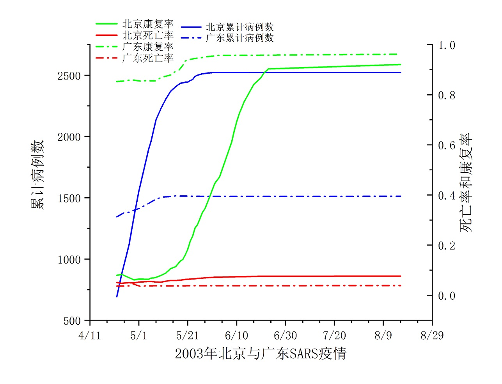
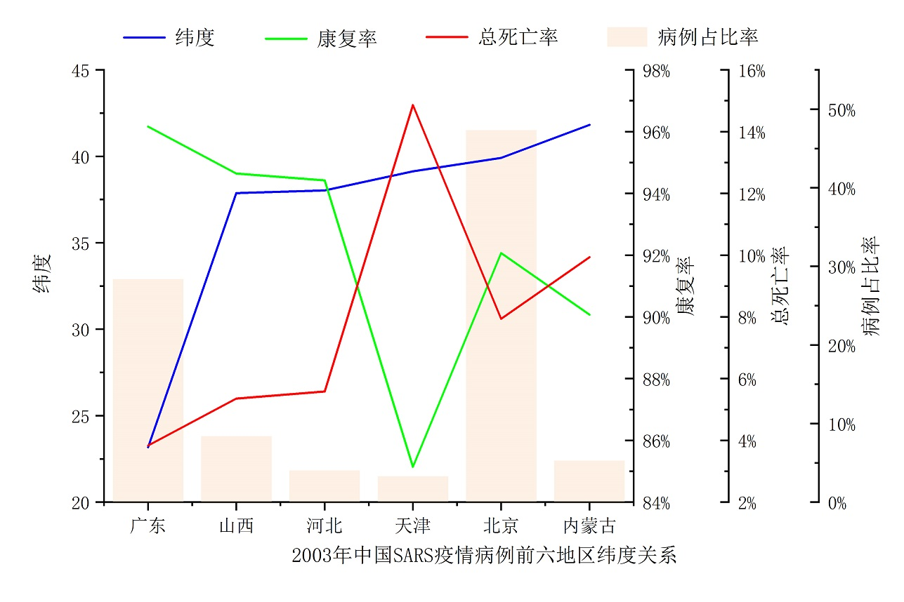

我们并未吸取教训，中国SARS疫情与天气温度相关性的数据推测分析
==================================================================

声明下，分析的数据来源是百度搜索“site:china.com.cn title:通报全国内地非典型肺炎最新疫情(附表)”, 是由中国卫生部新闻办公室整理发布的表格数据（Google同样的搜索条件搜不出来），个人有点粗心大意，急急忙忙的可能什么地方搞错了也有极大可能性，就当成饭后茶余的瞎扯蛋。

先大致介绍下背景，中国的SARS是于2002年12月5日的冬天的广东省深圳市开始，并于2003年7月份的夏天彻底消失。分析的数据是2003年4月23日首发的中国大陆疫情表格数据，若未特别说明，针对数据的分析都是按2003年来说的。8月16日SARS疫情的最后通报的总病例数是5327，北京是2521例，占比率是47.32%，广东是1512例，占比率是28.38%，它两合起来占比率是75.7%，亦即它两占了四分之三。

<table border="1"> 
   <caption align="top">中国SARS疫情北京和广东通报（截至2003年5月18日10时）</caption>
   <colgroup>
    <col /> 
    <col /> 
    <col /> 
    <col /> 
   </colgroup>
   <tbody>
    <tr> 
     <td>省&emsp;&emsp;份</td> 
     <td>病例</td> 
     <td>医疗人员病例</td> 
     <td>死亡</td> 
     <td>康复</td> 
     <td>仍在治疗病例</td> 
     <td>死亡率</td> 
     <td>康复率</td> 
     <td>仍在治疗病例率</td> 
     <td>医疗人员病例率</td> 
     <td>康复比死亡</td> 
     <td>死亡比康复</td> 
     <td>病例占比率</td> 
    </tr> 
    <tr> 
     <td>北京</td> 
     <td>2434</td> 
     <td>394</td> 
     <td>147</td> 
     <td>332</td> 
     <td>1955</td> 
     <td>6.04%</td> 
     <td>13.64%</td> 
     <td>80.32%</td> 
     <td>16.19%</td> 
     <td>2.26</td> 
     <td>0.44</td> 
     <td>51.81%</td> 
    </tr> 
    <tr> 
     <td>广东</td> 
     <td>1514</td> 
     <td>346</td> 
     <td>56</td> 
     <td>1363</td> 
     <td>95</td> 
     <td>3.70%</td> 
     <td>90.03%</td> 
     <td>6.27%</td> 
     <td>22.85%</td> 
     <td>24.34</td> 
     <td>0.04</td> 
     <td>32.23%</td> 
    </tr> 
    <tr> 
     <td>总共</td> 
     <td>4698</td> 
     <td>917</td> 
     <td>284</td> 
     <td>1529</td> 
     <td>2885</td> 
     <td>6.05%</td> 
     <td>32.55%</td> 
     <td>61.41%</td> 
     <td>19.52%</td> 
     <td>5.38</td> 
     <td>0.19</td> 
     <td></td> 
    </tr> 
   </tbody>
  </table>

北京4月22日确诊病例数是693，通过截至5月18日的表格数据，发现它的病例数是2434，短短的26天时间增长的数量达到了1741例，已经超过了发源地的广东同时期的1344例，甚至还比广东多了397例，广东首例发现时间是2002年12月5日，是经过164天时间才达到这个数量。

5月18日北京的康复率是13.64%，广东的是90.03%，北京是短期之内增长很大数量的确诊病例，但是康复的病例却很少，这才使得它的康复率很低。

通过5月18日的表格数据的病例数和康复率分析，可以看出广东的疫情算是得到控制好转了，但是北京却是疫情泛滥严重，有越演越烈的趋势。

<table border="1"> 
   <caption align="top">中国SARS疫情北京和广东通报（截止2003年8月16日10时）</caption>
   <colgroup>
    <col /> 
    <col /> 
    <col /> 
    <col /> 
   </colgroup>
   <tbody>
    <tr> 
     <td>省&emsp;&emsp;份</td> 
     <td>病例</td> 
     <td>医疗人员病例</td> 
     <td>死亡</td> 
     <td>康复</td> 
     <td>仍在治疗病例</td> 
     <td>死亡率</td> 
     <td>康复率</td> 
     <td>仍在治疗病例率</td> 
     <td>医疗人员病例率</td> 
     <td>康复比死亡</td> 
     <td>死亡比康复</td> 
     <td>病例占比率</td> 
    </tr> 
    <tr> 
     <td>北京</td> 
     <td>2521</td> 
     <td>399</td> 
     <td>193</td> 
     <td>2321</td> 
     <td>0</td> 
     <td>7.66%</td> 
     <td>92.07%</td> 
     <td>0.00%</td> 
     <td>15.83%</td> 
     <td>12.03</td> 
     <td>0.08</td> 
     <td>53.66%</td> 
    </tr> 
    <tr> 
     <td>广东</td> 
     <td>1512</td> 
     <td>346</td> 
     <td>58</td> 
     <td>1454</td> 
     <td>0</td> 
     <td>3.84%</td> 
     <td>96.16%</td> 
     <td>0.00%</td> 
     <td>22.88%</td> 
     <td>25.07</td> 
     <td>0.04</td> 
     <td>32.18%</td> 
    </tr> 
    <tr> 
     <td>总共</td> 
     <td>5327</td> 
     <td></td> 
     <td>349</td> 
     <td>4959</td> 
     <td>19</td> 
     <td>6.55%</td> 
     <td>93.09%</td> 
     <td>0.36%</td> 
     <td></td> 
     <td>14.21</td> 
     <td>0.07</td> 
     <td></td> 
    </tr> 
   </tbody>
  </table>

疫情于7月13日宣布基本结束，距离5月18日相隔了56天，通过最后8月16日整理和发布的数据，发现北京增长的病例是87例，广东增长的病例是2例。

7月13日北京的康复率是92.07%，广东的是96.16%，北京的死亡率是7.66%，广东的是3.84%，北京的死亡率是广东的2倍。

北京的疫情情况从这两个表格分析出，它的情况是突变的，在5月18日之前是来势汹汹，即使有广东的经验，也似乎看不到好转的迹象，但是至此以后情况得到了很大的好转。我们应该考虑下是否有多个因素影响造成的，但因为是突变性的变化，我们只考虑一个决定性因素的情况，它造成了这些疑惑：
 
- 北京的死亡率是广东的2倍
- 北京的康复率比广东的差
- 北京的新增病例增幅比广东的大
- 中期广东疫情已经好转，北京的疫情却泛滥严重
- 北京最后也像广东一样，疫情情况获得了好转
- 疫情在广东有被抑制的趋势
- 作为疫情发源地的广东的最后病例数比北京的少1009例

北京的四五六月之间有什么突变的因素吗？对，是有的，由冬天气候转换到夏天气候，具体到数值可以理解为温度由低到高，如果我们将这个因素考虑成温度的话，那么这些疑惑就都能得到很好的解释。未能找到2002年和2003年的天气数据，我们可以先这样理解，广东省的广州市是北纬23.16667度，北京是北纬39.91667度,北方的北京比南方的广州市离热热的赤道远了16.75度，故广州省整体温度要比北京热很多。广州是冬天再冷也没有供暖的地步，北京的冬天很冷，供暖时间是11月中旬到次年的3月中旬，就是说北京4月份还是很冷，5月中旬左右才算是进入夏天天气。北京是首都都市，人口密度也较高，再加上温度比广东更低，这也造成了其在4月份的疫情扩散速度比广东快。

为了使表格更加紧凑方便显示，医病是医疗人员病例的缩写，天差是距离4月22日的天数，XX增长是这次记录比上次记录的增长数量，XX增率是这次记录比上次记录的每天增长的数量，死比康是死亡病例除以康复病例，康比死是康复病例除以死亡病例。

<table border="1" > 
   <caption align="top">中国SARS疫情北京疫情详细情况表</caption>
   <colgroup>
    <col /> 
    <col /> 
    <col /> 
    <col /> 
    <col /> 
   </colgroup>
   <tbody>
    <tr> 
     <td>时间</td> 
     <td>病例</td> 
     <td>医病</td> 
     <td>死亡</td> 
     <td>康复</td> 
     <td>天差</td> 
     <td>病例增长</td> 
     <td>死亡增长</td> 
     <td>康复增长</td> 
     <td>医病增长</td> 
     <td>病例增率</td> 
     <td>死亡增率</td> 
     <td>康复增率</td> 
     <td>医病增率</td> 
     <td>死亡率</td> 
     <td>康复率</td> 
     <td>医病率</td> 
     <td>死比康</td> 
     <td>康比死</td> 
    </tr> 
    <tr> 
     <td>4/22</td> 
     <td>693</td> 
     <td></td> 
     <td>35</td> 
     <td>55</td> 
     <td>0</td> 
     <td></td> 
     <td></td> 
     <td></td> 
     <td></td> 
     <td></td> 
     <td></td> 
     <td></td> 
     <td></td> 
     <td>5.05%</td> 
     <td>7.94%</td> 
     <td>0.00%</td> 
     <td>0.64</td> 
     <td>1.57</td> 
    </tr> 
    <tr> 
     <td>4/24</td> 
     <td>877</td> 
     <td>160</td> 
     <td>42</td> 
     <td>73</td> 
     <td>2</td> 
     <td>184</td> 
     <td>7</td> 
     <td>18</td> 
     <td></td> 
     <td>92.00</td> 
     <td>3.50</td> 
     <td>9.00</td> 
     <td></td> 
     <td>4.79%</td> 
     <td>8.32%</td> 
     <td>18.24%</td> 
     <td>0.58</td> 
     <td>1.74</td> 
    </tr> 
    <tr> 
     <td>4/27</td> 
     <td>1114</td> 
     <td>187</td> 
     <td>56</td> 
     <td>78</td> 
     <td>5</td> 
     <td>237</td> 
     <td>14</td> 
     <td>5</td> 
     <td>27</td> 
     <td>47.40</td> 
     <td>2.80</td> 
     <td>1.00</td> 
     <td>5.40</td> 
     <td>5.03%</td> 
     <td>7.00%</td> 
     <td>16.79%</td> 
     <td>0.72</td> 
     <td>1.39</td> 
    </tr> 
    <tr> 
     <td>4/29</td> 
     <td>1347</td> 
     <td>255</td> 
     <td>66</td> 
     <td>83</td> 
     <td>7</td> 
     <td>233</td> 
     <td>10</td> 
     <td>5</td> 
     <td>68</td> 
     <td>33.29</td> 
     <td>1.43</td> 
     <td>0.71</td> 
     <td>9.71</td> 
     <td>4.90%</td> 
     <td>6.16%</td> 
     <td>18.93%</td> 
     <td>0.80</td> 
     <td>1.26</td> 
    </tr> 
    <tr> 
     <td>5/1</td> 
     <td>1553</td> 
     <td>288</td> 
     <td>82</td> 
     <td>100</td> 
     <td>9</td> 
     <td>206</td> 
     <td>16</td> 
     <td>17</td> 
     <td>33</td> 
     <td>22.89</td> 
     <td>1.78</td> 
     <td>1.89</td> 
     <td>3.67</td> 
     <td>5.28%</td> 
     <td>6.44%</td> 
     <td>18.54%</td> 
     <td>0.82</td> 
     <td>1.22</td> 
    </tr> 
    <tr> 
     <td>5/5</td> 
     <td>1897</td> 
     <td>335</td> 
     <td>103</td> 
     <td>121</td> 
     <td>13</td> 
     <td>344</td> 
     <td>21</td> 
     <td>21</td> 
     <td>47</td> 
     <td>26.46</td> 
     <td>1.62</td> 
     <td>1.62</td> 
     <td>3.62</td> 
     <td>5.43%</td> 
     <td>6.38%</td> 
     <td>17.66%</td> 
     <td>0.85</td> 
     <td>1.17</td> 
    </tr> 
    <tr> 
     <td>5/6</td> 
     <td>1960</td> 
     <td>348</td> 
     <td>107</td> 
     <td>134</td> 
     <td>14</td> 
     <td>63</td> 
     <td>4</td> 
     <td>13</td> 
     <td>13</td> 
     <td>4.50</td> 
     <td>0.29</td> 
     <td>0.93</td> 
     <td>0.93</td> 
     <td>5.46%</td> 
     <td>6.84%</td> 
     <td>17.76%</td> 
     <td>0.80</td> 
     <td>1.25</td> 
    </tr> 
    <tr> 
     <td>5/7</td> 
     <td>2049</td> 
     <td>358</td> 
     <td>110</td> 
     <td>141</td> 
     <td>15</td> 
     <td>89</td> 
     <td>3</td> 
     <td>7</td> 
     <td>10</td> 
     <td>5.93</td> 
     <td>0.20</td> 
     <td>0.47</td> 
     <td>0.67</td> 
     <td>5.37%</td> 
     <td>6.88%</td> 
     <td>17.47%</td> 
     <td>0.78</td> 
     <td>1.28</td> 
    </tr> 
    <tr> 
     <td>5/8</td> 
     <td>2136</td> 
     <td>370</td> 
     <td>112</td> 
     <td>152</td> 
     <td>16</td> 
     <td>87</td> 
     <td>2</td> 
     <td>11</td> 
     <td>12</td> 
     <td>5.44</td> 
     <td>0.13</td> 
     <td>0.69</td> 
     <td>0.75</td> 
     <td>5.24%</td> 
     <td>7.12%</td> 
     <td>17.32%</td> 
     <td>0.74</td> 
     <td>1.36</td> 
    </tr> 
    <tr> 
     <td>5/10</td> 
     <td>2227</td> 
     <td>375</td> 
     <td>116</td> 
     <td>175</td> 
     <td>18</td> 
     <td>91</td> 
     <td>4</td> 
     <td>23</td> 
     <td>5</td> 
     <td>5.06</td> 
     <td>0.22</td> 
     <td>1.28</td> 
     <td>0.28</td> 
     <td>5.21%</td> 
     <td>7.86%</td> 
     <td>16.84%</td> 
     <td>0.66</td> 
     <td>1.51</td> 
    </tr> 
    <tr> 
     <td>5/12</td> 
     <td>2304</td> 
     <td>384</td> 
     <td>129</td> 
     <td>203</td> 
     <td>20</td> 
     <td>77</td> 
     <td>13</td> 
     <td>28</td> 
     <td>9</td> 
     <td>3.85</td> 
     <td>0.65</td> 
     <td>1.40</td> 
     <td>0.45</td> 
     <td>5.60%</td> 
     <td>8.81%</td> 
     <td>16.67%</td> 
     <td>0.64</td> 
     <td>1.57</td> 
    </tr> 
    <tr> 
     <td>5/14</td> 
     <td>2370</td> 
     <td>387</td> 
     <td>139</td> 
     <td>252</td> 
     <td>22</td> 
     <td>66</td> 
     <td>10</td> 
     <td>49</td> 
     <td>3</td> 
     <td>3.00</td> 
     <td>0.45</td> 
     <td>2.23</td> 
     <td>0.14</td> 
     <td>5.86%</td> 
     <td>10.63%</td> 
     <td>16.33%</td> 
     <td>0.55</td> 
     <td>1.81</td> 
    </tr> 
    <tr> 
     <td>5/16</td> 
     <td>2405</td> 
     <td>391</td> 
     <td>141</td> 
     <td>273</td> 
     <td>24</td> 
     <td>35</td> 
     <td>2</td> 
     <td>21</td> 
     <td>4</td> 
     <td>1.46</td> 
     <td>0.08</td> 
     <td>0.88</td> 
     <td>0.17</td> 
     <td>5.86%</td> 
     <td>11.35%</td> 
     <td>16.26%</td> 
     <td>0.52</td> 
     <td>1.94</td> 
    </tr> 
    <tr> 
     <td>5/18</td> 
     <td>2434</td> 
     <td>394</td> 
     <td>147</td> 
     <td>332</td> 
     <td>26</td> 
     <td>29</td> 
     <td>6</td> 
     <td>59</td> 
     <td>3</td> 
     <td>1.12</td> 
     <td>0.23</td> 
     <td>2.27</td> 
     <td>0.12</td> 
     <td>6.04%</td> 
     <td>13.64%</td> 
     <td>16.19%</td> 
     <td>0.44</td> 
     <td>2.26</td> 
    </tr> 
    <tr> 
     <td>5/19</td> 
     <td>2437</td> 
     <td>396</td> 
     <td>150</td> 
     <td>349</td> 
     <td>27</td> 
     <td>3</td> 
     <td>3</td> 
     <td>17</td> 
     <td>2</td> 
     <td>0.11</td> 
     <td>0.11</td> 
     <td>0.63</td> 
     <td>0.07</td> 
     <td>6.16%</td> 
     <td>14.32%</td> 
     <td>16.25%</td> 
     <td>0.43</td> 
     <td>2.33</td> 
    </tr> 
    <tr> 
     <td>5/20</td> 
     <td>2444</td> 
     <td>395</td> 
     <td>154</td> 
     <td>395</td> 
     <td>28</td> 
     <td>7</td> 
     <td>4</td> 
     <td>46</td> 
     <td>-1</td> 
     <td>0.25</td> 
     <td>0.14</td> 
     <td>1.64</td> 
     <td>-0.04</td> 
     <td>6.30%</td> 
     <td>16.16%</td> 
     <td>16.16%</td> 
     <td>0.39</td> 
     <td>2.56</td> 
    </tr> 
    <tr> 
     <td>5/21</td> 
     <td>2444</td> 
     <td>395</td> 
     <td>156</td> 
     <td>447</td> 
     <td>29</td> 
     <td>0</td> 
     <td>2</td> 
     <td>52</td> 
     <td>0</td> 
     <td>0.00</td> 
     <td>0.07</td> 
     <td>1.79</td> 
     <td>0.00</td> 
     <td>6.38%</td> 
     <td>18.29%</td> 
     <td>16.16%</td> 
     <td>0.35</td> 
     <td>2.87</td> 
    </tr> 
    <tr> 
     <td>5/22</td> 
     <td>2456</td> 
     <td>395</td> 
     <td>158</td> 
     <td>528</td> 
     <td>30</td> 
     <td>12</td> 
     <td>2</td> 
     <td>81</td> 
     <td>0</td> 
     <td>0.40</td> 
     <td>0.07</td> 
     <td>2.70</td> 
     <td>0.00</td> 
     <td>6.43%</td> 
     <td>21.50%</td> 
     <td>16.08%</td> 
     <td>0.30</td> 
     <td>3.34</td> 
    </tr> 
    <tr> 
     <td>5/23</td> 
     <td>2465</td> 
     <td>395</td> 
     <td>160</td> 
     <td>582</td> 
     <td>31</td> 
     <td>9</td> 
     <td>2</td> 
     <td>54</td> 
     <td>0</td> 
     <td>0.29</td> 
     <td>0.06</td> 
     <td>1.74</td> 
     <td>0.00</td> 
     <td>6.49%</td> 
     <td>23.61%</td> 
     <td>16.02%</td> 
     <td>0.27</td> 
     <td>3.64</td> 
    </tr> 
    <tr> 
     <td>5/24</td> 
     <td>2490</td> 
     <td>396</td> 
     <td>163</td> 
     <td>667</td> 
     <td>32</td> 
     <td>25</td> 
     <td>3</td> 
     <td>85</td> 
     <td>1</td> 
     <td>0.78</td> 
     <td>0.09</td> 
     <td>2.66</td> 
     <td>0.03</td> 
     <td>6.55%</td> 
     <td>26.79%</td> 
     <td>15.90%</td> 
     <td>0.24</td> 
     <td>4.09</td> 
    </tr> 
    <tr> 
     <td>5/25</td> 
     <td>2499</td> 
     <td>396</td> 
     <td>167</td> 
     <td>704</td> 
     <td>33</td> 
     <td>9</td> 
     <td>4</td> 
     <td>37</td> 
     <td>0</td> 
     <td>0.27</td> 
     <td>0.12</td> 
     <td>1.12</td> 
     <td>0.00</td> 
     <td>6.68%</td> 
     <td>28.17%</td> 
     <td>15.85%</td> 
     <td>0.24</td> 
     <td>4.22</td> 
    </tr> 
    <tr> 
     <td>5/27</td> 
     <td>2512</td> 
     <td>398</td> 
     <td>172</td> 
     <td>828</td> 
     <td>35</td> 
     <td>13</td> 
     <td>5</td> 
     <td>124</td> 
     <td>2</td> 
     <td>0.37</td> 
     <td>0.14</td> 
     <td>3.54</td> 
     <td>0.06</td> 
     <td>6.85%</td> 
     <td>32.96%</td> 
     <td>15.84%</td> 
     <td>0.21</td> 
     <td>4.81</td> 
    </tr> 
    <tr> 
     <td>5/28</td> 
     <td>2514</td> 
     <td>398</td> 
     <td>175</td> 
     <td>866</td> 
     <td>36</td> 
     <td>2</td> 
     <td>3</td> 
     <td>38</td> 
     <td>0</td> 
     <td>0.06</td> 
     <td>0.08</td> 
     <td>1.06</td> 
     <td>0.00</td> 
     <td>6.96%</td> 
     <td>34.45%</td> 
     <td>15.83%</td> 
     <td>0.20</td> 
     <td>4.95</td> 
    </tr> 
    <tr> 
     <td>5/29</td> 
     <td>2517</td> 
     <td>398</td> 
     <td>176</td> 
     <td>928</td> 
     <td>37</td> 
     <td>3</td> 
     <td>1</td> 
     <td>62</td> 
     <td>0</td> 
     <td>0.08</td> 
     <td>0.03</td> 
     <td>1.68</td> 
     <td>0.00</td> 
     <td>6.99%</td> 
     <td>36.87%</td> 
     <td>15.81%</td> 
     <td>0.19</td> 
     <td>5.27</td> 
    </tr> 
    <tr> 
     <td>6/1</td> 
     <td>2522</td> 
     <td>399</td> 
     <td>181</td> 
     <td>1124</td> 
     <td>40</td> 
     <td>5</td> 
     <td>5</td> 
     <td>196</td> 
     <td>1</td> 
     <td>0.13</td> 
     <td>0.13</td> 
     <td>4.90</td> 
     <td>0.03</td> 
     <td>7.18%</td> 
     <td>44.57%</td> 
     <td>15.82%</td> 
     <td>0.16</td> 
     <td>6.21</td> 
    </tr> 
    <tr> 
     <td>6/2</td> 
     <td>2522</td> 
     <td>399</td> 
     <td>181</td> 
     <td>1157</td> 
     <td>41</td> 
     <td>0</td> 
     <td>0</td> 
     <td>33</td> 
     <td>0</td> 
     <td>0.00</td> 
     <td>0.00</td> 
     <td>0.80</td> 
     <td>0.00</td> 
     <td>7.18%</td> 
     <td>45.88%</td> 
     <td>15.82%</td> 
     <td>0.16</td> 
     <td>6.39</td> 
    </tr> 
    <tr> 
     <td>6/3</td> 
     <td>2522</td> 
     <td>399</td> 
     <td>181</td> 
     <td>1189</td> 
     <td>42</td> 
     <td>0</td> 
     <td>0</td> 
     <td>32</td> 
     <td>0</td> 
     <td>0.00</td> 
     <td>0.00</td> 
     <td>0.76</td> 
     <td>0.00</td> 
     <td>7.18%</td> 
     <td>47.15%</td> 
     <td>15.82%</td> 
     <td>0.15</td> 
     <td>6.57</td> 
    </tr> 
    <tr> 
     <td>6/8</td> 
     <td>2522</td> 
     <td></td> 
     <td>184</td> 
     <td>1543</td> 
     <td>47</td> 
     <td>0</td> 
     <td>3</td> 
     <td>354</td> 
     <td></td> 
     <td>0.00</td> 
     <td>0.06</td> 
     <td>7.53</td> 
     <td></td> 
     <td>7.30%</td> 
     <td>61.18%</td> 
     <td></td> 
     <td>0.12</td> 
     <td>8.39</td> 
    </tr> 
    <tr> 
     <td>6/9</td> 
     <td>2522</td> 
     <td></td> 
     <td>184</td> 
     <td>1653</td> 
     <td>48</td> 
     <td>0</td> 
     <td>0</td> 
     <td>110</td> 
     <td></td> 
     <td>0.00</td> 
     <td>0.00</td> 
     <td>2.29</td> 
     <td></td> 
     <td>7.30%</td> 
     <td>65.54%</td> 
     <td></td> 
     <td>0.11</td> 
     <td>8.98</td> 
    </tr> 
    <tr> 
     <td>6/10</td> 
     <td>2522</td> 
     <td></td> 
     <td>186</td> 
     <td>1747</td> 
     <td>49</td> 
     <td>0</td> 
     <td>2</td> 
     <td>94</td> 
     <td></td> 
     <td>0.00</td> 
     <td>0.04</td> 
     <td>1.92</td> 
     <td></td> 
     <td>7.38%</td> 
     <td>69.27%</td> 
     <td></td> 
     <td>0.11</td> 
     <td>9.39</td> 
    </tr> 
    <tr> 
     <td>6/11</td> 
     <td>2523</td> 
     <td></td> 
     <td>186</td> 
     <td>1821</td> 
     <td>50</td> 
     <td>1</td> 
     <td>0</td> 
     <td>74</td> 
     <td></td> 
     <td>0.02</td> 
     <td>0.00</td> 
     <td>1.48</td> 
     <td></td> 
     <td>7.37%</td> 
     <td>72.18%</td> 
     <td></td> 
     <td>0.10</td> 
     <td>9.79</td> 
    </tr> 
    <tr> 
     <td>6/13</td> 
     <td>2522</td> 
     <td></td> 
     <td>187</td> 
     <td>1944</td> 
     <td>52</td> 
     <td>-1</td> 
     <td>1</td> 
     <td>123</td> 
     <td></td> 
     <td>-0.02</td> 
     <td>0.02</td> 
     <td>2.37</td> 
     <td></td> 
     <td>7.41%</td> 
     <td>77.08%</td> 
     <td></td> 
     <td>0.10</td> 
     <td>10.40</td> 
    </tr> 
    <tr> 
     <td>6/17</td> 
     <td>2521</td> 
     <td></td> 
     <td>190</td> 
     <td>2120</td> 
     <td>56</td> 
     <td>-1</td> 
     <td>3</td> 
     <td>176</td> 
     <td></td> 
     <td>-0.02</td> 
     <td>0.05</td> 
     <td>3.14</td> 
     <td></td> 
     <td>7.54%</td> 
     <td>84.09%</td> 
     <td></td> 
     <td>0.09</td> 
     <td>11.16</td> 
    </tr> 
    <tr> 
     <td>6/20</td> 
     <td>2521</td> 
     <td></td> 
     <td>191</td> 
     <td>2189</td> 
     <td>59</td> 
     <td>0</td> 
     <td>1</td> 
     <td>69</td> 
     <td></td> 
     <td>0.00</td> 
     <td>0.02</td> 
     <td>1.17</td> 
     <td></td> 
     <td>7.58%</td> 
     <td>86.83%</td> 
     <td></td> 
     <td>0.09</td> 
     <td>11.46</td> 
    </tr> 
    <tr> 
     <td>6/21</td> 
     <td>2521</td> 
     <td></td> 
     <td>191</td> 
     <td>2231</td> 
     <td>60</td> 
     <td>0</td> 
     <td>0</td> 
     <td>42</td> 
     <td></td> 
     <td>0.00</td> 
     <td>0.00</td> 
     <td>0.70</td> 
     <td></td> 
     <td>7.58%</td> 
     <td>88.50%</td> 
     <td></td> 
     <td>0.09</td> 
     <td>11.68</td> 
    </tr> 
    <tr> 
     <td>6/23</td> 
     <td>2521</td> 
     <td></td> 
     <td>191</td> 
     <td>2277</td> 
     <td>62</td> 
     <td>0</td> 
     <td>0</td> 
     <td>46</td> 
     <td></td> 
     <td>0.00</td> 
     <td>0.00</td> 
     <td>0.74</td> 
     <td></td> 
     <td>7.58%</td> 
     <td>90.32%</td> 
     <td></td> 
     <td>0.08</td> 
     <td>11.92</td> 
    </tr> 
    <tr> 
     <td>8/16</td> 
     <td>2521</td> 
     <td></td> 
     <td>193</td> 
     <td>2321</td> 
     <td>116</td> 
     <td>0</td> 
     <td>2</td> 
     <td>44</td> 
     <td></td> 
     <td>0.00</td> 
     <td>0.02</td> 
     <td>0.38</td> 
     <td></td> 
     <td>7.66%</td> 
     <td>92.07%</td> 
     <td></td> 
     <td>0.08</td> 
     <td>12.03</td> 
    </tr> 
   </tbody>
  </table>

<table border="1"> 
   <caption align="top">中国SARS疫情广东详细情况表</caption>
   <colgroup>
    <col /> 
    <col /> 
   </colgroup>
   <tbody>
    <tr> 
     <td>时间</td> 
     <td>病例</td> 
     <td>医病</td> 
     <td>死亡</td> 
     <td>康复</td> 
     <td>天差</td> 
     <td>病例增长</td> 
     <td>死亡增长</td> 
     <td>康复增长</td> 
     <td>医病增长</td> 
     <td>病例增率</td> 
     <td>死亡增率</td> 
     <td>康复增率</td> 
     <td>医病增率</td> 
     <td>死亡率</td> 
     <td>康复率</td> 
     <td>医病率</td> 
     <td>死比康</td> 
     <td>康比死</td> 
    </tr> 
    <tr> 
     <td>4/22</td> 
     <td>1344</td> 
     <td></td> 
     <td>49</td> 
     <td>1146</td> 
     <td>0</td> 
     <td></td> 
     <td></td> 
     <td></td> 
     <td></td> 
     <td></td> 
     <td></td> 
     <td></td> 
     <td></td> 
     <td>3.65%</td> 
     <td>85.27%</td> 
     <td>0.00%</td> 
     <td>0.04</td> 
     <td>23.39</td> 
    </tr> 
    <tr> 
     <td>4/24</td> 
     <td>1374</td> 
     <td>342</td> 
     <td>50</td> 
     <td>1173</td> 
     <td>2</td> 
     <td>30</td> 
     <td>1</td> 
     <td>27</td> 
     <td></td> 
     <td>15.00</td> 
     <td>0.50</td> 
     <td>13.50</td> 
     <td></td> 
     <td>3.64%</td> 
     <td>85.37%</td> 
     <td>24.89%</td> 
     <td>0.04</td> 
     <td>23.46</td> 
    </tr> 
    <tr> 
     <td>4/27</td> 
     <td>1382</td> 
     <td>342</td> 
     <td>51</td> 
     <td>1185</td> 
     <td>5</td> 
     <td>8</td> 
     <td>1</td> 
     <td>12</td> 
     <td>0</td> 
     <td>1.60</td> 
     <td>0.20</td> 
     <td>2.40</td> 
     <td>0.00</td> 
     <td>3.69%</td> 
     <td>85.75%</td> 
     <td>24.75%</td> 
     <td>0.04</td> 
     <td>23.24</td> 
    </tr> 
    <tr> 
     <td>4/29</td> 
     <td>1399</td> 
     <td>342</td> 
     <td>66</td> 
     <td>1201</td> 
     <td>7</td> 
     <td>17</td> 
     <td>15</td> 
     <td>16</td> 
     <td>0</td> 
     <td>2.43</td> 
     <td>2.14</td> 
     <td>2.29</td> 
     <td>0.00</td> 
     <td>4.72%</td> 
     <td>85.85%</td> 
     <td>24.45%</td> 
     <td>0.05</td> 
     <td>18.20</td> 
    </tr> 
    <tr> 
     <td>5/1</td> 
     <td>1412</td> 
     <td>342</td> 
     <td>51</td> 
     <td>1206</td> 
     <td>9</td> 
     <td>13</td> 
     <td>-15</td> 
     <td>5</td> 
     <td>0</td> 
     <td>1.44</td> 
     <td>-1.67</td> 
     <td>0.56</td> 
     <td>0.00</td> 
     <td>3.61%</td> 
     <td>85.41%</td> 
     <td>24.22%</td> 
     <td>0.04</td> 
     <td>23.65</td> 
    </tr> 
    <tr> 
     <td>5/5</td> 
     <td>1453</td> 
     <td>343</td> 
     <td>54</td> 
     <td>1245</td> 
     <td>13</td> 
     <td>41</td> 
     <td>3</td> 
     <td>39</td> 
     <td>1</td> 
     <td>3.15</td> 
     <td>0.23</td> 
     <td>3.00</td> 
     <td>0.08</td> 
     <td>3.72%</td> 
     <td>85.68%</td> 
     <td>23.61%</td> 
     <td>0.04</td> 
     <td>23.06</td> 
    </tr> 
    <tr> 
     <td>5/6</td> 
     <td>1465</td> 
     <td>344</td> 
     <td>55</td> 
     <td>1251</td> 
     <td>14</td> 
     <td>12</td> 
     <td>1</td> 
     <td>6</td> 
     <td>1</td> 
     <td>0.86</td> 
     <td>0.07</td> 
     <td>0.43</td> 
     <td>0.07</td> 
     <td>3.75%</td> 
     <td>85.39%</td> 
     <td>23.48%</td> 
     <td>0.04</td> 
     <td>22.75</td> 
    </tr> 
    <tr> 
     <td>5/7</td> 
     <td>1478</td> 
     <td>344</td> 
     <td>55</td> 
     <td>1256</td> 
     <td>15</td> 
     <td>13</td> 
     <td>0</td> 
     <td>5</td> 
     <td>0</td> 
     <td>0.87</td> 
     <td>0.00</td> 
     <td>0.33</td> 
     <td>0.00</td> 
     <td>3.72%</td> 
     <td>84.98%</td> 
     <td>23.27%</td> 
     <td>0.04</td> 
     <td>22.84</td> 
    </tr> 
    <tr> 
     <td>5/8</td> 
     <td>1485</td> 
     <td>344</td> 
     <td>56</td> 
     <td>1273</td> 
     <td>16</td> 
     <td>7</td> 
     <td>1</td> 
     <td>17</td> 
     <td>0</td> 
     <td>0.44</td> 
     <td>0.06</td> 
     <td>1.06</td> 
     <td>0.00</td> 
     <td>3.77%</td> 
     <td>85.72%</td> 
     <td>23.16%</td> 
     <td>0.04</td> 
     <td>22.73</td> 
    </tr> 
    <tr> 
     <td>5/10</td> 
     <td>1504</td> 
     <td>345</td> 
     <td>56</td> 
     <td>1305</td> 
     <td>18</td> 
     <td>19</td> 
     <td>0</td> 
     <td>32</td> 
     <td>1</td> 
     <td>1.06</td> 
     <td>0.00</td> 
     <td>1.78</td> 
     <td>0.06</td> 
     <td>3.72%</td> 
     <td>86.77%</td> 
     <td>22.94%</td> 
     <td>0.04</td> 
     <td>23.30</td> 
    </tr> 
    <tr> 
     <td>5/12</td> 
     <td>1509</td> 
     <td>345</td> 
     <td>56</td> 
     <td>1319</td> 
     <td>20</td> 
     <td>5</td> 
     <td>0</td> 
     <td>14</td> 
     <td>0</td> 
     <td>0.25</td> 
     <td>0.00</td> 
     <td>0.70</td> 
     <td>0.00</td> 
     <td>3.71%</td> 
     <td>87.41%</td> 
     <td>22.86%</td> 
     <td>0.04</td> 
     <td>23.55</td> 
    </tr> 
    <tr> 
     <td>5/14</td> 
     <td>1510</td> 
     <td>345</td> 
     <td>56</td> 
     <td>1327</td> 
     <td>22</td> 
     <td>1</td> 
     <td>0</td> 
     <td>8</td> 
     <td>0</td> 
     <td>0.05</td> 
     <td>0.00</td> 
     <td>0.36</td> 
     <td>0.00</td> 
     <td>3.71%</td> 
     <td>87.88%</td> 
     <td>22.85%</td> 
     <td>0.04</td> 
     <td>23.70</td> 
    </tr> 
    <tr> 
     <td>5/16</td> 
     <td>1515</td> 
     <td>346</td> 
     <td>56</td> 
     <td>1353</td> 
     <td>24</td> 
     <td>5</td> 
     <td>0</td> 
     <td>26</td> 
     <td>1</td> 
     <td>0.21</td> 
     <td>0.00</td> 
     <td>1.08</td> 
     <td>0.04</td> 
     <td>3.70%</td> 
     <td>89.31%</td> 
     <td>22.84%</td> 
     <td>0.04</td> 
     <td>24.16</td> 
    </tr> 
    <tr> 
     <td>5/18</td> 
     <td>1514</td> 
     <td>346</td> 
     <td>56</td> 
     <td>1363</td> 
     <td>26</td> 
     <td>-1</td> 
     <td>0</td> 
     <td>10</td> 
     <td>0</td> 
     <td>-0.04</td> 
     <td>0.00</td> 
     <td>0.38</td> 
     <td>0.00</td> 
     <td>3.70%</td> 
     <td>90.03%</td> 
     <td>22.85%</td> 
     <td>0.04</td> 
     <td>24.34</td> 
    </tr> 
    <tr> 
     <td>5/19</td> 
     <td>1514</td> 
     <td>346</td> 
     <td>56</td> 
     <td>1388</td> 
     <td>27</td> 
     <td>0</td> 
     <td>0</td> 
     <td>25</td> 
     <td>0</td> 
     <td>0.00</td> 
     <td>0.00</td> 
     <td>0.93</td> 
     <td>0.00</td> 
     <td>3.70%</td> 
     <td>91.68%</td> 
     <td>22.85%</td> 
     <td>0.04</td> 
     <td>24.79</td> 
    </tr> 
    <tr> 
     <td>5/20</td> 
     <td>1514</td> 
     <td>346</td> 
     <td>56</td> 
     <td>1415</td> 
     <td>28</td> 
     <td>0</td> 
     <td>0</td> 
     <td>27</td> 
     <td>0</td> 
     <td>0.00</td> 
     <td>0.00</td> 
     <td>0.96</td> 
     <td>0.00</td> 
     <td>3.70%</td> 
     <td>93.46%</td> 
     <td>22.85%</td> 
     <td>0.04</td> 
     <td>25.27</td> 
    </tr> 
    <tr> 
     <td>5/21</td> 
     <td>1513</td> 
     <td>346</td> 
     <td>56</td> 
     <td>1419</td> 
     <td>29</td> 
     <td>-1</td> 
     <td>0</td> 
     <td>4</td> 
     <td>0</td> 
     <td>-0.03</td> 
     <td>0.00</td> 
     <td>0.14</td> 
     <td>0.00</td> 
     <td>3.70%</td> 
     <td>93.79%</td> 
     <td>22.87%</td> 
     <td>0.04</td> 
     <td>25.34</td> 
    </tr> 
    <tr> 
     <td>5/22</td> 
     <td>1513</td> 
     <td>346</td> 
     <td>57</td> 
     <td>1423</td> 
     <td>30</td> 
     <td>0</td> 
     <td>1</td> 
     <td>4</td> 
     <td>0</td> 
     <td>0.00</td> 
     <td>0.03</td> 
     <td>0.13</td> 
     <td>0.00</td> 
     <td>3.77%</td> 
     <td>94.05%</td> 
     <td>22.87%</td> 
     <td>0.04</td> 
     <td>24.96</td> 
    </tr> 
    <tr> 
     <td>5/23</td> 
     <td>1513</td> 
     <td>346</td> 
     <td>57</td> 
     <td>1428</td> 
     <td>31</td> 
     <td>0</td> 
     <td>0</td> 
     <td>5</td> 
     <td>0</td> 
     <td>0.00</td> 
     <td>0.00</td> 
     <td>0.16</td> 
     <td>0.00</td> 
     <td>3.77%</td> 
     <td>94.38%</td> 
     <td>22.87%</td> 
     <td>0.04</td> 
     <td>25.05</td> 
    </tr> 
    <tr> 
     <td>5/24</td> 
     <td>1513</td> 
     <td>346</td> 
     <td>57</td> 
     <td>1429</td> 
     <td>32</td> 
     <td>0</td> 
     <td>0</td> 
     <td>1</td> 
     <td>0</td> 
     <td>0.00</td> 
     <td>0.00</td> 
     <td>0.03</td> 
     <td>0.00</td> 
     <td>3.77%</td> 
     <td>94.45%</td> 
     <td>22.87%</td> 
     <td>0.04</td> 
     <td>25.07</td> 
    </tr> 
    <tr> 
     <td>5/25</td> 
     <td>1513</td> 
     <td>346</td> 
     <td>57</td> 
     <td>1432</td> 
     <td>33</td> 
     <td>0</td> 
     <td>0</td> 
     <td>3</td> 
     <td>0</td> 
     <td>0.00</td> 
     <td>0.00</td> 
     <td>0.09</td> 
     <td>0.00</td> 
     <td>3.77%</td> 
     <td>94.65%</td> 
     <td>22.87%</td> 
     <td>0.04</td> 
     <td>25.12</td> 
    </tr> 
    <tr> 
     <td>5/27</td> 
     <td>1512</td> 
     <td>346</td> 
     <td>57</td> 
     <td>1434</td> 
     <td>35</td> 
     <td>-1</td> 
     <td>0</td> 
     <td>2</td> 
     <td>0</td> 
     <td>-0.03</td> 
     <td>0.00</td> 
     <td>0.06</td> 
     <td>0.00</td> 
     <td>3.77%</td> 
     <td>94.84%</td> 
     <td>22.88%</td> 
     <td>0.04</td> 
     <td>25.16</td> 
    </tr> 
    <tr> 
     <td>5/28</td> 
     <td>1511</td> 
     <td>346</td> 
     <td>57</td> 
     <td>1436</td> 
     <td>36</td> 
     <td>-1</td> 
     <td>0</td> 
     <td>2</td> 
     <td>0</td> 
     <td>-0.03</td> 
     <td>0.00</td> 
     <td>0.06</td> 
     <td>0.00</td> 
     <td>3.77%</td> 
     <td>95.04%</td> 
     <td>22.90%</td> 
     <td>0.04</td> 
     <td>25.19</td> 
    </tr> 
    <tr> 
     <td>5/29</td> 
     <td>1511</td> 
     <td>346</td> 
     <td>57</td> 
     <td>1438</td> 
     <td>37</td> 
     <td>0</td> 
     <td>0</td> 
     <td>2</td> 
     <td>0</td> 
     <td>0.00</td> 
     <td>0.00</td> 
     <td>0.05</td> 
     <td>0.00</td> 
     <td>3.77%</td> 
     <td>95.17%</td> 
     <td>22.90%</td> 
     <td>0.04</td> 
     <td>25.23</td> 
    </tr> 
    <tr> 
     <td>6/1</td> 
     <td>1511</td> 
     <td>346</td> 
     <td>57</td> 
     <td>1442</td> 
     <td>40</td> 
     <td>0</td> 
     <td>0</td> 
     <td>4</td> 
     <td>0</td> 
     <td>0.00</td> 
     <td>0.00</td> 
     <td>0.10</td> 
     <td>0.00</td> 
     <td>3.77%</td> 
     <td>95.43%</td> 
     <td>22.90%</td> 
     <td>0.04</td> 
     <td>25.30</td> 
    </tr> 
    <tr> 
     <td>6/2</td> 
     <td>1511</td> 
     <td>346</td> 
     <td>57</td> 
     <td>1445</td> 
     <td>41</td> 
     <td>0</td> 
     <td>0</td> 
     <td>3</td> 
     <td>0</td> 
     <td>0.00</td> 
     <td>0.00</td> 
     <td>0.07</td> 
     <td>0.00</td> 
     <td>3.77%</td> 
     <td>95.63%</td> 
     <td>22.90%</td> 
     <td>0.04</td> 
     <td>25.35</td> 
    </tr> 
    <tr> 
     <td>6/3</td> 
     <td>1511</td> 
     <td>346</td> 
     <td>57</td> 
     <td>1445</td> 
     <td>42</td> 
     <td>0</td> 
     <td>0</td> 
     <td>0</td> 
     <td>0</td> 
     <td>0.00</td> 
     <td>0.00</td> 
     <td>0.00</td> 
     <td>0.00</td> 
     <td>3.77%</td> 
     <td>95.63%</td> 
     <td>22.90%</td> 
     <td>0.04</td> 
     <td>25.35</td> 
    </tr> 
    <tr> 
     <td>8/16</td> 
     <td>1512</td> 
     <td></td> 
     <td>58</td> 
     <td>1454</td> 
     <td>116</td> 
     <td>1</td> 
     <td>1</td> 
     <td>9</td> 
     <td></td> 
     <td>0.01</td> 
     <td>0.01</td> 
     <td>0.08</td> 
     <td>0.00</td> 
     <td>3.84%</td> 
     <td>96.16%</td> 
     <td></td> 
     <td>0.04</td> 
     <td>25.07</td> 
    </tr> 
   </tbody>
  </table>

通过对比我们发现：

- 广东疫情在5月16日就没有新的病例增加，而北京是在6月1日
- 广东疫情在5月10日后病例增率已经趋缓，而北京是在5月18日
- 广东疫情的康复率是早早就进入一个较好的数据，而北京是在5月16日后才进入较好的增长，并在30天后达到了一个较好的成绩
- 4月23日都已经汇总通报了，但是北京的医疗人员病例在5月12日前，还是出现了很高的增长，说明我们并未有较好的疫情控制手段
- 4月22日以后记录的广东疫情数据，就是北京疫情后期数据的另外一种变化，即病例增速减缓，康复率较高

广东的SARS疫情比北京更早更快地在各方面都取得了较好成绩，这些都很好地说明了SARS疾病和温度的相关性很大。在没有有效药物能杀死SARS病毒的情况下，康复率的上升也说明患者的身体免疫系统能力有了提升，北京的康复率由4月冬天到6月夏天的迅速增长，这说明其和温度是有很大的相关性的。由于SARS疾病的潜伏期和病例的确诊都需要一定的时间，免疫系统能力的提升在身体上表现出来的结果在这个数据上是突变性的，病例跨区域转移等原因，所以反应到具体记录的数据也需要相应的时间。

 <table border="1">
    <caption align="top">2003年中国SARS疫情病例前六地区纬度关系表</caption>
   <colgroup>
    <col /> 
   </colgroup>
   <tbody>
    <tr> 
     <td>省&emsp;&emsp;份</td> 
     <td>累计病例数</td> 
     <td>治愈出院人数</td> 
     <td>死亡人数</td> 
     <td>其他病致死</td> 
     <td>死亡率</td> 
     <td>康复率</td> 
     <td>其他病致死</td> 
     <td>总死亡率</td> 
     <td>康复比死亡</td> 
     <td>死亡比康复</td> 
     <td>病例占比率</td> 
     <td>经度</td> 
     <td>纬度</td> 
    </tr> 
    <tr> 
     <td>广东</td> 
     <td>1512</td> 
     <td>1454</td> 
     <td>58</td> 
     <td>0</td> 
     <td>3.84%</td> 
     <td>96.16%</td> 
     <td>0.00%</td> 
     <td>3.84%</td> 
     <td>25.07</td> 
     <td>0.04</td> 
     <td>28.38%</td> 
     <td>113.23</td> 
     <td>23.17</td> 
    </tr> 
    <tr> 
     <td>山西</td> 
     <td>448</td> 
     <td>424</td> 
     <td>24</td> 
     <td>0</td> 
     <td>5.36%</td> 
     <td>94.64%</td> 
     <td>0.00%</td> 
     <td>5.36%</td> 
     <td>17.67</td> 
     <td>0.06</td> 
     <td>8.41%</td> 
     <td>112.53</td> 
     <td>37.87</td> 
    </tr> 
    <tr> 
     <td>河北</td> 
     <td>215</td> 
     <td>203</td> 
     <td>12</td> 
     <td>0</td> 
     <td>5.58%</td> 
     <td>94.42%</td> 
     <td>0.00%</td> 
     <td>5.58%</td> 
     <td>16.92</td> 
     <td>0.06</td> 
     <td>4.04%</td> 
     <td>115.48</td> 
     <td>38.03</td> 
    </tr> 
    <tr> 
     <td>天津</td> 
     <td>175</td> 
     <td>149</td> 
     <td>14</td> 
     <td>12</td> 
     <td>8.00%</td> 
     <td>85.14%</td> 
     <td>6.86%</td> 
     <td>14.86%</td> 
     <td>10.64</td> 
     <td>0.09</td> 
     <td>3.29%</td> 
     <td>117.20</td> 
     <td>39.13</td> 
    </tr> 
    <tr> 
     <td>北京</td> 
     <td>2521</td> 
     <td>2321</td> 
     <td>193</td> 
     <td>7</td> 
     <td>7.66%</td> 
     <td>92.07%</td> 
     <td>0.28%</td> 
     <td>7.93%</td> 
     <td>12.03</td> 
     <td>0.08</td> 
     <td>47.32%</td> 
     <td>116.42</td> 
     <td>39.92</td> 
    </tr> 
    <tr> 
     <td>内蒙古</td> 
     <td>282</td> 
     <td>254</td> 
     <td>28</td> 
     <td>0</td> 
     <td>9.93%</td> 
     <td>90.07%</td> 
     <td>0.00%</td> 
     <td>9.93%</td> 
     <td>9.07</td> 
     <td>0.11</td> 
     <td>5.29%</td> 
     <td>111.67</td> 
     <td>41.82</td> 
    </tr> 
    <tr> 
     <td>合计</td> 
     <td>5327</td> 
     <td>4959</td> 
     <td>349</td> 
     <td>19</td> 
     <td>6.55%</td> 
     <td>93.09%</td> 
     <td>0.36%</td> 
     <td>6.91%</td> 
     <td>14.21</td> 
     <td>0.07</td> 
     <td>100.00%</td> 
     <td></td> 
     <td></td> 
    </tr> 
   </tbody>
  </table>

由于未找到2002年和2003年中国的各地区的历史温度数据，我们这里大概以纬度位置关系代表温度，简单的理解为地区离赤道越近，整体天气都会较高，同时期冬天温度也较高。这里我们看到病例数超过100例的地区按纬度从小到大的排序，病例数排第六名的天津的数据有一些怪异，或许这里面存在着一些特殊原因，病例数较多的前五个地区，合计占比率93.45%的病例数据都符合这一个特点：随着经纬度的增加，治愈率就减少，总死亡率升高的特点，这也是符合前面推测的温度和SARS疫情的严重程度存在很大相关性这个观点。

个人主张环境温度，体温，免疫系统能力和身体健康四者之间有很大相关性，即环境温度会影响体温，免疫系统拥有自己最佳的工作体温范围，身体长时间处在免疫系统的最佳的工作体温范围时它的能力是最强的，免疫系统能力强则不容易出现健康问题。我们的经验告诉我们，冬天是感冒多发的季节，夏天则不会，冬天注意身体保暖也就不太容易得感冒，但这些经验仅仅是一种粗浅的认知。当出现超出我们这种粗浅认知的情况，我们就无法很好地解决问题。比如第一次看到某年南极某科考站年耗1.6万个避孕套，你会不会觉得惊讶，这涉及到心理学家丹尼尔·卡尼曼（Daniel Kahneman）在《思考，快与慢》（《Thinking, Fast and Slow》）里说的“系统1”，即你用这个“系统1”来快速得出心里预期的答案和新闻报道的答案差别很大，具体来说就是你的知识经验很简单模糊地总结的是冬天人的性能力低下，你就是简单用这个模型得出了，在更冷的南极人会性能力更低下的答案，你没有环境温度具体会影响人的性欲到何种程度的知识（看知乎上有人说我国南极科考站供暖是26℃）。我们需要科学实验的数据来解释上面四者的之间的关系，从而对免疫系统能有一个更好的认知。四者关系简单推测详情请看博客[《提供一个武汉肺炎的攻克研究方向—–温度与身体免疫能力的关系》]( https://zyq5945.github.io/zyq5945/blog_9.html)，这里不再赘述。

个人认为SARS病毒就是一个加强版的感冒病毒，拥有较高的传染性且没有有效药物能杀死。现在的新型冠状病毒（2019-nCoV）和SARS病毒很像，弄清楚身体免疫能力高低问题，提高我们身体免疫能力是现阶段一种较好的解决办法。

----

**一些资料数据下载或者查看地址:**

[百度搜索中国卫生部新闻办公室关于通报全国内地非典型肺炎最新疫情](https://www.baidu.com/s?ie=utf-8&f=8&rsv_bp=1&rsv_idx=1&tn=baidu&wd=site%3Achina.com.cn%20title%3A%E9%80%9A%E6%8A%A5%E5%85%A8%E5%9B%BD%E5%86%85%E5%9C%B0%E9%9D%9E%E5%85%B8%E5%9E%8B%E8%82%BA%E7%82%8E%E6%9C%80%E6%96%B0%E7%96%AB%E6%83%85(%E9%99%84%E8%A1%A8)&rsv_t=019dfSk6Qnv5ClzTNrmN8NP%2FsYgNMo4XLVdU50bpxioZnL1QX3kRl8g0SZg&rsv_enter=1&rsv_dl=ib&rsv_sug3=2)

[非典（SARS，萨斯，沙士）是如何在天津爆发流行的？](http://blog.sina.com.cn/s/blog_8791cb400102vfv0.html)

[全国内地非典型肺炎疫情统计表（截至8月16日内地疫情）]( http://www.china.com.cn/chinese/zhuanti/feiyan/386427.htm)

[卫生部4月23日通报全国内地非典型肺炎最新疫情](http://www.china.com.cn/chinese/2003/Apr/319444.htm)

[卫生部5月18日通报全国内地非典型肺炎最新疫情](http://www.china.com.cn/chinese/2003/May/331415.htm)

[扒的原始表格数据地址在这下载](./data/ SARS_China_Raw.xlsx)

[整理后的表格数据地址在这下载](./data/ SARS_China.xlsx)

[百度百科---SARS事件](https://baike.baidu.com/item/SARS%E4%BA%8B%E4%BB%B6/7702261?fr=aladdin)

[维基百科---SARS事件]( https://zh.wikipedia.org/wiki/SARS%E4%BA%8B%E4%BB%B6)

[*返回主页*](.)
------------------------------------------------------------------

***
