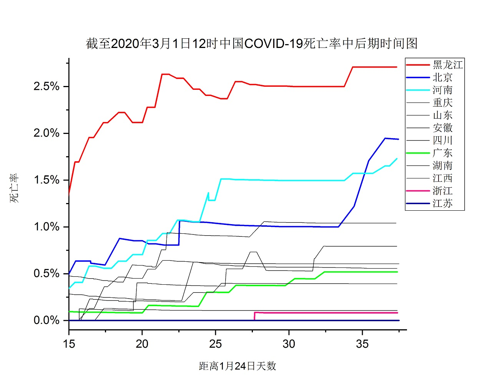

中国COVID-19(2019-nCov)疫情的死亡率与天气温度相关性的数据推测分析
==================================================================

本文使用的中国COVID-19(2019-nCov)疫情数据来源，是使用[diseasedataarrange](https://github.com/zyq5945/diseasedataarrange)程序针对[DXY-COVID-19-Data](https://github.com/BlankerL/DXY-COVID-19-Data)的最新DXYArea.csv文件，自动生成整理后的[CSV格式文件数据](https://github.com/zyq5945/DXY-COVID-19-Data-Arrange-CSV)。

若你对生成的数据有疑问，或者认为汇总的数据有误，请向[BlankerL反馈异常数据](https://github.com/BlankerL/DXY-COVID-19-Crawler/issues/34)。

我们首先来看下2020年3月1日12时左右的累计确诊个数超过400例省份数据统计表，按死亡率按高到低排序（“在治”是“正在治疗”的缩写，是确诊减去康复，再减去死亡）。

| 最后更新时间            | 省份 | 确诊 | 康复 | 死亡 | 在治 | 康复率 | 死亡率 | 在治率 |
|-----------------------|------------|----------------------|------------------|-----------------|---------------------|-----------------|----------------|--------------------|
| 2020\-03\-01 11:57:02 | 湖北         | 66907                | 31190            | 2761            | 32956               | 46\.62%         | 4\.13%         | 49\.26%            |
| 2020\-03\-01 08:03:19 | 黑龙江        | 480                  | 330              | 13              | 137                 | 68\.75%         | 2\.71%         | 28\.54%            |
| 2020\-03\-01 11:01:02 | 北京         | 413                  | 276              | 8               | 129                 | 66\.83%         | 1\.94%         | 31\.23%            |
| 2020\-03\-01 08:29:10 | 河南         | 1272                 | 1185             | 22              | 65                  | 93\.16%         | 1\.73%         | 5\.11%             |
| 2020\-03\-01 07:13:02 | 重庆         | 576                  | 438              | 6               | 132                 | 76\.04%         | 1\.04%         | 22\.92%            |
| 2020\-03\-01 08:20:05 | 山东         | 756                  | 431              | 6               | 319                 | 57\.01%         | 0\.79%         | 42\.20%            |
| 2020\-03\-01 11:57:02 | 安徽         | 990                  | 870              | 6               | 114                 | 87\.88%         | 0\.61%         | 11\.52%            |
| 2020\-03\-01 08:45:55 | 四川         | 538                  | 363              | 3               | 172                 | 67\.47%         | 0\.56%         | 31\.97%            |
| 2020\-03\-01 09:12:02 | 广东         | 1349                 | 1009             | 7               | 333                 | 74\.80%         | 0\.52%         | 24\.68%            |
| 2020\-03\-01 08:45:55 | 湖南         | 1018                 | 853              | 4               | 161                 | 83\.79%         | 0\.39%         | 15\.82%            |
| 2020\-03\-01 09:12:02 | 江西         | 935                  | 831              | 1               | 103                 | 88\.88%         | 0\.11%         | 11\.02%            |
| 2020\-03\-01 09:25:02 | 浙江         | 1205                 | 1027             | 1               | 177                 | 85\.23%         | 0\.08%         | 14\.69%            |
| 2020\-03\-01 11:57:02 | 江苏         | 631                  | 531              | 0               | 100                 | 84\.15%         | 0\.00%         | 15\.85%            |

从这个表我们可以看出，患者多的地区较容易出现高死亡率，北方比南方较容易出现较高死亡率，越冷就越如此，这和[最终统计的2003年北京的SARS的死亡率](https://zyq5945.github.io/zyq5945/blog_10.html)比广东的高，是广东的两倍相呼应。

疾病的康复率，死亡率和正在治疗率需要合在一起考虑，我们可以参考下2003年北京的SARS疫情数据，以疫情事件结束时间点来看，就会看到正在治疗率从高变到0，死亡率早期数据少可能会出现很大波动（最终死亡率越低越容易出现数据波动，现在疫情死亡是中老年人居多，假如刚好是感染了很多中老年人，那死亡率就会更高），中期稳定后会缓慢上升，康复率有可能符合玻尔兹曼(Boltzmann)方程数据分布（自己瞎琢磨尝试用2月28日安徽省的康复数标准化数据进行Boltzmann数据拟合，还挺符合的），早期较低，中期会迅速攀升，最后阶段稳定后处在一个较高数据。

下面我们看下中期阶段后各省份的死亡率时间图：

这个图是排除了疫情最为严重的湖北省，若是要做公平的比较的话，应该是在同样的累计增长曲线，相同的正在治疗率系数情况下进行比较。正在治疗率越高越说明其疫情阶段越越靠前，反之若是是越靠后，还是前面说的死亡率在中后期阶段后会缓慢上升。

是为什么会造成这样的结果？！详情请看博客[《提供一个武汉肺炎的攻克研究方向—–温度与身体免疫能力的关系》]( https://zyq5945.github.io/zyq5945/blog_9.html)，这里不再赘述。

----

**一些资料数据下载或者查看地址:**

#### [DXY-COVID-19-Data仓库地址](https://github.com/BlankerL/DXY-COVID-19-Data)

#### [DXY-COVID-19-Data-Arrange-CSV的github.com仓库地址](https://github.com/zyq5945/DXY-COVID-19-Data-Arrange-CSV)

#### [DXY-COVID-19-Data-Arrange-CSV的gitee.com仓库地址](https://gitee.com/zyq5945/DXY-COVID-19-Data-Arrange-CSV)

#### [DXY-COVID-19-Data-Arrange-CSV的github.io网站地址](https://zyq5945.github.io/DXY-COVID-19-Data-Arrange-CSV)

[*返回主页*](.)
------------------------------------------------------------------

***
