使用OriginLab的Boltzmann模型拟合仿真预测中国COVID-19(2019-nCov)疫情康复情况
==================================================================

最近在学习使用OriginLab进行数据分析，对其中的Boltzmann模型使用的一些心得，并记录下使用过程方便初学者参考。

首先声明下使用的数据来源是[DXY-COVID-19-Data-Arrange-CSV](https://github.com/zyq5945/DXY-COVID-19-Data-Arrange-CSV)，需要分析最新数据请自行下载。本次分析的是位于data/ParentDetail目录下，各省份随时间变化的疫情详细情况数据。其中TimeOffset是距离2020年1月24日的浮点型天数，UpdateTime是具体时间，ParentCuredCount就是本次需要拟合仿真预测的康复数。

首先我们先来看看一些数据拟合仿真预测的效果：

## 1.一些省份的拟合仿真预测

以下图形，X坐标均是距离2020年1月24日的天数，Y坐标是康复数。

注：数据是截至2020年3月2日17时的拟合，在图中X坐标上的值大概是38.7。

注：本人是个瞎琢磨的初学者，还不知道怎么修改其他参数，若你想要更好的拟合请自行探索修改。

### 1.1 湖北

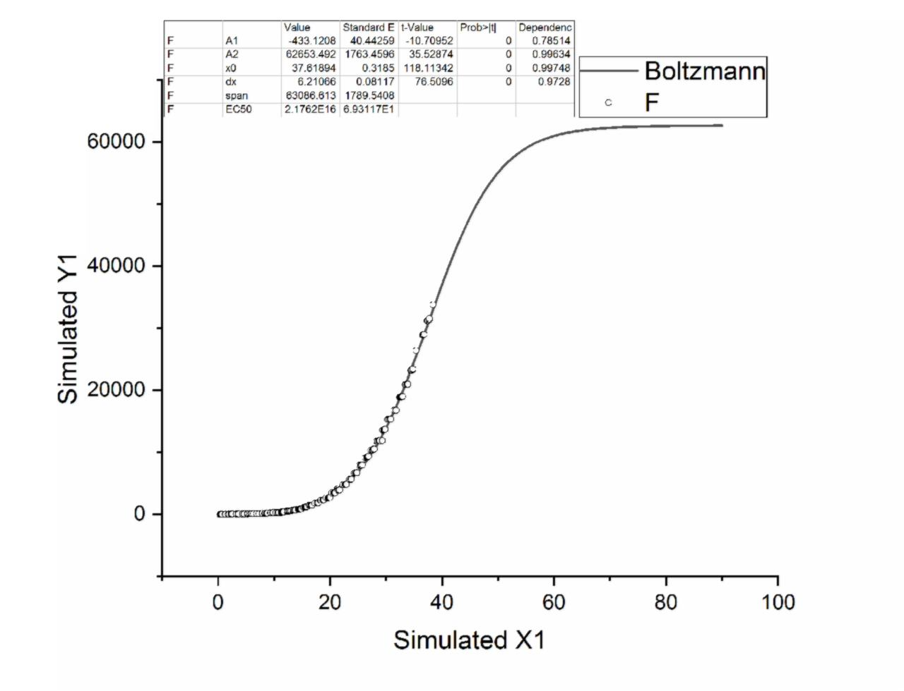

这个数据和统计的累计确诊案例实时关联性不大，即使短期增长很大确诊数，也需要一段时间才会反应到康复数上。

### 1.2 广东

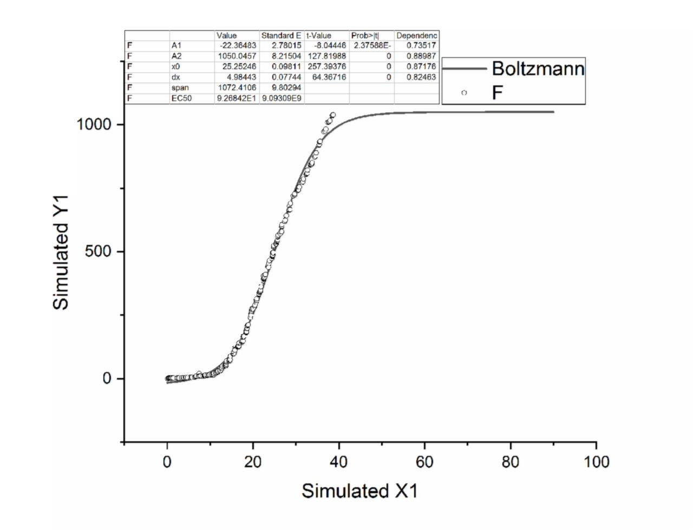

### 1.3 河南

### 1.4 浙江

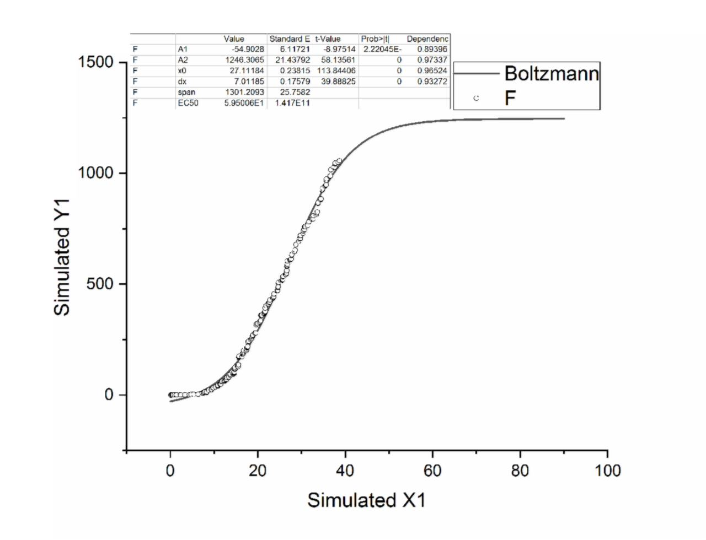

### 1.5 湖南

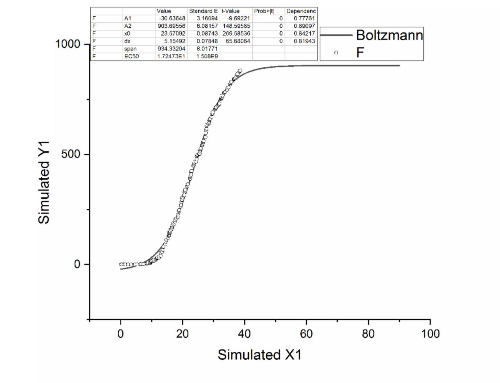

### 1.6 安徽

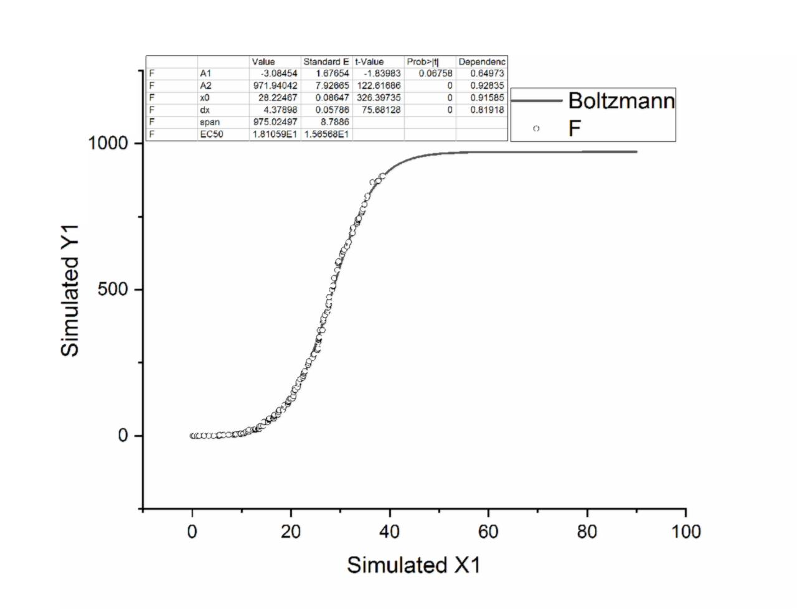

### 1.7 江西

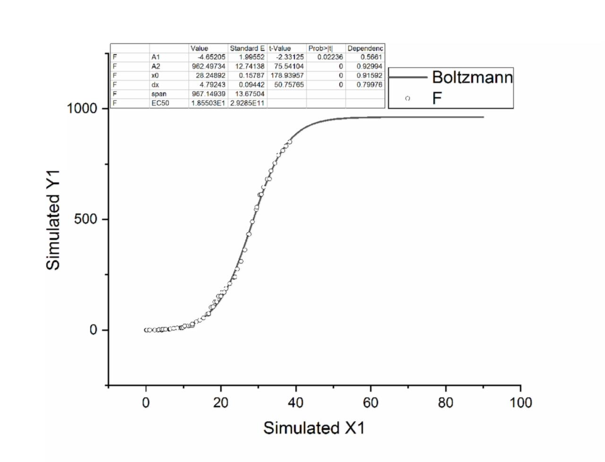

### 1.8 山东

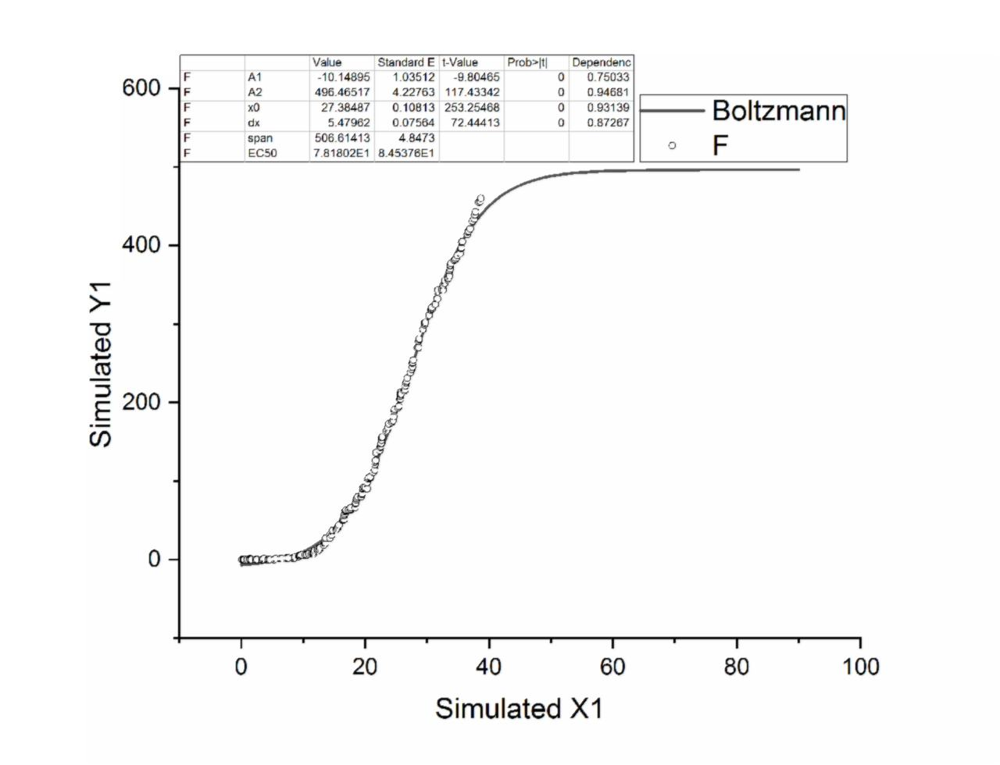

### 1.9 江苏

### 1.10 重庆

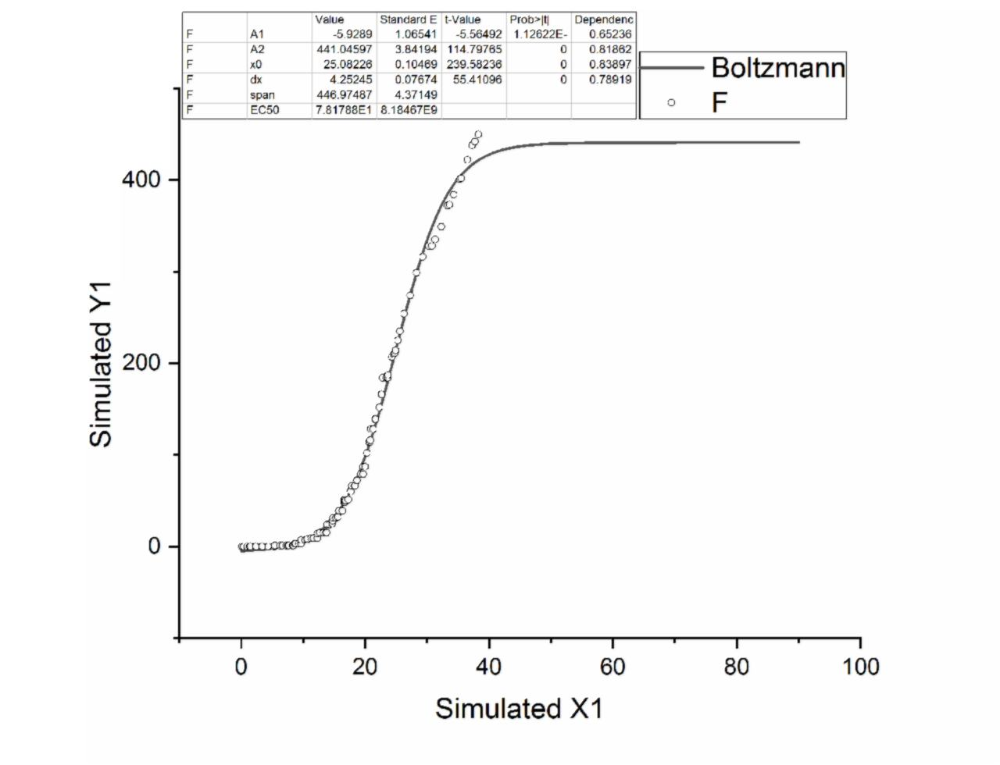

### 1.11 四川

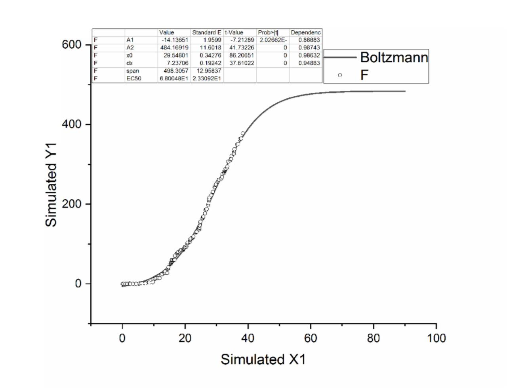

### 1.12 黑龙江

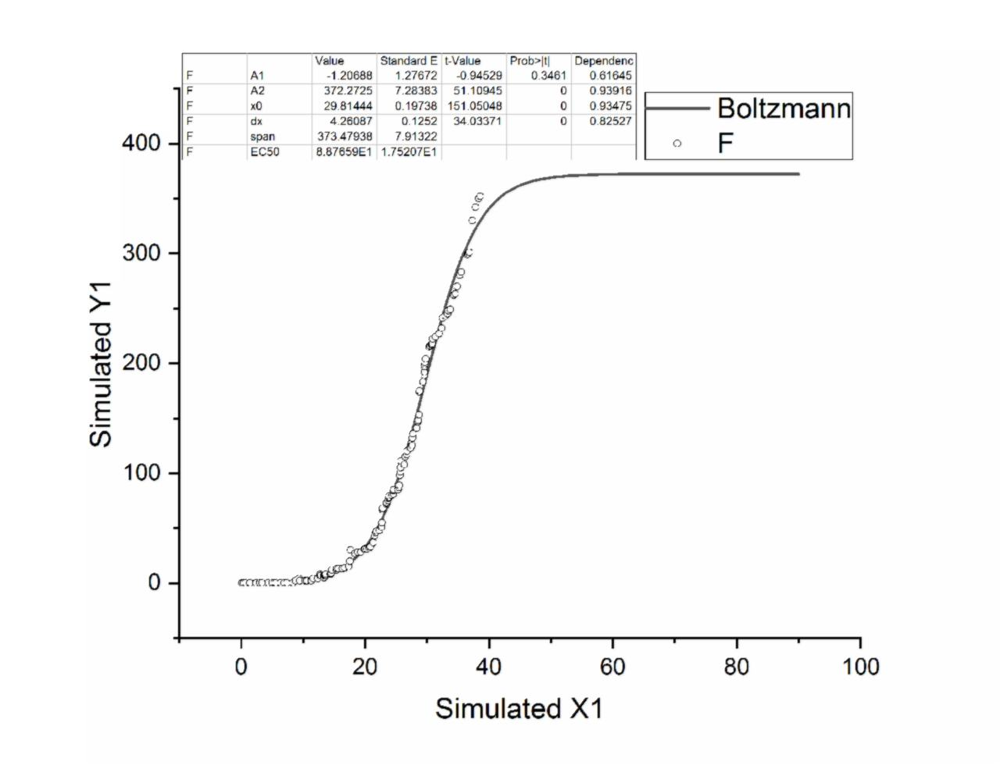

### 1.13 北京

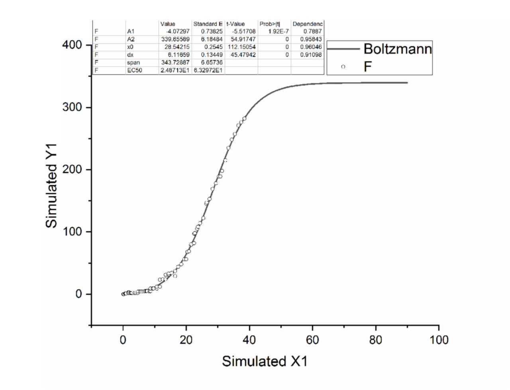

## 2.2003年SARS康复数据的拟合

若担心康复数是否会符合Boltzmann模型，可以借鉴参考下这篇博文[《我们并未吸取教训，中国SARS疫情与天气温度相关性的数据推测分析》](https://zyq5945.github.io/zyq5945/blog_10.html)，或者直接下载其中整理的[Excel数据](https://zyq5945.github.io/zyq5945/data/SARS_China.xlsx)自己分析，下面两图的这些数据起点是2003年04月22日。

以下图形，X坐标均是距离2003年04月22日的天数，Y坐标是康复数。

### 2.1 北京

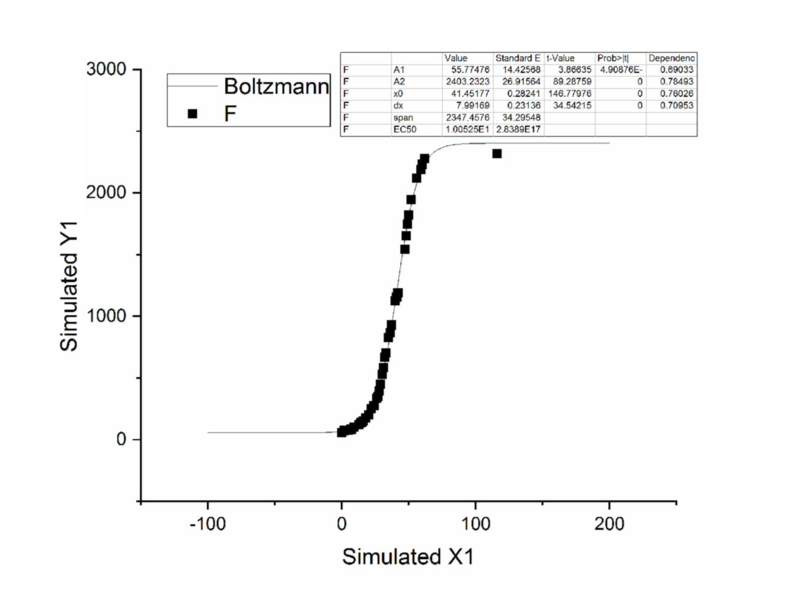

### 2.2 广东

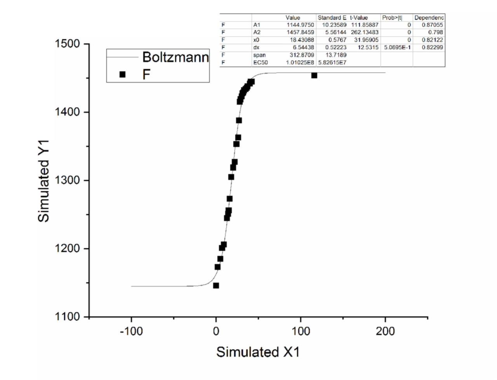

因没有2003年04月22日之前的广东数据，而且拟合的数据也仅仅是广东疫情后期的小部分，所以对前期疫情仿真预测效果很差。

## 3.3 使用OriginLab拟合仿真预测

这里使用OriginLab版本是9.5，其他版本若有不同请自行对应，国外的软件中文版软件容易有BUG，最好是用英文版。

### 3.3.1 新建工程导入疫情数据

#### 3.3.1.1 新建工程

菜单：File-->New-->Project

#### 3.3.1.2 固定项目管理器（选做）

菜单：View-->Project Explorer

选择和固定好Project Explorer

#### 3.3.1.3 导入数据

菜单：File-->Import-->Comma Delimited(CSV)

选择需要导入的多个文件，点击Add File(s)，并使得Show Options Dialog的复选框是选中的，然后点击OK。

点击Import Options前面的+，展开后在Import Options中选择：

1st File Import Mode:Replace Existing Data

Multi—File (except 1st)Import Mode:Start New Books

然后点击OK进行数据导入。

### 3.3.2 对数据进行拟合并获取拟合参数

Project Explorer中双击打开需要进行拟合的数据，选中ParentCuredCount列的需要进行拟合的数据

菜单：Analysis-->Fitting-->Nonlinear Curve Fit-->Open Dialog(CTRL+Y)

Settrings-->Function Selection

Category:Origin Basic Funcitons

Function:Boltzmann

注：本人是个瞎琢磨的初学者，还不知道怎么修改其他参数，若你想要更好的拟合请自行探索修改

点击OK，在输出页面，在Parameters中拷贝Value列的A1，A2，x0和dx参数值

### 3.3.3 使用拟合参数进行数据仿真预测

菜单：Analysis-->Fitting-->Simulate Curve

Category:Origin Basic Funcitons

Function:Boltzmann

在Parameters的A1，A2，x0和dx对应填入刚才拷贝的参数值

在X Data Type的：

X Scale Type:Linear

X Mininum:0

X Maxinum:100

注：X Mininum等于0可以看作2020年1月24日起点，X Maxinum的数值是你要仿真预测从2020年1月24日之后多少天的数据，X Maxinum等于90就是仿真预测到2020年4月23日的疫情。

点击OK按钮就看到仿真预测的曲线图

### 3.3.4 加载真实数据到仿真预测的曲线图中（选做）

Project Explorer中双击打开刚才进行拟合的真实康复数据，再选择刚才生成仿真预测的曲线图

菜单：Graph-->Add Plot to Layer-->Scatter

这样你就看到真实数据在仿真预测的曲线图中的样子了

----

**一些资料数据下载或者查看地址:**

#### [DXY-COVID-19-Data仓库地址](https://github.com/BlankerL/DXY-COVID-19-Data)

#### [DXY-COVID-19-Data-Arrange-CSV的github.com仓库地址](https://github.com/zyq5945/DXY-COVID-19-Data-Arrange-CSV)

[*返回主页*](.)
------------------------------------------------------------------

***
