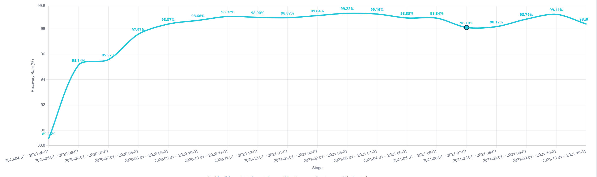

# COVID-19 康复情况的各地区与时段对比

> 🌐 [English Version](blog_16_en.md)

## 1. 环境温度与人体免疫力

本文用数据对比分析各国、各地区 COVID-19 的康复情况。先说一个与疫情无关的普遍规律：同一种疾病在冬天的死亡人数明显多于夏天，这是全球普遍现象，有大量流行病学数据支持（具体数据可联网检索）。由此可以推断：我们的身体对高温的适应性，整体上比对低温更好。

为什么？不妨从环境温度偏离程度、身体能量运用和身体反应三个角度对比一下。

先区分三个概念：环境温度、天气温度和体感温度。

- **环境温度**：人体所处空间的空气温度，用温度计在现场任意位置测得
- **天气温度**：气象站按统一标准测量的空气温度，温度计放在百叶箱内、离地 1.5 米、避光通风处测得
- **体感温度**：身体实际感受到的冷热程度

人体舒适的环境温度区间约为 19~23°C（各家说法略有出入，此处暂取该值）。在这个区间内，人体无需额外消耗能量调节体温，代谢率最低。一旦偏离这个区间，身体就会启动能量调控机制：

---

### 低于舒适区（寒冷）

| 偏离程度 | 能量运用                      | 身体反应                           |
| ---- | ------------------------- | ------------------------------ |
| 轻度偏冷 | 基础代谢率上升 10~30%，优先燃烧棕色脂肪产热 | 皮肤血管收缩（减少散热）、起鸡皮疙瘩（立毛肌收缩）、手脚发凉 |
| 中度偏冷 | 骨骼肌不自主收缩产热（寒战），能量消耗可翻倍    | 寒战、牙齿打颤、动作僵硬、判断力下降             |
| 重度偏冷 | 核心体温下降，身体放弃四肢保内脏，代谢率反而下降  | 意识模糊、瞳孔放大、心律失常，最终器官衰竭          |

**核心逻辑**：身体把能量从"日常活动"转向"产热保温"，代价是消耗糖原和脂肪储备。

---

### 高于舒适区（炎热）

| 偏离程度 | 能量运用                    | 身体反应                         |
| ---- | ----------------------- | ---------------------------- |
| 轻度偏热 | 代谢率略降，能量消耗减少（类似节能模式）    | 皮肤血管扩张（散热）、出汗增加、心跳加速         |
| 中度偏热 | 大量水分和电解质用于蒸发散热，心血管负担加重  | 大量出汗、口渴、疲劳、注意力下降             |
| 重度偏热 | 体温调节中枢紊乱，细胞代谢酶失活，能量产生障碍 | 热痉挛→热衰竭→热射病（核心体温>40°C，多器官损伤） |

**核心逻辑**：身体把能量从"肌肉活动"转向"散热循环"，代价是脱水和电解质流失；一旦散热跟不上产热，代谢本身就会崩溃。

---

### 总结

- 冷：身体"烧油取暖"，越冷烧得越猛，直到烧不动。
- 热：身体"开闸放水"降温，水放干了，引擎就过热熄火。

把上面两条放在一起看，本质就一句话：偏离舒适区越远，身体为维持体温消耗的能量越多。这些能量原本可以留给免疫系统，于是免疫力下降——开头的"冬天死亡率更高"，正是这个机制的宏观表现。

还有一个容易混淆的点需要澄清：真正影响身体的是环境温度，而不是天气预报里的天气温度（湿度、风速、辐射也有影响，但相对次要）。天气温度只能算环境温度的粗略代理。南极科考队就是极端例子：所在地天气温度极低，但营地全天候供暖，环境温度得到极大改善，确诊者几乎都是轻症或无症状，没有重症，也没有死亡报告（唯一的南极死亡案例发生在旅游邮轮上）。这侧面印证了环境温度与免疫力的关联，只是科考队员在统计上属于低风险人群，样本太少，不足以当作可靠证据。

因此我的判断是：同一种疫情毒株，寒冷天气下出现重症的概率更高，温暖天气下出现轻症或无症状的概率更高。这个判断是否成立，要用各国真实数据来检验——下面先说明衡量康复情况的计算方式。

---

## 2. 计算方式

衡量康复情况，最常用的指标是死亡数 ÷ 确诊数（即病死率 CFR）。本文改用一种新的计算方式：

- **阶段康复数** = 阶段结束时的累计康复数 - 阶段开始时的累计康复数
- **阶段死亡数** = 阶段结束时的累计死亡数 - 阶段开始时的累计死亡数
- **阶段总数** = 阶段康复数 + 阶段死亡数
- **阶段康复率** = 阶段康复数 ÷ 阶段总数

其中，阶段康复率的起点有两种取法：

- **全程阶段康复率**：以疫情尚未开始（康复数、死亡数均为 0）为起点计算，用于观察整体康复情况
- **时段阶段康复率**：以某个具体时间为起点计算，用于观察该时段内的康复情况

新旧两种方法的根本区别在于分母是否包含"尚未出结局的病例"，这直接决定了指标的解释力和适用场景。

---

### 旧方法：死亡数 ÷ 确诊数（即病死率 CFR）

**缺点**

- 分母"注水"：确诊数里包含大量还在住院、尚未康复也未死亡的病例。疫情初期这个比例会被严重低估（分母太大）；疫情后期随着存量病例出清，又会突然跳升。
- 混淆"康复"与"死亡"：它只告诉你"死了多少"，没告诉你"好了多少"，无法反映医疗救治的真实效果。
- 时间错配：今天报告的死亡可能来自几周前的确诊，分子分母在时间轴上不对齐。

**优点**

- 简单直观：只需两个累计数字，任何公开疫情通报都能直接算出。
- 实时性强：不需要等待患者出院或死亡，每天都有数据。
- 横向可比：不同地区、不同时间点用同一口径，方便快速对比。

---

### 新方法：阶段康复率 = 阶段康复数 ÷ (阶段康复数 + 阶段死亡数)

**缺点**

- 数据门槛高：需要追踪每个病例的最终结局，很多国家的公开数据并不提供"康复日期"或"阶段性康复数"。
- 阶段划分主观：阶段的起止点怎么定？按周、按月、按疫情波峰？不同切法结果差异很大。
- 样本量波动：如果某个阶段恰好处于疫情低谷期，康复和死亡都很少，算出来的率会剧烈震荡，统计意义有限。
- 康复标准不统一：不同国家/时期对"康复"的定义不同（核酸转阴？症状消失？出院？），跨阶段或跨国比较仍需谨慎。

**优点**

- 只看"已结案"病例：分母只包含有明确结局（康复或死亡）的人，排除了悬而未决的病例，结果更贴近真实的康复/死亡比例。
- 反映医疗质量变化：分阶段计算能捕捉不同时期（如疫苗普及后、新毒株出现后、医疗挤兑期）救治效果的波动。
- 符合流行病学逻辑：本质上是一个"条件概率"，即在已知结局的病例中康复的概率。

---

### 总结

旧方法适合快速感知疫情整体严重程度，但数字会被"未结案病例"扭曲；新方法更适合评估特定时期、特定条件下的医疗救治效果，但对数据质量和阶段设计的要求更高。要做严肃的疫情复盘或医疗质量评估，新方法更可靠；只是日常舆情监测的话，旧方法更实用。另外，新方法也更方便做同地区不同时段、以及不同地区之间的对比。

---

## 3. 全球全程阶段康复率

本节使用 [CSSEGISandData的COVID19](https://github.com/CSSEGISandData/COVID-19) 数据，通过 [HTML5阶段康复率分析工具](https://zyq5945.github.io/StageRecoveryRateAnalyzer/index.html?rf=data/CSSEGISandData_COVID-19_recovered_global.csv&df=data/CSSEGISandData_COVID-19_deaths_global.csv&lang=en&ds=2020-04-01&de=2021-08-01&mode=cumSummary&sort=deathDesc&tsort=rate&tdir=-1&hideIllegal=0&hideInvalid=0&filters={"endDeath":{"min":1,"max":null},"stageRec":{"min":1,"max":null},"total":{"min":10000,"max":null}}) （[代码仓库和使用说明](https://github.com/zyq5945/StageRecoveryRateAnalyzer)）分析。为避免数据太少产生噪音，取阶段康复数不少于 10000、且死亡数不少于 1 的地区，按阶段康复率从大到小排序，并补充其他字段，整理得到下表。

| 区域            | 结束日期       | 阶段恢复     | 阶段死亡   | 阶段总计     | 阶段康复率  | 确诊数      | 置信度     | 经度         | 纬度         | 2020Gdp |
| ------------- | ---------- | -------- | ------ | -------- | ------ | -------- | ------- | ---------- | ---------- | ------- |
| 新加坡           | 2021/8/1   | 62957    | 37     | 62994    | 99.94% | 65102    | 96.76%  | 103.8333   | 1.2833     | 61773   |
| 卡塔尔           | 2021/8/1   | 223849   | 601    | 224450   | 99.73% | 226390   | 99.14%  | 51.1839    | 25.3548    | 51684   |
| 马尔代夫          | 2021/8/1   | 74758    | 221    | 74979    | 99.71% | 77547    | 96.69%  | 73.2207    | 3.2028     | 7394    |
| 阿拉伯联合酋长国（阿联酋） | 2021/8/1   | 659664   | 1951   | 661615   | 99.71% | 682377   | 96.96%  | 53.847818  | 23.424076  | 37992   |
| 蒙古            | 2021/8/1   | 164829   | 716    | 165545   | 99.57% | 166210   | 99.60%  | 103.8467   | 46.8625    | 4001    |
| 塞舌尔           | 2021/8/1   | 17538    | 86     | 17624    | 99.51% | 18362    | 95.98%  | 55.492     | -4.6796    | 14041   |
| 巴林            | 2021/8/1   | 266921   | 1384   | 268305   | 99.48% | 269303   | 99.63%  | 50.55      | 26.0275    | 24343   |
| 科威特           | 2021/8/1   | 385401   | 2328   | 387729   | 99.40% | 398538   | 97.29%  | 47.481766  | 29.31166   | 25236   |
| 加蓬            | 2021/8/1   | 25166    | 164    | 25330    | 99.35% | 25384    | 99.79%  | 11.6094    | -0.8037    | 6606    |
| 科特迪瓦          | 2021/8/1   | 49389    | 330    | 49719    | 99.34% | 50278    | 98.89%  | -5.5471    | 7.54       | 2180    |
| 乌兹别克斯坦        | 2021/8/1   | 123995   | 880    | 124875   | 99.30% | 130216   | 95.90%  | 64.585262  | 41.377491  | 2088    |
| 以色列           | 2021/8/1   | 850839   | 6477   | 857316   | 99.24% | 875801   | 97.89%  | 34.851612  | 31.046051  | 44591   |
| 法国／法属波利尼西亚    | 2021/8/1   | 19206    | 149    | 19355    | 99.23% | 20048    | 96.54%  | 149.4068   | -17.6797   | 39170   |
| 白俄罗斯          | 2021/8/1   | 441369   | 3464   | 444833   | 99.22% | 446998   | 99.52%  | 27.9534    | 53.7098    | 6543    |
| 法国／留尼汪        | 2021/8/1   | 33894    | 275    | 34169    | 99.20% | 37231    | 91.78%  | 55.5364    | -21.1151   | 39170   |
| 古巴            | 2021/8/1   | 348487   | 2845   | 351332   | 99.19% | 394343   | 89.09%  | -77.781167 | 21.521757  | 9605    |
| 丹麦            | 2021/8/1   | 303958   | 2549   | 306507   | 99.17% | 317700   | 96.48%  | 9.5018     | 56.2639    | 60985   |
| 塔吉克斯坦         | 2021/8/1   | 14556    | 122    | 14678    | 99.17% | 15550    | 94.39%  | 71.2761    | 38.861     | 834     |
| 加纳            | 2021/8/1   | 97213    | 823    | 98036    | 99.16% | 103019   | 95.16%  | -1.0232    | 7.9465     | 2195    |
| 安道尔           | 2021/8/1   | 14210    | 128    | 14338    | 99.11% | 14678    | 97.68%  | 1.5218     | 42.5063    | 37361   |
| 佛得角           | 2021/8/1   | 33036    | 298    | 33334    | 99.11% | 33822    | 98.56%  | -23.0418   | 16.5388    | 3539    |
| 土耳其           | 2021/8/1   | 5459899  | 51428  | 5511327  | 99.07% | 5747935  | 95.88%  | 35.2433    | 38.9637    | 8798    |
| 几内亚           | 2021/8/1   | 24242    | 229    | 24471    | 99.06% | 25801    | 94.85%  | -9.6966    | 9.9456     | 1054    |
| 荷兰／阿鲁巴        | 2021/8/1   | 11176    | 110    | 11286    | 99.03% | 11765    | 95.93%  | -69.9683   | 12.5211    | 53468   |
| 荷兰／库拉索        | 2021/8/1   | 12926    | 127    | 13053    | 99.03% | 13669    | 95.49%  | -68.99     | 12.1696    | 53468   |
| 爱沙尼亚          | 2021/8/1   | 128902   | 1272   | 130174   | 99.02% | 133685   | 97.37%  | 25.0136    | 58.5953    | 23934   |
| 马来西亚          | 2021/8/1   | 925963   | 9184   | 935147   | 99.02% | 1130422  | 82.73%  | 101.975766 | 4.210484   | 9958    |
| 多哥            | 2021/8/1   | 14493    | 153    | 14646    | 98.96% | 15870    | 92.29%  | 0.8248     | 8.6195     | 961     |
| 塞浦路斯          | 2021/8/1   | 39061    | 422    | 39483    | 98.93% | 103668   | 38.09%  | 33.4299    | 35.1264    | 28130   |
| 巴布亚新几内亚       | 2021/8/1   | 17324    | 192    | 17516    | 98.90% | 17717    | 98.87%  | 143.95555  | -6.314993  | 2430    |
| 南苏丹           | 2021/8/1   | 10514    | 119    | 10633    | 98.88% | 11049    | 96.23%  | 31.307     | 6.877      | 322     |
| 卢森堡           | 2021/8/1   | 71867    | 822    | 72689    | 98.87% | 73870    | 98.40%  | 6.1296     | 49.8153    | 116860  |
| 约旦河西岸和加沙      | 2021/8/1   | 311918   | 3604   | 315522   | 98.86% | 316861   | 99.58%  | 35.2332    | 31.9522    | 3234    |
| 韩国            | 2021/8/1   | 176605   | 2099   | 178704   | 98.83% | 201002   | 88.91%  | 127.766922 | 35.907757  | 33646   |
| 多米尼加共和国       | 2021/8/1   | 323700   | 3963   | 327663   | 98.79% | 342267   | 95.73%  | -70.1627   | 18.7357    | 7135    |
| 委内瑞拉          | 2021/8/1   | 291556   | 3607   | 295163   | 98.78% | 306673   | 96.25%  | -66.5897   | 6.4238     | 1506    |
| 布基纳法索         | 2021/8/1   | 13369    | 169    | 13538    | 98.75% | 13588    | 99.63%  | -1.5616    | 12.2383    | 825     |
| 伊拉克           | 2021/8/1   | 1472093  | 18734  | 1490827  | 98.74% | 1635993  | 91.13%  | 43.679291  | 33.223191  | 4295    |
| 尼日利亚          | 2021/8/1   | 165005   | 2149   | 167154   | 98.71% | 174315   | 95.89%  | 8.6753     | 9.082      | 2797    |
| 马耳他           | 2021/8/1   | 31843    | 423    | 32266    | 98.69% | 34375    | 93.86%  | 14.3754    | 35.9375    | 31823   |
| 约旦            | 2021/8/1   | 751177   | 10048  | 761225   | 98.68% | 771753   | 98.64%  | 36.51      | 31.24      | 4411    |
| 吉布提           | 2021/8/1   | 11490    | 156    | 11646    | 98.66% | 11652    | 99.95%  | 42.5903    | 11.8251    | 2845    |
| 印度            | 2021/8/1   | 30857467 | 424773 | 31282240 | 98.64% | 31695958 | 98.69%  | 78.96288   | 20.593684  | 1907    |
| 阿曼            | 2021/8/1   | 279892   | 3850   | 283742   | 98.64% | 296835   | 95.59%  | 55.923255  | 21.512583  | 16785   |
| 刚果（布拉柴维尔）     | 2021/8/1   | 12421    | 178    | 12599    | 98.59% | 13186    | 95.55%  | 15.8277    | -0.228     | 1994    |
| 黎巴嫩           | 2021/8/1   | 537111   | 7909   | 545020   | 98.55% | 562527   | 96.89%  | 35.8623    | 33.8547    | 5561    |
| 尼泊尔           | 2021/8/1   | 656197   | 9875   | 666072   | 98.52% | 697370   | 95.51%  | 84.25      | 28.1667    | 1154    |
| 阿塞拜疆          | 2021/8/1   | 333128   | 5027   | 338155   | 98.51% | 344520   | 98.15%  | 47.5769    | 40.1431    | 4230    |
| 哥斯达黎加         | 2021/8/1   | 329639   | 5030   | 334669   | 98.50% | 406814   | 82.27%  | -83.7534   | 9.7489     | 12476   |
| 格鲁吉亚          | 2021/8/1   | 384712   | 5853   | 390565   | 98.50% | 422188   | 92.51%  | 43.3569    | 42.3154    | 4301    |
| 吉尔吉斯斯坦        | 2021/8/1   | 146061   | 2335   | 148396   | 98.43% | 163846   | 90.57%  | 74.766098  | 41.20438   | 1230    |
| 乌拉圭           | 2021/8/1   | 373636   | 5966   | 379602   | 98.43% | 381569   | 99.48%  | -55.7658   | -32.5228   | 15758   |
| 莫桑比克          | 2021/8/1   | 90845    | 1462   | 92307    | 98.42% | 123541   | 74.72%  | 35.5296    | -18.6657   | 462     |
| 斯里兰卡          | 2021/8/1   | 278910   | 4503   | 283413   | 98.41% | 311349   | 91.03%  | 80.771797  | 7.873054   | 3848    |
| 沙特阿拉伯         | 2021/8/1   | 507374   | 8249   | 515623   | 98.40% | 526814   | 97.88%  | 45.079162  | 23.885942  | 24339   |
| 立陶宛           | 2021/8/1   | 269323   | 4412   | 273735   | 98.39% | 283427   | 96.58%  | 23.8813    | 55.1694    | 20429   |
| 巴拿马           | 2021/8/1   | 417137   | 6833   | 423970   | 98.39% | 436475   | 97.14%  | -80.7821   | 8.538      | 13291   |
| 博茨瓦纳          | 2021/8/1   | 95323    | 1569   | 96892    | 98.38% | 106690   | 90.82%  | 24.6849    | -22.3285   | 6323    |
| 黑山            | 2021/8/1   | 99011    | 1630   | 100641   | 98.38% | 102092   | 98.58%  | 19.37439   | 42.708678  | 7555    |
| 埃塞俄比亚         | 2021/8/1   | 263587   | 4390   | 267977   | 98.36% | 280565   | 95.51%  | 40.4897    | 9.145      | 830     |
| 哈萨克斯坦         | 2021/8/1   | 537722   | 9077   | 546799   | 98.34% | 649207   | 84.23%  | 66.9237    | 48.0196    | 8782    |
| 摩洛哥           | 2021/8/1   | 566008   | 9833   | 575841   | 98.29% | 629717   | 91.44%  | -7.0926    | 31.7917    | 3268    |
| 斯洛文尼亚         | 2021/8/1   | 253763   | 4429   | 258192   | 98.28% | 259273   | 99.58%  | 14.9955    | 46.1512    | 25392   |
| 中国／香港         | 2021/8/1   | 11715    | 212    | 11927    | 98.22% | 11987    | 99.50%  | 114.2      | 22.3       | 10627   |
| 日本            | 2021/8/1   | 839090   | 15198  | 854288   | 98.22% | 936852   | 91.19%  | 138.252924 | 36.204824  | 41099   |
| 赞比亚           | 2021/8/1   | 188106   | 3406   | 191512   | 98.22% | 196293   | 97.56%  | 27.849332  | -13.133897 | 952     |
| 卢旺达           | 2021/8/1   | 44856    | 821    | 45677    | 98.20% | 71346    | 64.02%  | 29.8739    | -1.9403    | 803     |
| 利比亚           | 2021/8/1   | 192184   | 3548   | 195732   | 98.19% | 253436   | 77.23%  | 17.228331  | 26.3351    | 6650    |
| 捷克            | 2021/8/1   | 1640599  | 30374  | 1670973  | 98.18% | 1673694  | 99.84%  | 15.473     | 49.8175    | 23473   |
| 法国／法属圭亚那      | 2021/8/1   | 9995     | 185    | 10180    | 98.18% | 30040    | 33.89%  | -53.1258   | 3.9339     | 39170   |
| 菲律宾           | 2021/8/1   | 1506027  | 28016  | 1534043  | 98.17% | 1597689  | 96.02%  | 121.774017 | 12.879721  | 3228    |
| 阿尔巴尼亚         | 2021/8/1   | 130243   | 2457   | 132700   | 98.15% | 133121   | 99.68%  | 20.1683    | 41.1533    | 6028    |
| 拉脱维亚          | 2021/8/1   | 135583   | 2556   | 138139   | 98.15% | 138899   | 99.45%  | 24.6032    | 56.8796    | 17564   |
| 孟加拉国          | 2021/8/1   | 1093266  | 20916  | 1114182  | 98.12% | 1264328  | 88.12%  | 90.3563    | 23.685     | 2249    |
| 葡萄牙           | 2021/8/1   | 903514   | 17369  | 920883   | 98.11% | 970937   | 94.84%  | -8.2245    | 39.3999    | 22299   |
| 柬埔寨           | 2021/8/1   | 70754    | 1420   | 72174    | 98.03% | 77914    | 92.63%  | 104.9167   | 11.55      | 2082    |
| 奥地利           | 2021/8/1   | 643387   | 13138  | 656525   | 98.00% | 654787   | 100.27% | 14.5501    | 47.5162    | 48716   |
| 肯尼亚           | 2021/8/1   | 189131   | 3946   | 193077   | 97.96% | 203680   | 94.79%  | 37.9062    | -0.0236    | 1928    |
| 亚美尼亚          | 2021/8/1   | 219986   | 4619   | 224605   | 97.94% | 230339   | 97.51%  | 45.0382    | 40.0691    | 4269    |
| 科索沃           | 2021/8/1   | 105660   | 2269   | 107929   | 97.90% | 108465   | 99.51%  | 20.902977  | 42.602636  | 4321    |
| 芬兰            | 2021/8/1   | 46000    | 1006   | 47006    | 97.86% | 107866   | 43.58%  | 25.748151  | 61.92411   | 48829   |
| 智利            | 2021/8/1   | 1571788  | 35528  | 1607316  | 97.79% | 1616942  | 99.40%  | -71.543    | -35.6751   | 13118   |
| 巴哈马           | 2021/8/1   | 12606    | 287    | 12893    | 97.77% | 14840    | 86.88%  | -78.035889 | 25.025885  | 26179   |
| 马达加斯加         | 2021/8/1   | 41151    | 943    | 42094    | 97.76% | 42665    | 98.66%  | 46.869107  | -18.766947 | 451     |
| 阿根廷           | 2021/8/1   | 4581132  | 105772 | 4686904  | 97.74% | 4935847  | 94.96%  | -63.6167   | -38.4161   | 8536    |
| 克罗地亚          | 2021/8/1   | 354393   | 8263   | 362656   | 97.72% | 363758   | 99.70%  | 15.2       | 45.1       | 14808   |
| 乌克兰           | 2021/8/1   | 2256053  | 55577  | 2311630  | 97.60% | 2334433  | 99.02%  | 31.1656    | 48.3794    | 3710    |
| 摩尔多瓦          | 2021/8/1   | 252104   | 6255   | 258359   | 97.58% | 259549   | 99.54%  | 28.3699    | 47.4116    | 4376    |
| 巴基斯坦          | 2021/8/1   | 943020   | 23462  | 966482   | 97.57% | 1039695  | 92.96%  | 69.3451    | 30.3753    | 1278    |
| 伯利兹           | 2021/8/1   | 13420    | 337    | 13757    | 97.55% | 14163    | 97.13%  | -88.4976   | 17.1899    | 5239    |
| 德国            | 2021/8/1   | 3654720  | 91637  | 3746357  | 97.55% | 3766765  | 99.46%  | 10.451526  | 51.165691  | 47395   |
| 毛里塔尼亚         | 2021/8/1   | 22406    | 567    | 22973    | 97.53% | 25973    | 88.45%  | -10.9408   | 21.0079    | 1796    |
| 牙买加           | 2021/8/1   | 47001    | 1196   | 48197    | 97.52% | 53237    | 90.53%  | -77.2975   | 18.1096    | 5299    |
| 圭亚那           | 2021/8/1   | 21183    | 541    | 21724    | 97.51% | 22523    | 96.45%  | -58.93018  | 4.860416   | 6776    |
| 哥伦比亚          | 2021/8/1   | 4587754  | 120998 | 4708752  | 97.43% | 4794414  | 98.21%  | -74.2973   | 4.5709     | 5340    |
| 伊朗            | 2021/8/1   | 3385195  | 90996  | 3476191  | 97.38% | 3903519  | 89.05%  | 53.688046  | 32.427908  | 3203    |
| 安哥拉           | 2021/8/1   | 37397    | 1016   | 38413    | 97.36% | 42815    | 89.72%  | 17.8739    | -11.2027   | 1749    |
| 俄罗斯           | 2021/8/1   | 5556831  | 156726 | 5713557  | 97.26% | 6207513  | 92.04%  | 105.318756 | 61.52401   | 10108   |
| 波兰            | 2021/8/1   | 2653807  | 75261  | 2729068  | 97.24% | 2883029  | 94.66%  | 19.1451    | 51.9194    | 16151   |
| 塞内加尔          | 2021/8/1   | 47579    | 1367   | 48946    | 97.21% | 63002    | 77.69%  | -14.4524   | 14.4974    | 1461    |
| 苏里南           | 2021/8/1   | 21770    | 651    | 22421    | 97.10% | 25402    | 88.26%  | -56.0278   | 3.9193     | 4755    |
| 塞尔维亚          | 2020/7/19  | 15564    | 472    | 16036    | 97.06% | 20894    | 76.75%  | 21.0059    | 44.0165    | 8099    |
| 越南            | 2021/8/1   | 43157    | 1306   | 44463    | 97.06% | 157507   | 28.23%  | 108.277199 | 14.058324  | 3534    |
| 意大利           | 2021/8/1   | 4135930  | 128068 | 4263998  | 97.00% | 4355348  | 97.90%  | 12.56738   | 41.87194   | 32091   |
| 巴西            | 2021/8/1   | 17771228 | 557091 | 18328319 | 96.96% | 19942499 | 91.91%  | -51.9253   | -14.235    | 7074    |
| 纳米比亚          | 2021/8/1   | 95913    | 3057   | 98970    | 96.91% | 119285   | 82.97%  | 18.4904    | -22.9576   | 3879    |
| 危地马拉          | 2021/8/1   | 324332   | 10413  | 334745   | 96.89% | 369626   | 90.56%  | -90.2308   | 15.7835    | 4478    |
| 乌干达           | 2021/8/1   | 84052    | 2696   | 86748    | 96.89% | 94195    | 92.09%  | 32.290275  | 1.373333   | 846     |
| 南非            | 2021/8/1   | 2230871  | 72191  | 2303062  | 96.87% | 2456184  | 93.77%  | 22.9375    | -30.5595   | 5581    |
| 罗马尼亚          | 2021/8/1   | 1047767  | 34286  | 1082053  | 96.83% | 1083341  | 99.88%  | 24.9668    | 45.9432    | 13009   |
| 特立尼达和多巴哥      | 2021/8/1   | 31941    | 1084   | 33025    | 96.72% | 38930    | 84.83%  | -61.2225   | 10.6918    | 15284   |
| 印度尼西亚         | 2021/8/1   | 2809538  | 95723  | 2905261  | 96.71% | 3440396  | 84.45%  | 113.9213   | -0.7893    | 3854    |
| 瑞士            | 2021/8/1   | 317600   | 10794  | 328394   | 96.71% | 717665   | 45.76%  | 8.2275     | 46.8182    | 87530   |
| 刚果（金沙萨）       | 2021/8/1   | 29994    | 1038   | 31032    | 96.66% | 49917    | 62.17%  | 21.7587    | -4.0383    | 486     |
| 萨尔瓦多          | 2021/8/1   | 76265    | 2641   | 78906    | 96.65% | 86620    | 91.09%  | -88.8965   | 13.7942    | 3997    |
| 巴拉圭           | 2021/8/1   | 421051   | 15042  | 436093   | 96.55% | 452698   | 96.33%  | -58.4438   | -23.4425   | 5365    |
| 北马其顿          | 2021/8/1   | 150371   | 5493   | 155864   | 96.48% | 156452   | 99.62%  | 21.7453    | 41.6086    | 6660    |
| 阿尔及利亚         | 2021/8/1   | 116009   | 4291   | 120300   | 96.43% | 172564   | 69.71%  | 1.6596     | 28.0339    | 3744    |
| 喀麦隆           | 2021/8/1   | 35261    | 1334   | 36595    | 96.35% | 82064    | 44.59%  | 11.5021    | 3.848      | 1556    |
| 斯威士兰（埃斯瓦蒂尼）   | 2021/8/1   | 21047    | 798    | 21845    | 96.35% | 26220    | 83.31%  | 31.4659    | -26.5225   | 3467    |
| 马里            | 2021/8/1   | 13948    | 533    | 14481    | 96.32% | 14587    | 99.27%  | -3.996166  | 17.570692  | 953     |
| 突尼斯           | 2021/8/1   | 516831   | 20067  | 536898   | 96.26% | 595532   | 90.15%  | 9.537499   | 33.886917  | 3549    |
| 匈牙利           | 2021/8/1   | 748157   | 30026  | 778183   | 96.14% | 809491   | 96.13%  | 19.5033    | 47.1625    | 16387   |
| 澳大利亚／维多利亚州    | 2021/8/1   | 19996    | 820    | 20816    | 96.06% | 20950    | 99.36%  | 144.9631   | -37.8136   | 51983   |
| 马拉维           | 2021/8/1   | 38147    | 1661   | 39808    | 95.83% | 52631    | 75.64%  | 34.3015    | -13.2543   | 603     |
| 玻利维亚          | 2021/8/1   | 408577   | 17839  | 426416   | 95.82% | 473899   | 89.98%  | -63.5887   | -16.2902   | 3581    |
| 海地            | 2021/8/1   | 12961    | 566    | 13527    | 95.82% | 20345    | 66.49%  | -72.2852   | 18.9712    | 1290    |
| 挪威            | 2021/8/1   | 17998    | 799    | 18797    | 95.75% | 137853   | 13.64%  | 8.4689     | 60.472     | 71058   |
| 缅甸            | 2021/8/1   | 213227   | 9731   | 222958   | 95.64% | 302665   | 73.66%  | 95.956     | 21.9162    | 1490    |
| 保加利亚          | 2021/8/1   | 398554   | 18215  | 416769   | 95.63% | 425148   | 98.03%  | 25.4858    | 42.7339    | 10761   |
| 津巴布韦          | 2021/8/1   | 76665    | 3583   | 80248    | 95.54% | 109546   | 73.26%  | 29.154857  | -19.015438 | 2060    |
| 美国            | 2020/12/13 | 6298082  | 302831 | 6600913  | 95.41% | 16441925 | 40.15%  | -100       | 40         | 64465   |
| 斯洛伐克          | 2021/8/1   | 255300   | 12540  | 267840   | 95.32% | 776512   | 34.49%  | 19.699     | 48.669     | 19735   |
| 波斯尼亚和黑塞哥维那    | 2021/8/1   | 189369   | 9687   | 199056   | 95.13% | 205655   | 96.79%  | 17.6791    | 43.9159    | 6130    |
| 中国台湾*         | 2021/8/1   | 12879    | 789    | 13668    | 94.23% | 15688    | 87.12%  | 121        | 23.7       | 28705   |
| 中国／湖北         | 2021/8/1   | 63665    | 4512   | 68177    | 93.38% | 68198    | 99.97%  | 112.2707   | 30.9756    | 10627   |
| 厄瓜多尔          | 2021/8/1   | 443880   | 31634  | 475514   | 93.35% | 487598   | 97.52%  | -78.1834   | -1.8312    | 5464    |
| 埃及            | 2021/8/1   | 230699   | 16528  | 247227   | 93.31% | 284311   | 86.96%  | 30.802498  | 26.820553  | 3511    |
| 洪都拉斯          | 2021/8/1   | 100697   | 7834   | 108531   | 92.78% | 297111   | 36.53%  | -86.2419   | 15.2       | 2308    |
| 阿富汗           | 2021/8/1   | 82586    | 6737   | 89323    | 92.46% | 147501   | 60.56%  | 67.709953  | 33.93911   | 511     |
| 叙利亚           | 2021/8/1   | 21995    | 1916   | 23911    | 91.99% | 25983    | 92.03%  | 38.9968    | 34.8021    | 594     |
| 苏丹            | 2021/8/1   | 30647    | 2776   | 33423    | 91.69% | 37138    | 90.00%  | 30.2176    | 12.8628    | 578     |
| 秘鲁            | 2021/8/1   | 2080424  | 196438 | 2276862  | 91.37% | 2113201  | 107.74% | -75.0152   | -9.19      | 6133    |
| 墨西哥           | 2021/8/1   | 2226594  | 241034 | 2467628  | 90.23% | 2854992  | 86.43%  | -102.5528  | 23.6345    | 8841    |
| 希腊            | 2021/8/1   | 93764    | 12975  | 106739   | 87.84% | 494907   | 21.57%  | 21.8243    | 39.0742    | 17887   |
| 泰国            | 2021/8/1   | 26873    | 4990   | 31863    | 84.34% | 615314   | 5.18%   | 100.992541 | 15.870032  | 6983    |
| 爱尔兰           | 2021/8/1   | 23364    | 5035   | 28399    | 82.27% | 302074   | 9.40%   | -7.6921    | 53.1424    | 86514   |
| 法国            | 2021/8/1   | 342482   | 110874 | 453356   | 75.54% | 6063402  | 7.48%   | 2.2137     | 46.2276    | 39170   |
| 比利时           | 2020/11/11 | 31130    | 13758  | 44888    | 69.35% | 515391   | 8.71%   | 4.469936   | 50.8333    | 45906   |
| 西班牙           | 2021/8/1   | 150376   | 81486  | 231862   | 64.86% | 4447044  | 5.21%   | -3.74922   | 40.463667  | 27234   |
| 英国            | 2020/4/12  | 344      | 19861  | 20205    | 1.70%  | 92885    | 21.75%  | -3.436     | 55.3781    | 40815   |

表中额外增加了确诊数（Confirmed）、置信率（Confidence_Rate）、2020年人均GDP（2020Gdp）三列。置信率 =（康复数 + 死亡数）÷ 确诊数；2020年人均GDP 为各国 2020 年的人均国内生产总值。

### 总结

阶段康复率排名前十的地区中，除蒙古（其 2021-07-31 确诊数大于康复数与死亡数之和，数据疑似有误）外，其余地区的纬度都在 -1° 到 30° 之间，历史天气普遍偏暖或温热。这十个地区又可分成三个梯队：新加坡是第一梯队且独占一档，卡塔尔、马尔代夫、阿联酋是第二梯队，其余地区是第三梯队。前十地区集中在低纬暖区，这与第 1 节的判断方向一致：温暖环境下康复率更高。

新加坡的天气很有特点：根据 [2020-04-01 至 2021-08-01 的历史天气数据](https://archive-api.open-meteo.com/v1/archive?latitude=1.2833&longitude=103.8333&start_date=2020-04-01&end_date=2021-08-01&daily=temperature_2m_max,temperature_2m_min&timezone=auto)，当地最低温在 22.9°C 到 27.5°C 之间，最高温在 24.6°C 到 33.7°C 之间。新加坡国土面积小，全国温差通常只有 1~3°C，单点气温基本可以代表全国（大国很难做到这一点）。

---

## 4. 全球寒热时段阶段康复率

上面比较的是各地区之间的整体差异（横向维度）；这里换成时段维度，看同一地区冬夏两个时段的变化。

本节使用 [CSSEGISandData的COVID19](https://github.com/CSSEGISandData/COVID-19) 数据，选取温度变化较大、数据量也较大的地区，通过 [HTML5阶段康复率分析工具](https://zyq5945.github.io/StageRecoveryRateAnalyzer/index.html?rf=data/CSSEGISandData_COVID-19_recovered_global.csv&df=data/CSSEGISandData_COVID-19_deaths_global.csv&lang=en&ds=2020-04-01&de=2021-08-01&mode=twostage&fs=2020-06-01&fe=2020-09-01&ss=2020-12-01&se=2021-03-01&sort=original&tsort=region&tdir=0&hideIllegal=0&hideInvalid=0&filters={"stageRec":{"min":1,"max":null},"stageDeath":{"min":1,"max":null},"total":{"min":3000,"max":null}}) 分析。为避免数据太少产生噪音，取阶段康复数不少于 3000、康复数和死亡数均不少于 1、2020 年人均 GDP 大于 8000 美元的地区；以 2020-06-01 至 2020-09-01 为第一组对照、2020-12-01 至 2021-03-01 为第二组对照，只保留两组对照都有康复率的地区，按纬度从大到小排序（|纬度| ≥ 35°），再补充其他字段，整理得到下表。

| 区域    | 开始日期      | 开始恢复数   | 开始死亡数 | 结束日期     | 结束恢复    | 结束死亡数 | 阶段恢复数   | 阶段死亡数 | 阶段总计    | 阶段康复率  | 康复率变化  | 确诊数     | 置信度    | 经度         | 纬度        | 2020GDP | 预期    |
| ----- | --------- | ------- | ----- | -------- | ------- | ----- | ------- | ----- | ------- | ------ | ------ | ------- | ------ | ---------- | --------- | ------- | ----- |
| 俄罗斯   | 2020/6/1  | 175514  | 4849  | 2020/9/1 | 813603  | 17250 | 638089  | 12401 | 650490  | 98.09% | —      | 997072  | 83.33% | 105.318756 | 61.52401  | 10108   | —     |
| 俄罗斯   | 2020/12/1 | 1787962 | 40050 | 2021/3/1 | 3780195 | 85025 | 1992233 | 44975 | 2037208 | 97.79% | -0.30% | 4209850 | 91.81% | 105.318756 | 61.52401  | 10108   | TRUE  |
| 丹麦    | 2020/6/1  | 10412   | 576   | 2020/9/1 | 15300   | 625   | 4888    | 49    | 4937    | 99.01% | —      | 17084   | 93.22% | 9.5018     | 56.2639   | 60985   | —     |
| 丹麦    | 2020/12/1 | 64757   | 846   | 2021/3/1 | 202517  | 2365  | 137760  | 1519  | 139279  | 98.91% | -0.10% | 211692  | 96.78% | 9.5018     | 56.2639   | 60985   | TRUE  |
| 波兰    | 2020/6/1  | 11449   | 1074  | 2020/9/1 | 47030   | 2058  | 35581   | 984   | 36565   | 97.31% | —      | 67922   | 72.27% | 19.1451    | 51.9194   | 16151   | —     |
| 波兰    | 2020/12/1 | 597589  | 17599 | 2021/3/1 | 1430861 | 43793 | 833272  | 26194 | 859466  | 96.95% | -0.36% | 1711772 | 86.15% | 19.1451    | 51.9194   | 16151   | TRUE  |
| 德国    | 2020/6/1  | 165632  | 8511  | 2020/9/1 | 218403  | 9302  | 52771   | 791   | 53562   | 98.52% | —      | 243599  | 93.48% | 10.451526  | 51.165691 | 47395   | —     |
| 德国    | 2020/12/1 | 769380  | 16636 | 2021/3/1 | 2260719 | 70105 | 1491339 | 53469 | 1544808 | 96.54% | -1.98% | 2447068 | 95.25% | 10.451526  | 51.165691 | 47395   | TRUE  |
| 捷克    | 2020/6/1  | 6642    | 321   | 2020/9/1 | 18116   | 425   | 11474   | 104   | 11578   | 99.10% | —      | 25117   | 73.82% | 15.473     | 49.8175   | 23473   | —     |
| 捷克    | 2020/12/1 | 455177  | 8407  | 2021/3/1 | 1070622 | 20469 | 615445  | 12062 | 627507  | 98.08% | -1.02% | 1240051 | 87.99% | 15.473     | 49.8175   | 23473   | TRUE  |
| 哈萨克斯坦 | 2020/6/1  | 5587    | 41    | 2020/9/1 | 102962  | 1878  | 97375   | 1837  | 99212   | 98.15% | —      | 131596  | 79.67% | 66.9237    | 48.0196   | 8782    | —     |
| 哈萨克斯坦 | 2020/12/1 | 148043  | 2477  | 2021/3/1 | 240302  | 3389  | 92259   | 912   | 93171   | 99.02% | 0.87%  | 263396  | 92.52% | 66.9237    | 48.0196   | 8782    | FALSE |
| 奥地利   | 2020/6/1  | 15596   | 741   | 2020/9/1 | 23565   | 903   | 7969    | 162   | 8131    | 98.01% | —      | 27354   | 89.45% | 14.5501    | 47.5162   | 48716   | —     |
| 奥地利   | 2020/12/1 | 227497  | 4205  | 2021/3/1 | 432016  | 10464 | 204519  | 6259  | 210778  | 97.03% | -0.98% | 454870  | 97.28% | 14.5501    | 47.5162   | 48716   | TRUE  |
| 瑞士    | 2020/6/1  | 28500   | 1796  | 2020/9/1 | 36300   | 1848  | 7800    | 52    | 7852    | 99.34% | —      | 42393   | 89.99% | 8.2275     | 46.8182   | 87530   | —     |
| 瑞士    | 2020/12/1 | 250200  | 5160  | 2021/3/1 | 317600  | 10027 | 67400   | 4867  | 72267   | 93.27% | -6.07% | 557492  | 58.77% | 8.2275     | 46.8182   | 87530   | TRUE  |
| 法国    | 2020/6/1  | 66120   | 28780 | 2020/9/1 | 73727   | 30525 | 7607    | 1745  | 9352    | 81.34% | —      | 309247  | 33.71% | 2.2137     | 46.2276   | 39170   | —     |
| 法国    | 2020/12/1 | 141558  | 53158 | 2021/3/1 | 231815  | 86347 | 90257   | 33189 | 123446  | 73.11% | -8.23% | 3736390 | 8.52%  | 2.2137     | 46.2276   | 39170   | TRUE  |
| 罗马尼亚  | 2020/6/1  | 13426   | 1276  | 2020/9/1 | 38454   | 3681  | 25028   | 2405  | 27433   | 91.23% | —      | 88593   | 47.56% | 24.9668    | 45.9432   | 13009   | —     |
| 罗马尼亚  | 2020/12/1 | 360934  | 11530 | 2021/3/1 | 741471  | 20403 | 380537  | 8873  | 389410  | 97.72% | 6.49%  | 804090  | 94.75% | 24.9668    | 45.9432   | 13009   | FALSE |
| 克罗地亚  | 2020/6/1  | 2077    | 103   | 2020/9/1 | 7735    | 187   | 5658    | 84    | 5742    | 98.54% | —      | 10414   | 76.07% | 15.2       | 45.1      | 14808   | —     |
| 克罗地亚  | 2020/12/1 | 108231  | 1861  | 2021/3/1 | 234635  | 5537  | 126404  | 3676  | 130080  | 97.17% | -1.37% | 243064  | 98.81% | 15.2       | 45.1      | 14808   | TRUE  |
| 保加利亚  | 2020/6/1  | 1090    | 140   | 2020/9/1 | 11615   | 642   | 10525   | 502   | 11027   | 95.45% | —      | 16454   | 74.49% | 25.4858    | 42.7339   | 10761   | —     |
| 保加利亚  | 2020/12/1 | 53000   | 4188  | 2021/3/1 | 206630  | 10308 | 153630  | 6120  | 159750  | 96.17% | 0.72%  | 249626  | 86.91% | 25.4858    | 42.7339   | 10761   | FALSE |
| 意大利   | 2020/6/1  | 158355  | 33475 | 2020/9/1 | 207944  | 35491 | 49589   | 2016  | 51605   | 96.09% | —      | 270189  | 90.10% | 12.56738   | 41.87194  | 32091   | —     |
| 意大利   | 2020/12/1 | 784595  | 56361 | 2021/3/1 | 2416093 | 97945 | 1631498 | 41584 | 1673082 | 97.51% | 1.42%  | 2938371 | 85.56% | 12.56738   | 41.87194  | 32091   | FALSE |
| 葡萄牙   | 2020/6/1  | 19552   | 1424  | 2020/9/1 | 42104   | 1824  | 22552   | 400   | 22952   | 98.26% | —      | 58243   | 75.42% | -8.2245    | 39.3999   | 22299   | —     |
| 葡萄牙   | 2020/12/1 | 220877  | 4577  | 2021/3/1 | 720235  | 16351 | 499358  | 11774 | 511132  | 97.70% | -0.56% | 804956  | 91.51% | -8.2245    | 39.3999   | 22299   | TRUE  |
| 希腊    | 2020/6/1  | 1374    | 179   | 2020/9/1 | 6486    | 271   | 5112    | 92    | 5204    | 98.23% | —      | 10524   | 64.21% | 21.8243    | 39.0742   | 17887   | —     |
| 希腊    | 2020/12/1 | 23074   | 2517  | 2021/3/1 | 93764   | 6534  | 70690   | 4017  | 74707   | 94.62% | -3.61% | 192270  | 52.17% | 21.8243    | 39.0742   | 17887   | TRUE  |
| 土耳其   | 2020/6/1  | 128947  | 4563  | 2020/9/1 | 245929  | 6417  | 116982  | 1854  | 118836  | 98.44% | —      | 271705  | 92.87% | 35.2433    | 38.9637   | 8798    | —     |
| 土耳其   | 2020/12/1 | 409320  | 13936 | 2021/3/1 | 2578181 | 28638 | 2168861 | 14702 | 2183563 | 99.33% | 0.89%  | 2711479 | 96.14% | 35.2433    | 38.9637   | 8798    | FALSE |
| 日本    | 2020/6/1  | 14463   | 900   | 2020/9/1 | 57503   | 1314  | 43040   | 414   | 43454   | 99.05% | —      | 69018   | 85.22% | 138.252924 | 36.204824 | 41099   | —     |
| 日本    | 2020/12/1 | 125304  | 2193  | 2021/3/1 | 410448  | 7948  | 285144  | 5755  | 290899  | 98.02% | -1.03% | 433334  | 96.55% | 138.252924 | 36.204824 | 41099   | TRUE  |
| 韩国    | 2020/6/1  | 10446   | 272   | 2020/9/1 | 15356   | 326   | 4910    | 54    | 4964    | 98.91% | —      | 20449   | 76.69% | 127.766922 | 35.907757 | 33646   | —     |
| 韩国    | 2020/12/1 | 28065   | 526   | 2021/3/1 | 81338   | 1606  | 53273   | 1080  | 54353   | 98.01% | -0.90% | 90372   | 91.78% | 127.766922 | 35.907757 | 33646   | TRUE  |
| 智利    | 2020/6/1  | 44946   | 1113  | 2020/9/1 | 385790  | 11321 | 340844  | 10208 | 351052  | 97.09% | —      | 413145  | 96.12% | -71.543    | -35.6751  | 13118   | —     |
| 智利    | 2020/12/1 | 528034  | 15430 | 2021/3/1 | 784213  | 20660 | 256179  | 5230  | 261409  | 98.00% | 0.91%  | 829770  | 97.00% | -71.543    | -35.6751  | 13118   | TRUE  |
| 阿根廷   | 2020/6/1  | 5521    | 556   | 2020/9/1 | 308376  | 8919  | 302855  | 8363  | 311218  | 97.31% | —      | 428239  | 74.09% | -63.6167   | -38.4161  | 8536    | —     |
| 阿根廷   | 2020/12/1 | 1263251 | 38928 | 2021/3/1 | 1911338 | 52077 | 648087  | 13149 | 661236  | 98.01% | 0.70%  | 2112023 | 92.96% | -63.6167   | -38.4161  | 8536    | TRUE  |

表中又额外增加了 0301-0901康复率（0301-0901Recovery Rate）、期望值（Expectation）两列。0301-0901康复率是同一地区第二组对照组的康复率减去第一组对照组的康复率得到的差值；期望值为 TRUE 表示符合"冬天康复差于夏天"的预期。

### 总结

共有 20 个地区作为对照，其中北半球 18 个、南半球 2 个。结果：南半球 2 个均符合"冬天康复差于夏天"；北半球 13 个符合、5 个不符合（原因暂时未知）；法国虽符合，但其 2021-03-01 的置信率存疑。

---

## 5. 印度数据

全球整体对比之外，再看一个特殊情况——印度。

### 5.1 印度按月各州的时段阶段康复率

印度各州数据来自 [covid19india的COVID19](https://github.com/covid19india/data)，用 [HTML5阶段康复率分析工具](https://zyq5945.github.io/StageRecoveryRateAnalyzer/index.html?rf=data/covid19india_states_Recovered.csv&df=data/covid19india_states_Deaths.csv&lang=en&ds=2020-04-01&mode=interval&interval=1&sort=deathDesc&tsort=region&tdir=0&hideIllegal=0&hideInvalid=0) 按月统计各州的时段阶段康复率。

| 区域  | 开始日期      | 开始恢复数    | 开始死亡数  | 结束日期       | 结束恢复     | 结束死亡数  | 阶段恢复数    | 阶段死亡数  | 阶段总计     | 阶段康复率  | 确诊数      | 置信度    |
| --- | --------- | -------- | ------ | ---------- | -------- | ------ | -------- | ------ | -------- | ------ | -------- | ------ |
| 印度  | 2020/4/1  | 169      | 58     | 2020/5/1   | 10021    | 1231   | 9852     | 1173   | 11025    | 89.36% | 37263    | 30.20% |
| 印度  | 2020/5/1  | 10021    | 1231   | 2020/6/1   | 95744    | 5606   | 85723    | 4375   | 90098    | 95.14% | 198372   | 51.09% |
| 印度  | 2020/6/1  | 95744    | 5606   | 2020/7/1   | 359905   | 17848  | 264161   | 12242  | 276403   | 95.57% | 605221   | 62.42% |
| 印度  | 2020/7/1  | 359905   | 17848  | 2020/8/1   | 1146917  | 37410  | 787012   | 19562  | 806574   | 97.57% | 1752171  | 67.59% |
| 印度  | 2020/8/1  | 1146917  | 37410  | 2020/9/1   | 2899528  | 66462  | 1752611  | 29052  | 1781663  | 98.37% | 3766110  | 78.75% |
| 印度  | 2020/9/1  | 2899528  | 66462  | 2020/10/1  | 5348746  | 99807  | 2449218  | 33345  | 2482563  | 98.66% | 6392051  | 85.24% |
| 印度  | 2020/10/1 | 5348746  | 99807  | 2020/11/1  | 7542905  | 122642 | 2194159  | 22835  | 2216994  | 98.97% | 8229324  | 93.15% |
| 印度  | 2020/11/1 | 7542905  | 122642 | 2020/12/1  | 8931803  | 138160 | 1388898  | 15518  | 1404416  | 98.90% | 9499730  | 95.48% |
| 印度  | 2020/12/1 | 8931803  | 138160 | 2021/1/1   | 9905570  | 149255 | 973767   | 11095  | 984862   | 98.87% | 10306471 | 97.56% |
| 印度  | 2021/1/1  | 9905570  | 149255 | 2021/2/1   | 10447450 | 154522 | 541880   | 5267   | 547147   | 99.04% | 10767208 | 98.47% |
| 印度  | 2021/2/1  | 10447450 | 154522 | 2021/3/1   | 10797040 | 157286 | 349590   | 2764   | 352354   | 99.22% | 11124327 | 98.47% |
| 印度  | 2021/3/1  | 10797040 | 157286 | 2021/4/1   | 11522884 | 163428 | 725844   | 6142   | 731986   | 99.16% | 12302115 | 94.99% |
| 印度  | 2021/4/1  | 11522884 | 163428 | 2021/5/1   | 15981938 | 215524 | 4459054  | 52096  | 4511150  | 98.85% | 19549772 | 82.85% |
| 印度  | 2021/5/1  | 15981938 | 215524 | 2021/6/1   | 26171147 | 335116 | 10189209 | 119592 | 10308801 | 98.84% | 28307035 | 93.64% |
| 印度  | 2021/6/1  | 26171147 | 335116 | 2021/7/1   | 29540895 | 400346 | 3369748  | 65230  | 3434978  | 98.10% | 30457549 | 98.30% |
| 印度  | 2021/7/1  | 29540895 | 400346 | 2021/8/1   | 30849685 | 424807 | 1308790  | 24461  | 1333251  | 98.17% | 31695370 | 98.67% |
| 印度  | 2021/8/1  | 30849685 | 424807 | 2021/9/1   | 32021420 | 439561 | 1171735  | 14754  | 1186489  | 98.76% | 32856721 | 98.80% |
| 印度  | 2021/9/1  | 32021420 | 439561 | 2021/10/1  | 33061004 | 448605 | 1039584  | 9044   | 1048628  | 99.14% | 33789420 | 99.17% |
| 印度  | 2021/10/1 | 33061004 | 448605 | 2021/10/31 | 33661339 | 458470 | 600335   | 9865   | 610200   | 98.38% | 34285612 | 99.52% |

数据太多，这里只展示印度总体情况。疫情初期各州康复率普遍不理想；中后期 2021-06-01 至 2021-07-01、2021-07-01 至 2021-08-01 这两个时段最差。

### 5.2 印度按月各地区的时段阶段康复率

各地区（districts）数据同样来自 [covid19india的COVID19](https://github.com/covid19india/data)，用 [HTML5阶段康复率分析工具](https://zyq5945.github.io/StageRecoveryRateAnalyzer/index.html?rf=data/covid19india_districts_Recovered.csv&df=data/covid19india_districts_Deaths.csv&lang=en&ds=2020-05-01&mode=interval&interval=1&sort=deathDesc&tsort=region&tdir=0&hideIllegal=0&hideInvalid=0) 按月统计各地区（districts）的时段阶段康复率。

数据太多，如需查看，请点击上面的链接自行分析。

### 总结

印度每年都有高温致死的记录，夏季普遍处于第 1 节所说的"重度偏热"水平；加上人均 GDP 偏低，多数家庭难以通过空调等改善室内环境温度。疫情叠加在这个基础上，反映在数据上，就是不少地区夏天的阶段康复率明显变差。

---

## 6. 南极洲的新冠疫情

第 1 节提到的南极科考队案例，细节可参考以下链接：

<https://en.wikipedia.org/wiki/COVID-19_pandemic_in_Antarctica>

<https://www.wikiwand.com/en/COVID-19_pandemic_in_Antarctica>

数据是否真实有效，未做考证，姑且一观吧。

---

## 7. 结论

回到开头的问题：温度是否影响 COVID-19 的康复情况？整体来看，[CSSEGISandData的COVID19](https://github.com/CSSEGISandData/COVID-19)（截至 2021-08-01）和 [covid19india的COVID19](https://github.com/covid19india/data)（截至 2021-10-31）的数据都支持这一判断：第 3 节中全程康复率排名前十的地区几乎都集中在低纬度、天气偏暖的区域；第 4 节的冬夏对照中，北半球 13 个、南半球 2 个地区都呈现"冬天康复差于夏天"的规律，与第 1 节的判断方向一致。

当然也有解释不了的地方：北半球有 5 个地区不符合冬夏规律，原因暂时未知；法国虽符合但数据存疑；南极案例样本太少，只能算旁证。此外，第 5 节的印度补上了过热方向的数据：极端高温同样让康复率变差，这印证了第 1 节的机制——温度与康复不是线性关系，舒适区附近最好，过冷过热都会拖累康复。

所以更准确的结论是：温度是影响康复情况的因素之一，但不是唯一因素——医疗条件、数据口径、人群结构都会起作用。本文用"阶段康复率"这个指标做了一次尝试性对比，指标本身也有局限（依赖数据质量、阶段划分主观）。要得出更可靠的结论，还需要更大样本和更严谨的统计来验证。
