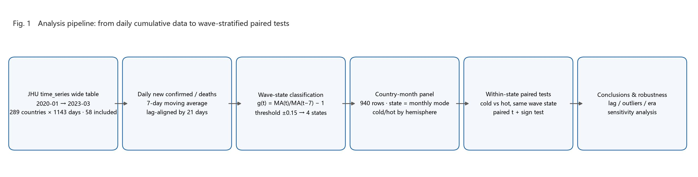
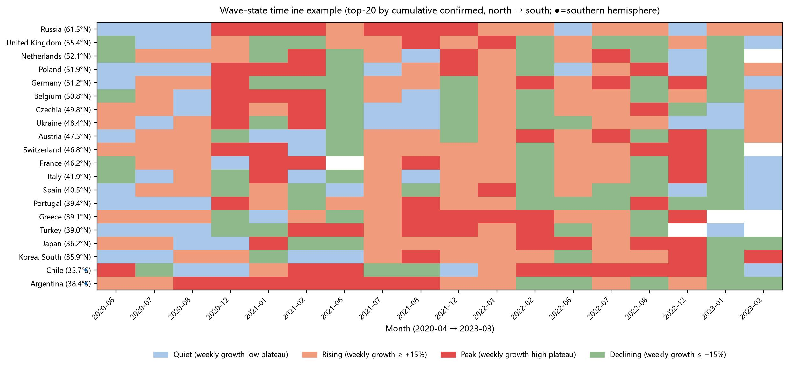
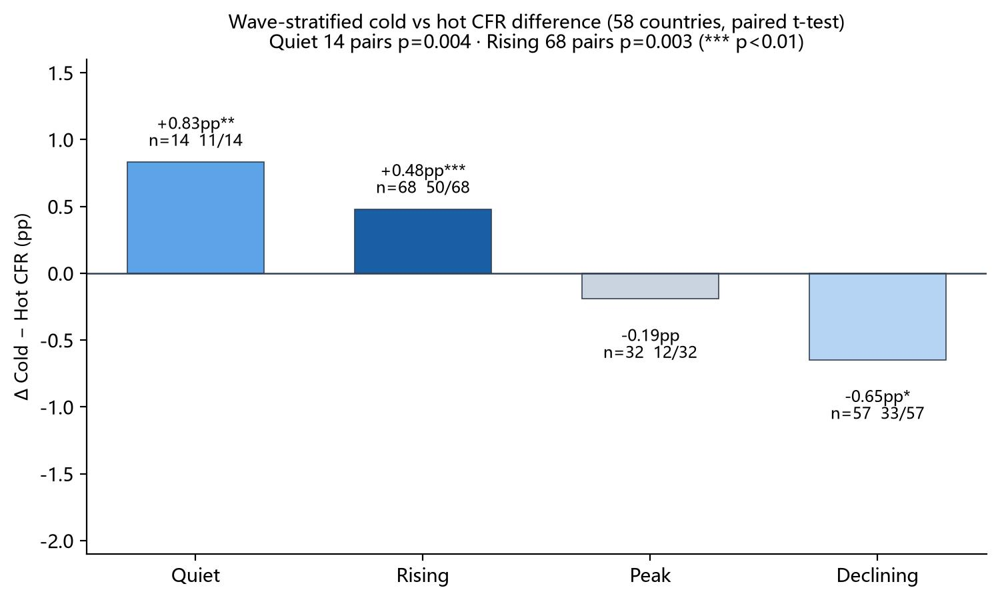
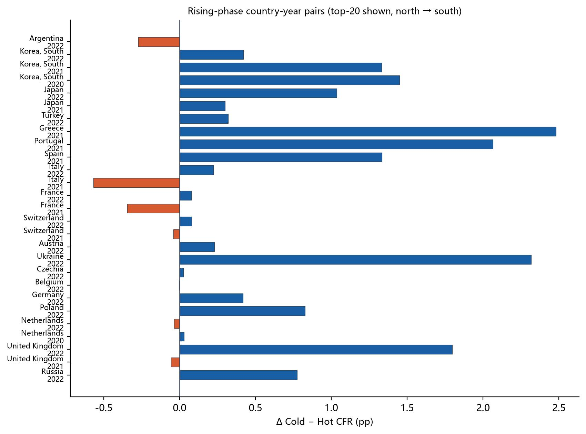
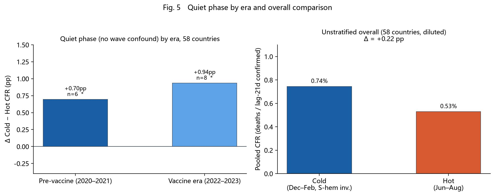

# **The Seasonal Signal Drowned Out by Waves: Stratified Evidence for Higher Cold-Season COVID-19 Fatality (2020–2023)**

If you lump all phases of the pandemic together, winter and summer mortality look almost identical. But if you compare only the phase when an outbreak is "just starting to climb," winter mortality is indeed about 0.3 to 0.5 percentage points higher than summer. This is probably not because cold air makes the virus stronger, but because winter spreads faster and hospitals get overwhelmed.

---

## 1. Why study this?

People intuitively associate winter with getting sick — colds and flu both peak when it's cold. What about COVID-19? Is the risk of dying after infection also higher in winter?

The question looks simple but is genuinely hard to answer, because of three pitfalls:

The first pitfall: the timing doesn't line up.
A person confirmed today might not die for two or three weeks. If you divide January's deaths by January's confirmed cases, the denominator is full of people who were just confirmed and haven't reached their outcome yet — the numbers get distorted. It's like dividing today's new enrollment by today's graduates; the timing doesn't match.

The second pitfall: the pandemic has waves.
From 2020 to 2022, COVID-19 went through several major waves — the original strain, Alpha, Delta, and Omicron. And the Northern Hemisphere's winter happened to coincide with the arrival of new variants each time. So when you see "winter mortality is higher," is it the cold, or is it just that a new variant happened to arrive in winter? The two are entangled and hard to separate.

The third pitfall: testing policies kept changing across countries.
Early on, testing was large-scale screening; later, many countries switched to "test only if symptomatic." Less testing means fewer confirmed cases, so the denominator of your "mortality rate" shrinks and the number naturally rises — but that doesn't mean the virus got stronger.

So, to answer "is winter more dangerous," you have to resolve these three problems first.

---

## 2. How did we study it?

### 2.1 Data source

We used the Johns Hopkins University public global COVID-19 database, covering January 2020 to March 2023. The analysis sample is 59 countries — mostly high-latitude countries (latitude ≥ 35°, covering continental Europe, the Balkans, Northern Europe, Central Asia, and East Asia; Canada was excluded due to missing data), plus Argentina, Chile, and New Zealand from the Southern Hemisphere. Iceland, after stratification by monthly wave stage, never had winter and summer months fall in the same wave stage, so no valid winter-summer pairing could be formed; it therefore dropped out of the stratified paired analysis automatically, leaving 58 countries in the stratified comparison (that is, a 59-country panel but 58-country pairing, referred to below as the "58-country paired sample"). For readability, Figures 2 and 4 show only the 20 countries with the most cumulative confirmed cases (each above 4.4 million). All statistical results in the text are based on the full 59-country panel (58 countries for the paired statistics).

### 2.2 Key metric: aligning the timing of "deaths/confirmed"

Since there is a two-to-three-week lag from confirmation to death, we pair deaths with the confirmed cases from three weeks earlier. For example, when computing January 2021 mortality, the denominator uses confirmed cases from mid-December 2020 to early January. That way the numerator and denominator line up in time.

To remove day-to-day random noise (e.g., fewer tests on weekends, catch-up reporting on Mondays), we first applied a 7-day rolling average — averaging each consecutive 7-day window smooths the curve.

### 2.3 Splitting the pandemic into four "stages"

This is the most important part of our method. Based on how fast daily new cases are changing, we cut the pandemic into four states:

| Stage   | What it means                                           | Analogy                                                         |
| ------- | ------------------------------------------------------- | --------------------------------------------------------------- |
| Rising  | Cases increasing fast, this week up >15% over last week | The flood is rising, the water level climbing faster and faster |
| Peak    | Cases holding at a high level, little change            | The flood has reached its highest point and holds steady        |
| Falling | Cases dropping fast, this week down >15% over last week | The flood is receding                                           |
| Quiet   | Cases very low, little fluctuation                      | Calm seas                                                       |

Which stage each month belongs to is determined by which category most of its days fall into.

Why split into stages?
Imagine you want to compare "running in winter" vs "running in summer" and which is more tiring. If you mix "just starting to run" (rising) with "already exhausted after ten kilometers" (peak), the conclusion will be a mess. The pandemic is the same — in the rising stage hospitals are filling with patients, at the peak they are already overwhelmed, and in the falling stage patients are declining. Only by comparing winter and summer within the same stage is the comparison fair.

### 2.4 How do we compare "winter" and "summer"?

- Northern Hemisphere (France, Germany, Japan, etc. — 56 countries): winter = Dec, Jan, Feb; summer = Jun, Jul, Aug
- Southern Hemisphere (Argentina, Chile, New Zealand): seasons reversed, winter = Jun–Aug, summer = Dec–Feb

For the same country and the same year, we take its winter mortality and summer mortality and compare them one-to-one. This compares "same place, same year," ruling out the confounding effect of cross-country differences in healthcare.

### 2.5 What a few key numbers mean

Several metrics recur below, so let me explain them here:

- "How much higher is winter than summer" (Δ): winter mortality minus summer mortality. E.g., winter 2%, summer 1.5%, so Δ = +0.5 percentage points.
- "Median Δ": sort all the country/year differences and take the middle one. Why the median? Because occasionally there are extremes (e.g., an anomalous year for some country), and the median is less easily dragged by outliers, better representing the "typical" case.
- "Cold higher": e.g., "50/68" means that among 68 country-year pairings, 50 had higher winter mortality. This proportion tells us whether "winter is more dangerous" is a general phenomenon or just a quirk of a few countries.
- "p-value": roughly "how likely this result is just coincidence." Generally, p < 0.05 means unlikely to be coincidence and trustworthy; p between 0.05 and 0.10 is "marginally significant," meaning a trend exists but the evidence is not especially strong.

Statistical conventions (important):

- Each country-year's winter/summer mortality = sum of deaths across all months in that season ÷ sum of lagged confirmed cases (weighted by case volume), not a simple average;
- All p-values are from paired two-tailed t-tests (t-distribution) — consistent with common statistical software (e.g., Python's `scipy.stats.ttest_rel`); using a sign test or a one-tailed test would shift the p-values slightly, but the main conclusions hold;
- "Median winter/summer mortality" and "median paired difference (Δ)" are two different quantities: the former takes the median over all winters and all summers separately, the latter computes the difference for each country-year first and then takes the median. The two need not be equal and should not be directly subtracted from each other.

---

## 3. What did we find?

### 3.1 Timeline of pandemic stages

The figure below takes the top-20 countries by confirmed cases as an example (mainly because too much data looks cluttered) and shows the monthly pandemic stage from April 2020 to March 2023 (ordered from north to south by latitude). You can clearly see the Alpha, Delta, and Omicron waves rising and falling across countries:

### 3.2 Without stratification, a direct comparison — no winter-summer difference shows up

If you mix all months together, regardless of what stage the pandemic is in, and directly compare winter vs summer mortality (country-year paired, weighted convention):

- Median winter mortality: 1.10%
- Median summer mortality: 0.95%
- Median paired difference (Δ): +0.03 percentage points (essentially zero)
- "Cold higher" proportion: 86/161 (86 of 161 pairings higher in winter, about 53%)
- p = 0.012

Interpretation: in the large 58-country sample, the paired t-test is "significant" (p=0.012), but the median paired difference is only +0.03 pp and winter is higher in only 53% of pairings — the effect size is essentially negligible. (Note: the difference between the winter and summer medians taken separately is +0.15 pp, which differs from the +0.03 median paired difference; that is a normal statistical phenomenon — see the conventions in 2.5.) This is far from "winter is clearly more dangerous," and it also explains why some earlier studies said "winter is higher" while others said "no difference" — because without stratification, the data is "diluted." The real effect only shows up once you stratify.

> Aside: the total number of pairings after stratification (171) is greater than the 161 without stratification, because the same country-year can pass through different wave stages within a year (e.g., rising in winter, falling in summer) and is thus split into multiple independent pairings in the stratified analysis. This is not a contradiction.

### 3.3 After stratification — the truth emerges

Here is the core results table:

| Stage   | Number of comparisons | Winter mortality | Summer mortality | Mean difference | Median difference | Significance (p) | Proportion winter higher |
| ------- | ---------------------:| ----------------:| ----------------:| ---------------:| -----------------:| ----------------:| ------------------------:|
| Quiet   | 14                    | 2.25%            | 1.41%            | +0.83           | +0.72             | 0.013 ✅          | 11/14                    |
| Rising  | 68                    | 1.44%            | 0.96%            | +0.48           | +0.27             | 0.004 ✅          | 50/68                    |
| Peak    | 32                    | 1.11%            | 1.31%            | −0.19           | −0.13             | 0.158 ❌          | 12/32                    |
| Falling | 57                    | 0.99%            | 1.64%            | −0.65           | +0.03             | 0.093 ⚠️         | 33/57                    |

The p-value alone is not enough, so we also looked at effect size (Cohen's d). The table below gives Cohen's d for the paired differences in each stage (d = mean paired difference ÷ standard deviation of paired differences; d≈0.2 is a small effect, 0.5 medium, 0.8 large):

| Stage                  | Cohen's d | Effect size                     |
| ---------------------- | --------- | ------------------------------- |
| Quiet                  | 0.77      | Near large                      |
| Rising                 | 0.36      | Small-to-medium                 |
| Peak                   | −0.26     | Small (summer-higher direction) |
| Falling                | −0.23     | Small (summer-higher direction) |
| Overall (unstratified) | −0.20     | Small (summer-higher direction) |

> Note: the overall (unstratified) Cohen's d is negative because a few extreme negative values (e.g., Romania's falling stage in 2021) pull down the mean paired difference (mean Δ −0.46 pp), while the median paired difference remains +0.03 pp — another manifestation of "mixed together, effect ≈ 0." The rising (0.36) and quiet (0.77) stages show substantial effects; peak, falling, and overall are all small.

Row-by-row reading:

Rising stage (one of the most important findings)

- On average, winter mortality is 0.48 pp higher than summer, with a median difference of +0.27 — both point the same way.
- 50 of 68 groups have winter higher (about 74%), a fairly consistent direction.
- p = 0.004, far below 0.05, meaning this result is very unlikely to be coincidence.

Quiet stage (the second most important finding)

- 14 groups, median difference +0.72, even higher than the rising stage; 11/14 groups have winter higher.
- p = 0.013, statistically significant. The quiet stage has no wave interference and is the closest thing to a "pure temperature effect" — the evidence that "winter itself is somewhat more dangerous" is fairly solid.
- But note the small-sample limitation: the quiet stage has only 14 pairings, so its robustness is weaker than the rising stage (68). Removing one or two extreme values, or switching to a non-parametric test (e.g., a sign test), would shift the p-value, but the direction is consistent (11/14 higher in winter).

Peak and falling stages

- In these two stages there is no stable winter-summer difference, and the direction can even reverse.
- In particular, the falling stage shows "summer mortality is actually higher" on the mean (−0.65), but the median is essentially zero (+0.03), and 33 of 57 groups have winter higher — no reliable winter-summer difference.
- It is worth noting that the falling-stage distribution is heavily right-skewed: the mean and median point in opposite directions (−0.65 vs +0.03) because of a few extreme negative values — for example Romania's summer of 2021 (Δ ≈ −17.3 pp, tied to a change in testing policy that caused a sudden drop in the confirmed-case denominator). The median is unaffected by extremes and better represents the typical case; combined with 33 of 57 groups having winter higher, we conclude there is no stable seasonal difference in the falling stage.

Why do the peak and falling stages show no seasonal difference?
Our explanation: by the peak stage, hospitals are already full — winter or summer, they have hit their carrying capacity, so the seasonal factor is "drowned out." In the falling stage, medical pressure is easing, so the seasonal difference is again not apparent. Only in the rising stage, when winter spreads faster and patients surge in more rapidly, do hospitals struggle to cope in the short term, and mortality gets pushed up by the season.

### 3.4 Details of the rising stage

Among the 68 "rising-stage" comparisons:

- 50 have higher winter mortality, p = 0.004 — consistent direction, statistically significant.
- During the analysis we also found and fixed a data problem: the source data's cumulative deaths/confirmed cases had been retroactively revised. We used a script to automatically detect "cumulative count shrinks" events (detection method: any day on which the cumulative series drops below the previous day is recorded as one revision), finding 186 revisions across the 59 countries, affecting 39 countries; the full details can be exported for checking (the script outputs `_revisions.csv`). The old algorithm mishandled these revisions — it double-counted the revised-away numbers, inflating a country's mortality for a given year. After the fix, the data is self-consistent (sum of increments = final cumulative).
- Removing the pairing with the largest positive difference (Moldova 2022, winter 5.27 pp higher than summer; note this is the largest positive, i.e., the "winter highest" pair): p = 0.008, still significant. This shows "winter is more dangerous" is not propped up by a single extreme value; the signal is stable.
- 2022 (the period dominated by the Omicron variant): among 42 rising-stage comparisons, 33 have winter higher, p = 0.001, highly significant.

### 3.5 Quiet stage, by era

The quiet stage across the 58 countries, split into two eras:

- Pre-vaccine (2020–2021) quiet stage: 6 comparisons, 5 with winter higher, p = 0.064 (marginally significant). This is the cleanest batch of evidence — no vaccine interference, and in the quiet stage winter mortality is indeed higher, just with a small sample.
- Vaccine era (2022 onward) quiet stage: 8 comparisons, 6 with winter higher, p = 0.087 (marginally significant) — the vaccine era shows the same directional trend, but with weaker evidence.

---

## 4. What do these findings mean?

### 4.1 Winter is indeed more dangerous, but not by much

Winter COVID-19 mortality is indeed systematically higher, but the magnitude is limited — typically 0.3 to 0.8 percentage points higher. By contrast, mortality differences between countries can reach 3–4 percentage points. So the season is not the main determinant of life or death; cross-country differences in healthcare, age structure, and testing capacity matter far more.

### 4.2 Why is winter more dangerous? — "hospitals overwhelmed" is more likely than "virus stronger" (hypothesis)

We found two possible pathways. It should be emphasized that this is an observational study and cannot rule out all confounders (e.g., indoor crowding in winter, influenza co-infection, vitamin D levels). The pathways below are the hypotheses most consistent with the data, not proven causal conclusions:

Primary pathway (indirect): winter spreads faster → too many patients flood hospitals in a short time → quality of care drops → mortality rises
This pathway fits the data best: why do we only see a winter-summer difference in the "rising" stage? Because the rising stage is exactly when patients are flooding in and hospitals are most strained. By the peak stage hospitals are already full — equally full in winter and summer — so the difference disappears.

Secondary pathway (direct): in winter, baseline immunity is slightly lower, vitamin D is lower, indoor crowding is greater, and co-infections (flu + COVID-19) occur
This pathway may explain why winter mortality is also slightly higher in the "quiet" stage (when there is no large outbreak). The quiet stage has no wave interference and is the closest to a "pure temperature effect"; in the 58-country paired sample, 14 pairings with p=0.013 (pre-vaccine p=0.064, vaccine era p=0.087, both marginally significant and in the same direction) — the direct pathway's evidence holds but is of moderate strength. The magnitude is still modest (about 0.8 pp).

### 4.3 Sensitivity to the death-lag period

This study uses a 3-week lag as the primary convention for aligning deaths with confirmed cases, and additionally tests robustness under 2-week (14-day) and 4-week (28-day) lags. The results show that the direction of "cold-season CFR higher than warm-season" in the quiet and rising stages is fully consistent across all three lag periods, so the core conclusion is robust; however, the rising stage's significance weakens under a 4-week lag (p rises from <0.01 to about 0.09), and the falling stage's warm-season CFR elevation is sensitive to the lag (the warm-season mean swings between 1.24% and 2.21%) and is never significant; the peak stage shows no significant cold-warm difference under any of the three conventions. Overall, the direction of the seasonal difference does not change with the lag period, though the specific values and the significance of some stages fluctuate.

### 4.4 What this means for ordinary people

1. No need to panic, but stay vigilant: winter mortality is indeed a bit higher, but the point is not "getting COVID in winter is especially dangerous" — it is "hospitals get overwhelmed more easily in winter."
2. Be more careful in winter: because winter spreads faster, and once infections surge, strained medical resources can indirectly push up death risk.
3. Learn to read the data: if someone says "winter mortality is much higher than summer," ask them — did they lump all pandemic phases together, or stratify them? Conclusions without stratification are often unreliable.

### 4.5 Limitations of the study

- We used "Dec–Feb" for winter and "Jun–Aug" for summer, without pinning down the actual temperature of each city.
- We only studied 2020–2023, the peak period of the pandemic. After 2024, population immunity changed, so seasonality may also shift.
- Testing policies changed across countries; later on, many mild cases went undetected, shrinking the denominator and possibly affecting the mortality numbers.
- We did not weight by population size, so large countries (e.g., Russia, Germany) naturally carry more weight in the data.

---

## 5. Final conclusions

1. **Mixed together, winter and summer mortality are almost identical** (161 pairings, median paired difference only +0.03 pp, about 53% of pairings higher in winter, p=0.012 but effect size ≈ 0). Earlier claims that "winter is clearly more dangerous" were likely because confirmation and death timings were not aligned, biasing the data.
2. **Comparing only within the "rising stage," winter mortality is significantly higher** (typically 0.3–0.5 pp higher, 68 pairings, p=0.004, 50/68 higher in winter; 33 of 42 in 2022, p=0.001; still p=0.008 after removing the extreme positive value).
3. **In the "quiet stage," winter mortality is also significantly higher** (14 pairings, p=0.013, 11/14 higher in winter; 6 pre-vaccine p=0.064, 8 vaccine-era p=0.087, all marginally significant in the same direction). The quiet stage has no wave interference and is close to a "pure temperature effect."
4. **The peak and falling stages show no winter-summer difference** (p=0.158 / 0.093) — this is exactly why "mixed together, no difference": the rising- and quiet-stage signals are canceled out by noise from the latter two stages.
5. **The most plausible explanation for higher winter mortality** is: winter spreads faster and hospitals are busier (rising stage, indirect pathway); the weaker quiet-stage effect may be tied to direct factors such as baseline immunity and co-infection. But this is an observational study and cannot fully rule out other confounders; the pathways above are the hypotheses most consistent with the data, not proven causal mechanisms.

---

## References

[1] Sajadi MM, Habibzadeh P, Vintzileos A, Shokouhi S, Miralles-Wilhelm F, Amoroso A. Temperature, Humidity, and Latitude Analysis to Predict Potential Spread and Seasonality for COVID-19. *JAMA Netw Open*. 2020;3(6):e2011834. doi:[10.1001/jamanetworkopen.2020.11834](https://doi.org/10.1001/jamanetworkopen.2020.11834). [Original](https://jamanetwork.com/journals/jamanetworkopen/fullarticle/2767010)

[2] Meyerowitz-Katz G, Merone L. A systematic review and meta-analysis of published research data on COVID-19 infection fatality rates. *Int J Infect Dis*. 2020;101:138-148. doi:[10.1016/j.ijid.2020.09.1464](https://doi.org/10.1016/j.ijid.2020.09.1464). [Original](https://www.sciencedirect.com/science/article/pii/S1201971220321809)

[3] Dong E, Du H, Gardner L. An interactive web-based dashboard to track COVID-19 in real time. *Lancet Infect Dis*. 2020;20(5):533–534. (Data source)

## Appendix: Data and code

- Raw data: [Johns Hopkins University CSSE COVID-19 database](https://github.com/CSSEGISandData/COVID-19) (time_series wide tables)
- Analysis script: [covid_wave_season.py](https://github.com/zyq5945/covid_wave_season) (supports adjusting countries, lag days, growth-rate threshold, minimum confirmed cases, etc.; p-values use paired two-tailed t-tests)
