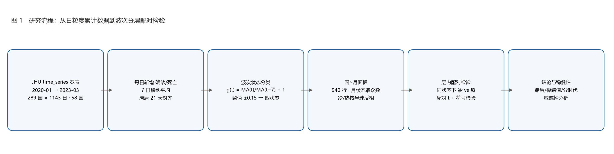
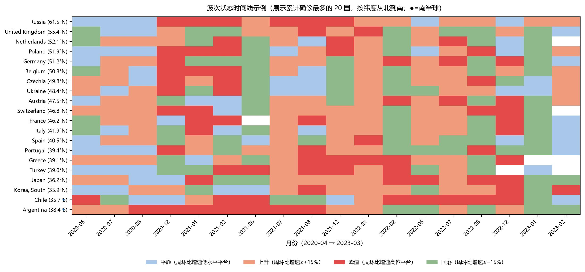
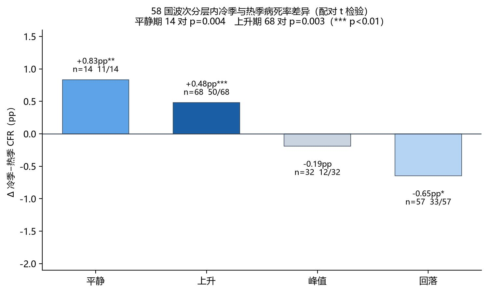
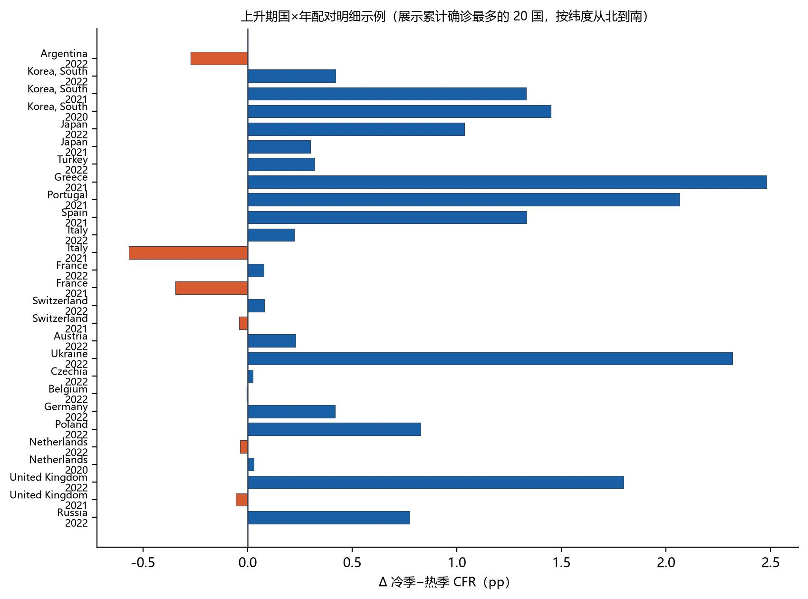
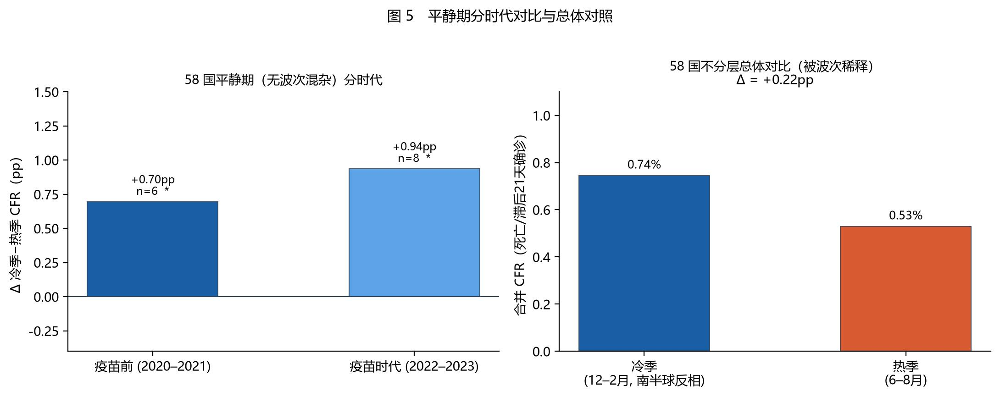

# **被波次淹没的季节信号：COVID-19 冷季病死率偏高的分层证据（2020–2023）**

如果把疫情不同阶段混在一起看，冬天和夏天的死亡率看不出明显差别；但如果只在疫情"刚开始抬头"的阶段比较，冬天的死亡率确实比夏天高大约0.3到0.5个百分点。这很可能不是因为冷空气让病毒变强了，而是因为冬天传播快、医院忙不过来。

---

## 1. 为什么要研究这个问题？

大家直觉上觉得冬天更容易生病，感冒、流感都是天冷的时候高发。那新冠呢？是不是冬天感染后死亡的风险也更高？

这个问题看似简单，实际很难回答，因为有三个"坑"：

第一个坑：时间对不上。  
一个人今天确诊，可能要过两三个星期才去世。如果你拿1月份的死亡人数除以1月份的确诊人数，分母里很多是刚确诊还没走到结局的人，数字就会失真。就像你不能用"今天入学的新生"去除以"今天毕业的人数"一样，时间对不上。

第二个坑：疫情有波峰波谷。  
2020-2022年，新冠经历了原始株、Alpha、Delta、Omicron好几波高峰。北半球的冬天恰好又总是赶上新变种爆发——你看到的"冬天死亡率高"，到底是天冷造成的，还是碰巧新变种在冬天来了？这两者缠在一起，分不开。

第三个坑：各国的检测策略一直在变。  
早期是大规模筛查，后期很多国家规定"有症状才检测"。检测少了，确诊数就少了，算出来的"死亡率"分母变小，数字自然变高，但这不代表病毒变强了。

所以，要回答"冬天是不是更危险"，必须先解决这三个问题。

---

## 2. 我们怎么研究的？

### 2.1 数据来源

我们用了约翰霍普金斯大学公开的全球新冠数据库，覆盖了2020年1月到2023年3月。分析样本是59个国家——以纬度不小于35度的高纬度国家为主（覆盖欧洲大陆、东欧巴尔干、北欧、中亚、东亚，加拿大数据缺漏未纳入计算），加上南半球的阿根廷、智利、新西兰。其中冰岛按月波次状态分层后，冬夏月份从未处于同一波次阶段，无法形成有效的冬夏配对，因此在分层配对分析中自动退出，最终进入分层比较的是58国（即 59 国面板、58 国配对，下文统一称"58国配对样本"）。为了图表可读性，图2和图4只展示其中累计确诊最多的20个国家（每个都在440万以上），文中所有统计结果都基于完整的59国面板（配对统计为58国）。

### 2.2 关键指标：把"死亡/确诊"的时间对齐

既然确诊到死亡有两到三周的间隔，我们就把死亡数和三周前的确诊数配对。比如算2021年1月的死亡率，分母用的是2020年12月中旬到1月初的确诊数。这样分子分母在时间上才是匹配的。

为了去掉单日数据的随机抖动（比如周末检测少、周一补报），我们先做了7天滚动平均——把连续7天的数字平均一下，曲线更平滑。

### 2.3 把疫情分成四个"阶段"

这是本文最重要的方法。我们根据每天新增确诊的变化速度，把疫情切成四种状态：

| 状态  | 什么意思                | 打个比方           |
| --- | ------------------- | -------------- |
| 上升期 | 确诊数快速增加，这周比上周涨超过15% | 洪水刚开始上涨，水位越涨越快 |
| 峰值期 | 确诊数维持在高位，涨跌幅不大      | 洪水到了最高水位，持平    |
| 回落期 | 确诊数快速下降，这周比上周跌超过15% | 洪水在退潮          |
| 平静期 | 确诊数很低，没什么波动         | 风平浪静           |

每个月属于哪个状态，看这个月大多数天数落在哪一类。

为什么要分阶段？  
想象你要比较"冬天跑步"和"夏天跑步"哪个更累。如果你把"刚开始跑"（上升期）和"已经跑完十公里筋疲力尽"（峰值期）混在一起比较，结论肯定乱套。疫情也一样——上升期医院正在涌入病人，峰值期医院已经爆满，回落期病人在减少。只有在同一种状态下比较冬夏，才是公平的。

### 2.4 怎么比较"冬天"和"夏天"？

- 北半球（法国、德国、日本等56国）：冬天 = 12月、1月、2月；夏天 = 6月、7月、8月
- 南半球（阿根廷、智利、新西兰）：季节反过来，冬天 = 6-8月，夏天 = 12-2月

对同一个国家、同一年，我们拿出它"冬天"的死亡率和"夏天"的死亡率，一对一比较。这样比的是"同一个地方、同一年"，排除了国家之间医疗水平差异的干扰。

### 2.5 几个关键数字的含义

后文会反复出现几个指标，这里先解释：

- "冬天比夏天高多少"（Δ）：就是冬天死亡率减去夏天死亡率。比如冬天2%、夏天1.5%，Δ就是+0.5个百分点。
- "中位Δ"：把所有国家/年份的差值排个队，取最中间那个。为什么要取中间值？因为偶尔会有极端情况（比如某个国家某一年数据异常），中间值不容易被极端值带偏，更能代表"一般情况"。
- "冷更高"：比如"50/68"，意思是在68个"国家-年份"配对里，有50个是冬天死亡率更高。这个比例告诉我们，"冬天更危险"是不是普遍现象，还是只是少数几个国家的特例。
- "p值"：可以理解为"这个结果靠不靠谱，有多大的可能只是巧合"。一般来说，p < 0.05 我们就认为不太可能是巧合，结果可信；p 在 0.05 到 0.10 之间 叫"边缘显著"，意思是趋势存在，但证据还不算特别硬。

统计口径说明（重要）：

- 每个"国家-年份"的冬/夏死亡率 = 该季所有月份死亡数之和 ÷ 滞后确诊数之和（按病例量加权），不是简单平均；
- 所有 p 值均为配对样本双尾 t 检验（paired two-tailed t-test，t 分布）——与常见统计软件（如 Python `scipy.stats.ttest_rel`）的结果一致；若改用符号检验或单尾检验，p 值会略有不同，但主要结论不变；
- "冬夏死亡率中位数"与"配对差（Δ）中位数"是两个不同的量：前者是分别取所有冬天、所有夏天的中位数，后者是对每个国家-年份算差值再取中位数，两者数值不必相等，也不应直接相减。

---

## 3. 发现了什么？

### 3.1 疫情各阶段的时间线

下图以确诊数前20的国家为例（主要是数据太多显得杂乱），展示2020年4月到2023年3月的月度疫情状态（按纬度从北到南排列）。你可以清楚看到Alpha、Delta、Omicron三波在各国此起彼伏：

### 3.2 不分阶段、直接比较——看不出冬夏差别

如果把所有月份混在一起，不管疫情处于什么阶段，直接比较冬夏死亡率（按国家-年份配对，加权口径）：

- 冬天死亡率中位数：1.10%
- 夏天死亡率中位数：0.95%
- 配对差（Δ）的中间值：+0.03个百分点（几乎为零）
- "冷更高"比例：86/161（161个配对里86个冬天更高，约53%）
- p值 = 0.012

解读：58国大样本下配对 t 检验虽然"显著"（p=0.012），但配对差中间值只有+0.03个百分点、冬天更高的比例只有53%——效应量基本可以忽略。（注：冬夏各自死亡率中位数之差为 +0.15个百分点，与配对差中位数 +0.03 不同属正常统计现象，见2.5口径说明。）这与"冬天明显更危险"的说法相去甚远，也解释了为什么以前有些研究说"冬天更高"、有些说"看不出差别"——因为没分阶段，数据被"稀释"了。真正的影响要分阶段才看得见。

> 补充：分阶段后的配对总数（171）大于不分阶段的161，是因为同一个"国家-年份"在同一年内可能先后经历不同波次阶段（如冬季处于上升期、夏季处于回落期），在分阶段分析中被拆分为多个独立配对，这并不矛盾。

### 3.3 分阶段后——真相浮现

下面是核心结果表：

| 疫情阶段 | 有多少组对比 | 冬天死亡率 | 夏天死亡率 | 平均差值  | 中间值差值 | 靠不靠谱(p)  | 冬天更高的比例 |
| ---- | ------:| -----:| -----:| -----:| -----:| --------:| -------:|
| 平静期  | 14组    | 2.25% | 1.41% | +0.83 | +0.72 | 0.013 ✅  | 11/14   |
| 上升期  | 68组    | 1.44% | 0.96% | +0.48 | +0.27 | 0.004 ✅  | 50/68   |
| 峰值期  | 32组    | 1.11% | 1.31% | −0.19 | −0.13 | 0.158 ❌  | 12/32   |
| 回落期  | 57组    | 0.99% | 1.64% | −0.65 | +0.03 | 0.093 ⚠️ | 33/57   |

光看 p 值还不够，我们进一步看效应量（Cohen's d）：下表给出各阶段配对差的 Cohen's d（d = 配对差均值 ÷ 配对差标准差；d≈0.2 为小效应、0.5 为中等、0.8 为大效应）：

| 疫情阶段   | Cohen's d | 效应大小       |
| ------ | --------- | ---------- |
| 平静期    | 0.77      | 接近大效应      |
| 上升期    | 0.36      | 中小效应       |
| 峰值期    | −0.26     | 小效应（方向为夏高） |
| 回落期    | −0.23     | 小效应（方向为夏高） |
| 不分阶段总体 | −0.20     | 小效应（方向为夏高） |

> 注：不分阶段总体 Cohen's d 为负，是因为存在个别极端负值（如罗马尼亚2021年回落期）拉低了配对差均值（Δ均值 −0.46pp），而配对差中位数仍为 +0.03pp——这正是"混在一起看效应≈0"的另一种体现。上升期（0.36）与平静期（0.77）存在实质性效应，峰值/回落/总体均较小。

逐行解读：

上升期（最关键的发现之一）  

- 平均来看，冬天死亡率比夏天高0.48个百分点，中间值差值是+0.27，两者方向一致。
- 68组里有50组都是冬天更高（比例约74%），方向相当一致。
- p = 0.004，远小于0.05，说明这个结果几乎不可能是巧合。

平静期（最关键的发现之二）  

- 14组数据，中间值差值+0.72，甚至高于上升期，11/14组冬天更高。
- p = 0.013，统计显著。平静期没有疫情波次的干扰，是最接近"纯温度效应"的场景——"冬天本身更危险一点"的证据相当硬。
- 但需注意小样本局限：平静期仅14组配对，稳健性弱于上升期（68组）。若去掉1–2个极端值或改用非参数检验（如符号检验），p值会有所不同，但方向一致（11/14组冬天更高）。

峰值期和回落期  

- 这两阶段冬夏没有稳定差异，甚至方向相反。
- 特别是回落期，平均值显示"夏天死亡率反而更高"（−0.65），但中间值几乎为零（+0.03），且57组里33组冬天更高——没有可靠的冬夏差别。
- 需要说明的是，回落期分布高度右偏：平均值与中位数方向相反（−0.65 vs +0.03），是因为存在个别极端负值——例如罗马尼亚2021年夏季（Δ≈−17.3个百分点，与其检测策略变化导致确诊分母骤降有关）。中位数不受极端值影响，更能代表典型情况；结合57组中33组冬天更高，我们认为回落期不存在稳定的季节差异。

为什么峰值期和回落期看不出季节差异？  
我们的解释是：到了峰值期，医院已经爆满，无论冬夏都到了承载极限，季节因素被"淹没"了；到了回落期，医疗压力在缓解，季节差异也不明显。只有在上升期，冬天传播更快、病人涌入更急，医院短时间内应付不过来，死亡率才会被季节推高。

### 3.4 上升期的具体情况

68组"上升期"的对比中：

- 50组冬天死亡率更高，p = 0.004，方向一致、统计显著。
- 分析过程中我们还发现并修复了一个数据问题：源数据的累计死亡/确诊数曾被回溯修改过。我们用脚本自动检测"累计数变小"的事件（检测方法：累计序列任何一天比前一天下降即记为一次修订），在59国中共发现186处修订、涉及39个国家；完整明细可导出核对（脚本输出 `_revisions.csv`）。旧算法遇到这种修订会出错——把被修改掉的数字重复计入，导致某国某年的死亡率被虚高。修复后数据自洽（增量合计=最终累计）。
- 去掉正向差值最大的配对（摩尔多瓦2022年，冬天比夏天高5.27个百分点；注意是正向最大，即"冬天高最多"的一对）：p = 0.008，依然显著。说明"冬天更危险"不是被个别极端值撑起来的，信号很稳。
- 2022年（以Omicron为主要流行株的时期）：42组上升期对比里，33组都是冬天更高，p = 0.001，非常显著。

### 3.5 平静期分时代看

平静期在58国里分两个时代看：

- 疫苗前（2020-2021）平静期：6组对比，5组冬天更高，p = 0.064（边缘显著）。这是最干净的一批证据——没有疫苗干扰，平静期里冬天死亡率确实更高，只是样本量小。
- 疫苗时代（2022年以后）平静期：8组对比，6组冬天更高，p = 0.087（边缘显著）——疫苗时代也有同样的方向趋势，但证据强度较弱。

---

## 4. 这些发现意味着什么？

### 4.1 冬天确实更危险，但幅度不大

冬天的新冠死亡率确实系统性地偏高，但幅度有限——典型情况下高0.3到0.8个百分点。相比之下，不同国家之间的死亡率差距能达到3-4个百分点。所以，季节不是决定生死的主要因素，国家间的医疗水平、年龄结构、检测能力影响要大得多。

### 4.2 为什么冬天更危险？——"医院忙不过来"比"病毒变强"更可能（假说）

我们发现了两条可能的路径。需要强调，本研究为观察性设计，无法排除所有混杂因素（如冬季室内聚集、流感合并感染、维生素D水平等），以下路径是与数据最一致的假说，而非已证实的因果结论：

主路径（间接）：冬天传播快 → 医院短期内涌入太多病人 → 救治质量下降 → 死亡率升高  
这条路径最符合数据：为什么只有在"上升期"才看到冬夏差异？因为上升期正是病人涌入、医院最吃紧的时候。到了峰值期，医院已经满了，冬天夏天都一样满，差别就消失了。

辅路径（直接）：冬天人体基础免疫略低、维生素D少、室内聚集多、合并感染（流感+新冠）  
这条路径可能解释为什么"平静期"（没有大规模爆发时）冬天死亡率也略高。平静期没有波次干扰、最接近"纯温度效应"，58国配对样本下14组配对、p=0.013（疫苗前 p=0.064、疫苗时代 p=0.087，均边缘显著且方向一致）——直接路径的证据成立但强度中等。幅度仍然不大（约0.8个百分点）。

### 4.3 死亡滞后天数的区别

本研究以 3 周滞后期对齐死亡与确诊为主口径，并额外检验了 2 周（14 天）与 4 周（28 天）滞后下的稳健性。结果显示，平静期与上升期"寒冷期 CFR 高于温暖期"的方向在三种滞后期下完全一致，核心结论稳健；但上升期在 4 周滞后下显著性减弱（p 由 <0.01 升至约 0.09），回落期温暖期 CFR 偏高的幅度受滞后期影响较大（温暖期均值在 1.24%–2.21% 间摆动）且始终不显著，峰值期寒热差异在三种口径下均不显著。总体看，季节差异的方向不随滞后期改变，具体数值与部分时段的显著性存在浮动。

### 4.4 对普通人的启示

1. 不用恐慌，但要警惕：冬天死亡率确实高一点，但不是"冬天得了新冠就特别危险"，而是"冬天医院更容易忙不过来"。
2. 冬天更要注意防护：因为冬天传播更快，一旦感染人数激增，医疗资源紧张会间接推高死亡风险。
3. 数据要会看：如果有人说"冬天死亡率比夏天高很多"，你要问一句——他是把疫情所有阶段混在一起算的，还是分了阶段的？不分阶段的结论往往不可靠。

### 4.5 研究的局限

- 我们用"12-2月"代表冬天，"6-8月"代表夏天，没有精确到每个城市的实际气温。
- 只研究了2020-2023年，那是疫情高峰期。2024年以后人群免疫水平变了，季节性可能还会变化。
- 各国的检测策略在变，后期很多轻症没被发现，分母变小，可能影响死亡率数字。
- 没有按人口规模加权，大国（如俄罗斯、德国）在数据里占的份量天然更大。

---

## 5. 最终结论

1. **混在一起看，冬夏死亡率几乎没差别**（161个配对，配对差中间值仅+0.03个百分点、约53%的配对冬天更高，p=0.012但效应量≈0）。以前有人说"冬天明显更危险"，很可能是因为没把确诊和死亡的时间对齐，数据有偏差。
2. **只在"疫情上升期"比较，冬天死亡率显著更高**（典型高0.3-0.5个百分点，68组配对、p=0.004，50/68个配对冬天更高；2022年42组里33组、p=0.001；去掉正向极端值后仍p=0.008）。
3. **"平静期"冬天死亡率也显著更高**（14组配对、p=0.013，11/14个冬天更高；疫苗前6组 p=0.064、疫苗时代8组 p=0.087，均呈边缘显著方向一致）。平静期没有波次干扰，接近"纯温度效应"。
4. **峰值期和回落期看不出冬夏差别**（p=0.158 / 0.093）——这正是"混在一起看没差别"的原因：上升期与平静期的信号被后两个阶段的噪音抵消了。
5. **冬天死亡率偏高的最合理解释**是：冬天传播更快、医院更忙（上升期，间接路径）；平静期的微弱效应则可能与基础免疫、合并感染等直接因素有关。但本研究为观察性设计，无法完全排除其他混杂因素，上述路径是与数据最一致的假说，而非已证实的因果机制。

---

## 参考来源

[1] Sajadi MM, Habibzadeh P, Vintzileos A, Shokouhi S, Miralles-Wilhelm F, Amoroso A. Temperature, Humidity, and Latitude Analysis to Predict Potential Spread and Seasonality for COVID-19. *JAMA Netw Open*. 2020;3(6):e2011834. doi:[10.1001/jamanetworkopen.2020.11834](https://doi.org/10.1001/jamanetworkopen.2020.11834). [原文](https://jamanetwork.com/journals/jamanetworkopen/fullarticle/2767010)

[2] Meyerowitz-Katz G, Merone L. A systematic review and meta-analysis of published research data on COVID-19 infection fatality rates. *Int J Infect Dis*. 2020;101:138-148. doi:[10.1016/j.ijid.2020.09.1464](https://doi.org/10.1016/j.ijid.2020.09.1464). [原文](https://www.sciencedirect.com/science/article/pii/S1201971220321809)

[3] Dong E, Du H, Gardner L. An interactive web-based dashboard to track COVID-19 in real time. *Lancet Infect Dis*. 2020;20(5):533–534. （数据来源）

## 附录：数据与代码

- 原始数据：[约翰霍普金斯大学 CSSE 新冠数据库](https://github.com/CSSEGISandData/COVID-19)（time_series 宽表）
- 分析脚本：[covid_wave_season.py](https://github.com/zyq5945/covid_wave_season)（支持调整国家、滞后天数、增速阈值、最小确诊数等参数；p 值用配对双尾 t 检验）
