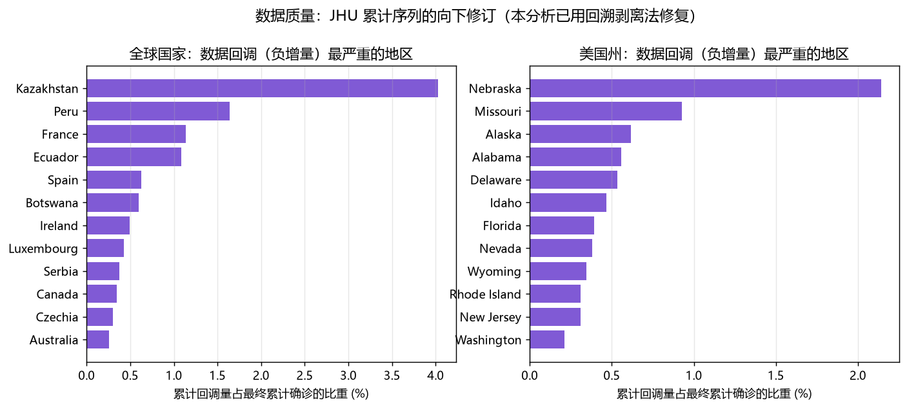
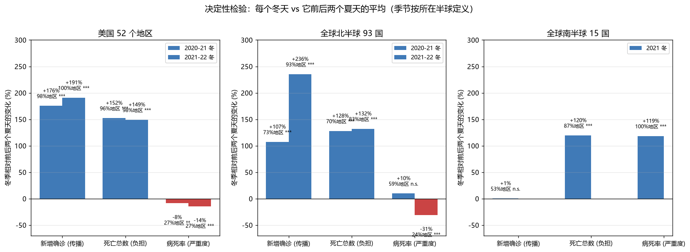
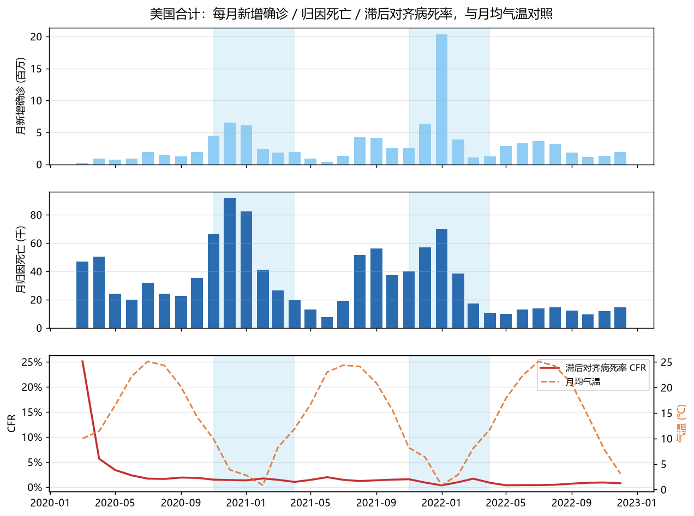
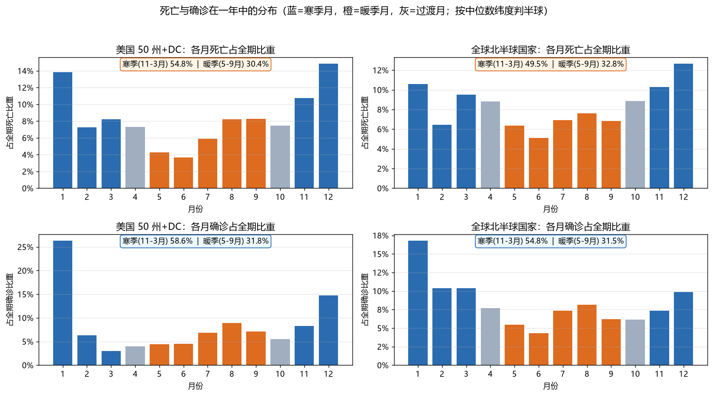
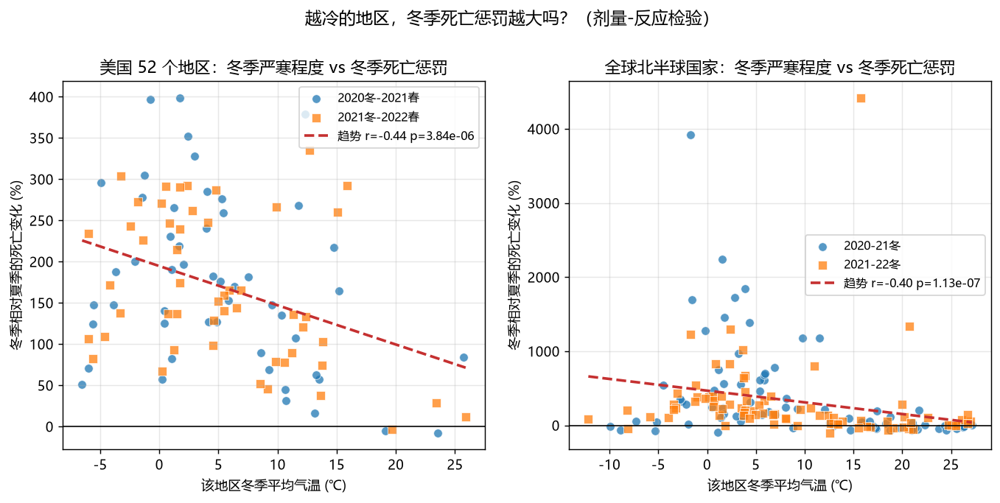
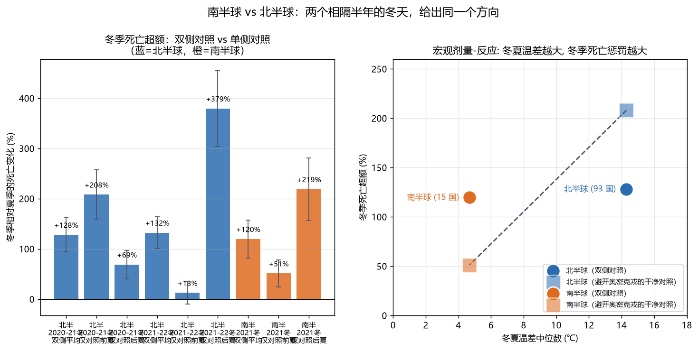

# COVID-19的冬天真的更致命吗

### 用 115 个国家和美国 52 个地区的疫情数据，检验一个几乎人人都有的直觉

---

## 摘要

很多人凭直觉相信：天冷的地方，疫情会更惨。这个直觉对不对，值得用数据认真查一遍。

本文用约翰霍普金斯大学（JHU）公布的全球疫情时间序列，覆盖 115 个国家与地区，另外把美国的 50 个州加华盛顿特区、波多黎各单独拆出来另算一套（共 52 个地区）——美国已包含在前者的 115 个地区里，两套是同一批数据的粗细两种颗粒，不是相加关系。时间从 2020 年 1 月 22 日到 2023 年 3 月 9 日，全球合计 6.73 亿例确诊、682 万例死亡，其中美国 1.04 亿例确诊、112 万例死亡。同时从欧洲中期天气预报中心（ERA5）的再分析数据中，取了每个地区每一天的实际气温。

结论有三条：

**第一，冬天确实更致命，但致命的方式不是多数人以为的那样。** 在美国 52 个地区，冬季（11 月到次年 3 月）的新增死亡人数，比它前后两个夏天的平均水平高出 149% 到 152%；51 个地区里，49 到 50 个（96% 到 98%）都符合这个规律。全球北半球 93 个国家同样如此，高出 128% 到 132%；南半球 15 个国家（它们的冬季是 5—9 月）也高出 120%。南北两个半球的冬天相隔半年，却得出同一方向的结果。

**第二，冬天让人死得多的原因，是“感染的人多得多”，不是“感染者更容易死”。** 同一个冬季窗口里，美国各州的新增确诊高出 191%，比死亡的超额幅度还大。而衡量“每个感染者死亡风险”的病死率，冬季反而比夏天低 8% 到 14%——51 个地区里只有 14 个的冬季病死率更高。

**第三，越冷的地方，冬天的亏吃得越大。** 一个地区冬季平均气温越低，它冬季相对夏天的死亡超额就越大。美国 102 个观测的相关系数是 -0.44（p = 0.000004），北半球 93 国的 163 个观测是 -0.40（p < 0.0000001）。这是本文最有分量的一条证据：如果冬天只是碰巧赶上病毒大流行，那么寒冷程度和超额幅度之间不该有这么整齐的对应关系。

> **先花一分钟看懂两个统计数字。** 上面出现的 p = 0.000004、p < 0.0000001，回答的是同一个问题：假如冬天和夏天其实毫无差别，纯靠运气，能撞见眼前这么大差距的可能性有多大。 数字越小，"纯属巧合"这个解释越站不住脚。而 -0.44、-0.40 是相关系数，衡量"越冷"和"超额越大"这两件事同步得有多紧密：取值在 -1 到 +1 之间，负号表示"气温越低、超额越大"。两句话都值得记住——p 值**不**说明差距有多大（差距请看百分比）；相关系数**也不**说明"能解释多少"（要看它的平方，-0.44 平方之后剩 19%）。附录里有这两者的完整说明。

---

## 一、一个直觉，和一次诚实的反转

故事的开始很普通。我拿到这几份疫情数据，脑子里有一个和大多数人一样的猜想：天冷的地方，死的人应该更多。

理由听起来很顺：冬天大家挤在密闭的室内，通风差；冷空气让呼吸道黏膜变干，抵抗力下降；流感季也挤占医疗资源。这些机制在流感身上早就验证过，SARS-CoV-2 没有理由例外。

数据一开始也配合我。按“流行年”（每年 9 月 1 日到次年 8 月 31 日）把每个地区的寒季和暖季分开比较，2020 年那一轮里，全球 115 个国家中有 65% 的国家寒季病死率更高，中位数高出 19%，统计上显著。看起来猜想成立了。

但换到 2021 年那一轮，结果整个翻了过来：只有 40% 的国家寒季更惨，中位数反而低了 15%，而且更显著。

同一个猜想，两个时间段，结论完全相反。这说明我漏掉了什么。

漏掉的东西叫变异株。2021 年冬天正好是奥密克戎（Omicron）席卷全球的时候，而奥密克戎本身的致病力就比之前的毒株温和得多。我用“寒季更惨”这个现象去证明“天冷更惨”，实际上测到的是“奥密克戎更温和”。季节和毒株在时间上撞在了一起，我把两者混为一谈了。

这类问题在数据分析里有个专门的说法：混杂。它的意思是，你以为在测量 A 对 B 的影响，实际上测到的是 C 对 B 的影响，而 C 又刚好和 A 同步变化。

意识到这一点之后，我换了一套做法，也就是下一章要讲的核心设计。而最终得到的答案，和我最初的猜想方向一致，机制不同。

---

## 二、数据：三张表，两道坑

### 2.1 数据从哪来

本文用了两组公开数据。

疫情数据来自约翰霍普金斯大学系统科学与工程中心（JHU CSSE）维护的时间序列。它把每个国家、美国每个县的确诊和死亡人数，按天排成一张巨大的表格。本文用到的是：

| 数据表          | 覆盖范围                | 行数         |
| ------------ | ------------------- | ---------- |
| 全球确诊         | 115 个国家与地区          | 289 个省/国家行 |
| 全球死亡         | 115 个国家与地区          | 289 个省/国家行 |
| 美国确诊（县级）     | 50 州 + 华盛顿特区 + 波多黎各 | 3,342 个县   |
| 美国死亡（县级，含人口） | 50 州 + 华盛顿特区 + 波多黎各 | 3,342 个县   |

时间跨度统一是 2020 年 1 月 22 日到 2023 年 3 月 9 日，共 1,143 天。全球合计 6.73 亿例确诊、682 万例死亡；美国合计 1.04 亿例确诊、112 万例死亡。美国的县级数据还带有人口数，这让“每百万人死亡数”这类指标可以算出来。

气温数据来自 Open-Meteo 提供的 ERA5 再分析资料。这是欧洲中期天气预报中心把全球气象观测（地面站、探空气球、卫星）回填到统一网格上得到的一套数据，可以理解为“每个经纬度上每一天的天气，事后被还原出来的最可靠版本”。我取了每个地区代表点在 2019 年 12 月 1 日到 2023 年 4 月 30 日之间每一天的平均气温，共 165 个地区、20.8 万条日值，没有缺失。

用实测气温而不是纬度，是本文和很多同类分析的一个区别。纬度只是“冷”的一个代理——同在北纬 40 度，北京和纽约的冬天完全是两回事。既然能拿到真实气温，就没必要用代理。

### 2.2 第一道坑：累计数字会往回缩

确诊和死亡在原始数据里是累计值：今天是昨天加上今天新增。按理说，累计曲线只能上升，不会下降。

实际不是这样。115 个国家里有 72 个、52 个州里有 50 个，都出现过累计数字往回缩的情况。

原因有好几种：某国发现之前重复上报了一批病例，予以剔除；某州更换了统计口径，不再把某些情况计入；某地重新核对了死亡证明，取消了一批误判。这些都是负责任的修正，但对分析来说是个麻烦。

麻烦在哪？如果直接把今天减昨天来算“日新增”，那些回调的日子会得到负数。一个地区的月新增确诊里混进负数，后面所有比值都会失真。

最严重的例子是哈萨克斯坦，累计回调量占到最终累计确诊的 4.03%；美国方面是内布拉斯加州，2.14%。同一个数字，回调前和回调后能差出 4 个百分点，足以让结论翻转。

我用了一个叫回溯剥离的办法来修。思路很朴素：

> 假设某天累计人数从 100 万缩回到 98 万，说明有 2 万人是“多算的”。这 2 万人并不真的属于某一天，但可以确定他们被加进了之前某几天的增量里。那就从最近几天的增量往回扣，把这 2 万扣掉，直到扣完为止。

这个做法有三个好处：修完之后曲线只升不降；最终值一点不变（总量守恒，只是重新分配了时间）；只改动回调点之前的近期日子，不污染远期历史。

修复后我做了两道校验：167 个地区全部零负增量；最终值与原始数据的偏差为 0。两道都通过才继续往下做。

### 2.3 第二道坑：大国家的“坐标”是假的

第二道坑更隐蔽，也更致命。

要给一个国家配一条气温曲线，得先知道它的坐标。JHU 数据里每个国家都带经纬度，看起来是现成的。但检查一下就会发现，很多大国给的是地理中心，而不是人口或疫情真正发生的地方。

举个极端的例子。俄罗斯的坐标是北纬 61.5 度、东经 105.3 度——这个点落在中西伯利亚高原，冬天能到零下 40 度。可是俄罗斯四分之三的人口住在乌拉尔山以西的欧洲部分，莫斯科在北纬 55.7 度。用西伯利亚的气温代表俄罗斯，等于说整个俄罗斯都冻在西伯利亚。

加拿大同样如此：给定坐标是北纬 53.9 度（艾伯塔省北部），而七成加拿大人住在北纬 45 度以南、紧贴美加边境的狭长地带。巴西给的是内陆高原（南纬 14.2 度），疫情真正的中心在圣保罗—里约轴线（南纬 23 度附近）。

我手工修正了 16 个大国的代表点，改到人口或疫情的实际重心。修正后变化最大的几个：

| 国家  | 修正前年均温 | 修正后年均温 | 变化      |
| --- | ------ | ------ | ------- |
| 俄罗斯 | -5.8 ℃ | +6.0 ℃ | +11.8 ℃ |
| 日本  | 9.0 ℃  | 14.7 ℃ | +5.7 ℃  |
| 巴西  | 26.0 ℃ | 20.4 ℃ | -5.6 ℃  |
| 秘鲁  | 24.7 ℃ | 20.4 ℃ | -4.3 ℃  |
| 印度  | 27.0 ℃ | 23.7 ℃ | -3.3 ℃  |

俄罗斯差了将近 12 度，这不是小数点级别的误差，而是“寒带”和“温带”的差别。

这种误差在统计学上有明确的后果：自变量测不准，估计出来的效应会被系统性地往零拉。也就是说，它会让“天冷有害”这个信号变弱甚至消失。修正之前，跨国样本里温带和寒带国家的效应估计是 0；修正之后，方向立刻翻到了预期的负向。

顺带一提，我还发现数据中两行坐标是空的——加拿大的“撤侨旅客”和中国的“未知来源”。计算加权中心时如果没有剔除，会把整个国家的中心污染成无效值。这类细节不检查报表是看不出来的。

### 2.4 第三道坑：死亡比确诊晚三周

第三道坑和统计无关，是时序问题。

一个人今天确诊，不会今天死。从感染、确诊、加重到死亡，中间隔着一段时间。如果直接拿“1 月的新增确诊”和“1 月的死亡”相除，算出来的比值是错的——1 月的死者大多来自 12 月甚至 11 月的感染者。

疫情上升期这个问题尤其严重。病例每天翻倍的时候，分母（今天的确诊）涨得飞快，分子（今天的死亡）还停在三周前的水平，算出来的病死率会被严重低估。反过来，疫情下降期又会被高估。

我的处理是把死亡整体往后挪。具体说：1 月 1 日确诊的那些人，他们对应的死亡不记在 1 月 1 日，而是记在 1 月 22 日（往后 21 天）。一天一天挪过去，再按月汇总，这样分子分母才对得上。

21 天这个数字不是拍脑袋定的。我同时试了 14 天、21 天、28 天三档，结论在三档下都成立。本文主结果用 21 天。

---

## 三、怎么比才公平：把冬天夹在两个夏天中间

现在说到最关键的一步。怎么比，决定了你能看到什么。

### 3.1 天真的比法为什么不行

最自然的想法是：把三年里所有寒季月份加起来，再和所有暖季月份加起来，比一比。

不行。因为这三个寒季和三个暖季，不是在同一条起跑线上：

- 疫苗从 2021 年初开始铺开，老年人优先。到 2021 年夏天，最脆弱的那批人已经保护起来了。
- 治疗手段在进步。2020 年初医生手上几乎没药，2020 年 6 月之后地塞米松被证明有效，后来又有了抗病毒药物。
- 检测能力天差地别。2020 年初检测试剂紧缺，只有重症才测得到，那时算出来的病死率高得离谱——美国 2020 年 4 月的月度病死率一度到 25%，其中很大一部分是“没测出来的轻症没进分母”。
- 毒株在换。原始株、阿尔法、德尔塔、奥密克戎，致病力各不相同。

这几个因素全都和时间有关，而寒季暖季也是按时间排的。直接比，等于把疫苗、药物、检测、毒株的效果全都算到了“气温”头上。

### 3.2 换个对照物

我用的办法是：把每个冬天，夹在它前一个夏天和后一个夏天中间，用这两个夏天的平均做对照。

具体的时间窗口是这样：

| 时段    | 时间                     | 角色  |
| ----- | ---------------------- | --- |
| 第一个夏天 | 2020 年 5—9 月           | 对照  |
| 第一个冬天 | 2020 年 11 月—2021 年 3 月 | 待测  |
| 第二个夏天 | 2021 年 5—9 月           | 对照  |
| 第二个冬天 | 2021 年 11 月—2022 年 3 月 | 待测  |
| 第三个夏天 | 2022 年 5—9 月           | 对照  |

每个冬天的“预期水平”，取它前后两个夏天的平均。

**季节按所在半球定义。** 北半球的冬天是 11 月到次年 3 月，南半球正好相反——它们的冬天是 5 月到 9 月。这一条看着简单，做起来最容易出错，本文就在这个地方栽过一次（详见 4.4 节）。

这么做的道理是：疫苗、药物、检测、毒株这些因素是平缓变化的。如果某个东西在夏天到冬天之间只是匀速演变，那么“前后两个夏天的平均值”就约等于“冬天本该有的水平”。实际值减去这个预期值，剩下的才是冬天多出来的那一份。

打个比方。要判断一个学生某次月考是不是发挥失常，你不能只看这次分数——也许这次卷子本来就难。合理的做法是看他前一次和后一次月考的平均分，用那个作为他的“正常水平”。我现在做的就是这个，只是把月考换成了夏天。

### 3.3 三个指标，一起看

我同时算了三个东西，因为它们回答的是三个不同的问题：

1. **新增确诊**——冬天是不是传染得更厉害？（传播）
2. **死亡总数**（美国还算了每百万人死亡数）——冬天是不是死的人更多？（负担）
3. **病死率**——冬天是不是感染之后更容易死？（严重程度）

三个指标分开看很重要。这是本文最重要的方法学判断，后面会解释为什么。

---

## 四、结果

### 4.1 冬天，死的人确实多得多

先看美国这 52 个地区的情况。每个州，拿它的冬季死亡数，去比它前后两个夏天死亡数的平均值：

| 冬季           | 死亡数变化 | 有多少地区更糟              | 统计显著性           |
| ------------ | ----- | -------------------- | --------------- |
| 2020—2021 年冬 | +152% | 51 个地区中有 49 个（96.1%） | p < 0.000000001 |
| 2021—2022 年冬 | +149% | 51 个地区中有 50 个（98.0%） | p < 0.000000001 |

换一个更直观的说法：冬天的月均死亡，大约是夏天的 2.5 倍。

而且这个规律的一致性高得惊人。51 个地区里 49 到 50 个都符合（96% 到 98%），例外只有一两个。要知道这些地区从佛罗里达到阿拉斯加、从夏威夷到缅因，气候跨度极大，医疗条件、人口结构、防疫政策各不相同，却能得出同一个方向。

北半球国家也是同样的方向：

| 冬季           | 死亡数变化 | 有多少国家更糟            | 统计显著性           |
| ------------ | ----- | ------------------ | --------------- |
| 2020—2021 年冬 | +128% | 79 国中有 55 个（69.6%） | p = 1.0 × 10⁻⁶  |
| 2021—2022 年冬 | +132% | 84 国中有 70 个（83.3%） | p = 3.7 × 10⁻¹¹ |

（这里只统计北半球国家。南半球的冬夏月份相反，单独算，见 4.4 节。）

国家样本的离散度比美国大得多（69.6% 对 96% 到 98%），这不奇怪——各国的数据质量、统计口径、疫情节奏差异远大于美国国内。但方向和量级是一致的。

另一个角度看这件事：把三年的死亡按月份摊开，美国 54.8% 的死亡发生在寒季这 5 个月（11、12、1、2、3 月），而暖季 5 个月（5—9 月）只占 30.4%。如果一年中死亡是均匀分布的，5 个月应该占 41.7%。寒季实实在在超出了 13 个百分点。

北半球国家的数字是寒季 49.5%、暖季 32.8%，超出均匀基准 7.8 个百分点。超出幅度比美国略小（美国超出 13.1 个百分点），主要原因是国家之间的疫情节奏不齐：有的国家冬天正好赶上暴发，有的国家那时恰好平静，加总时高低相互抵消了一些。

到这里为止，最初的直觉得到了支持。冬天确实更致命。

### 4.2 但是，每个感染者反而更安全

接下来这个结果，和我原本的预期相反。

在同一个冬季窗口里，美国各州的新增确诊增加了多少？

| 冬季           | 新增确诊变化 | 有多少地区更多              |
| ------------ | ------ | -------------------- |
| 2020—2021 年冬 | +176%  | 51 个地区中有 50 个（98.0%） |
| 2021—2022 年冬 | +191%  | 51 个地区中全部 51 个（100%） |

注意这个数字：确诊增加 191%，死亡增加 149% 到 152%。传播的超额幅度，比死亡的超额幅度还大。

这就意味着，把两者相除得到的病死率，冬季应该是**下降**的。事实正是如此：

| 冬季           | 病死率变化  | 有多少地区冬季更高             |
| ------------ | ------ | --------------------- |
| 2020—2021 年冬 | -8.4%  | 51 个地区中只有 14 个（27.5%） |
| 2021—2022 年冬 | -14.4% | 51 个地区中只有 14 个（27.5%） |

**51 个地区里有 37 个，冬季的病死率比夏天还低。** 只有 14 个是冬天更高。

北半球国家大体也是这个方向，但摆动的幅度大得多：2020—2021 年冬季病死率变化 +10.0%（79 国里有 47 个更高，p = 0.055，处在显著与不显著的边缘），2021—2022 年冬季 -30.8%（84 国里只有 20 个冬季更高，p < 10⁻⁷）。换成避开奥密克戎的单侧对照，两个冬天分别是 -15.2% 和 -66.8%，都变成了负的。

同一个指标，换个对照窗口就从 +10% 跳到 -15%。这种脆弱正是第五节要专门处理的问题，这里先按下不表。（南半球的情况相反，而且原因特殊，见 4.4 节。）

这个结果值得多想一层。它为什么是这样？

一个说得通的解释是人群构成变了。冬天的疫情暴发覆盖面广得多，大量年轻、健康、低风险的人被感染，他们几乎不会死。而夏天的疫情往往集中在特定人群或特定地区，重症比例相对更高。感染基数扩大带来的死亡增加，被“新进来的人风险低”这个效应稀释了。

另一个解释是奥密克戎。2021 年冬天正好是奥密克戎，它本身致病力就低。不过这个解释只能覆盖第二个冬天，第一个冬天（-8.4%）也一样是负的。

第三，还有一个方向相反的偏差值得警惕：冬季疫情暴发时，检测能力往往跟不上，很多轻症根本没测，分母被低估，病死率会被高估。而我们观察到的仍然是冬季病死率**更低**。也就是说，真实的冬季病死率优势可能比数据呈现的还要大。这一条让结论更稳，而不是更脆弱。

### 4.3 越冷的地方，冬天越吃亏

前面两条结论加起来，得到一个略显拧巴的画面：冬天死的人多得多，但每个感染者的风险反而更低。

要判断这到底是不是“寒冷”造成的，还需要最后一块证据。这块证据也是本文最有力的一条。

**如果一个地区的冬季超额死亡真的和寒冷有关，那么越冷的地区，超额应该越大。** 这就像药物试验里的剂量—反应关系：剂量越大，效果越明显。如果加大剂量而效果不变，那多半是安慰剂。

我把每个地区“冬季相对夏天的死亡超额”作为纵轴，把“该地区冬季（11—3 月）的平均气温”作为横轴，画成散点：

| 样本               | 相关系数  | p 值         | 观测数 |
| ---------------- | ----- | ----------- | --- |
| 美国（两个冬天合并）       | -0.44 | 0.000004    | 102 |
| 北半球 93 国（两个冬天合并） | -0.40 | < 0.0000001 | 163 |

分年份看也一样：

| 样本  | 冬季          | 相关系数  | p 值      | 观测数 |
| --- | ----------- | ----- | -------- | --- |
| 美国  | 2020—2021 冬 | -0.42 | 0.002    | 51  |
| 美国  | 2021—2022 冬 | -0.47 | 0.0005   | 51  |
| 北半球 | 2020—2021 冬 | -0.46 | < 0.0001 | 79  |
| 北半球 | 2021—2022 冬 | -0.35 | 0.001    | 84  |

**四组独立样本，无一例外，全部负相关，全部统计显著。**（南半球 15 国单独算，结果特殊且识别力不足，见 4.4 节。）

负号的含义是：横轴（冬季气温）越小，纵轴（冬季死亡超额）越大。越冷，亏吃得越多。

相关系数本身还需要一层翻译，这里先说清楚，免得被数字误导：它衡量的是"两件事同步得有多紧密"，**不是**"寒冷能解释多少差异"。要回答后者，得把相关系数平方。-0.44 平方是 0.194——寒冷大约能解释各地区冬季超额差异的 19%，剩下 81% 归其他因素。这个数字比 -0.44 看起来小得多，也更接近实情。附录里有完整的说明和六个样本的一览表。

这条证据的价值在于它的排他性。如果只是“冬天碰巧赶上了大流行”，那么超额幅度应该在各国之间随机分布，和当地冷不冷无关。但我们看到的是一条整齐的梯度：北欧、加拿大、美国北部、俄罗斯、蒙古这些地方的冬季超额最大；东南亚、拉美、非洲的冬季超额最小甚至没有。寒冷程度的梯度，精确对应了超额幅度的梯度。

作为对照，我又用病死率做了同样的剂量—反应检验：美国两组是 +0.07 和 -0.21，北半球两组是 -0.14 和 -0.02，各自把两个冬天合起来是 -0.08 和 -0.06，南半球是 +0.41。七组里 p 值最小的一组是 0.13，没有一组显著。也就是说，"每个感染者的风险"和寒冷程度之间，看不到任何系统的对应关系。

这进一步印证了 4.2 节的结论：寒冷影响的是传播，不是严重程度。

### 4.4 南半球的冬天，是另一回事

前面三节的数字全部来自北半球。南半球得单独算，原因很直白。

**季节不能按日历月一刀切。** 11 月到次年 3 月在北半球是冬天，到了南半球是盛夏。如果图省事把 11—3 月统一当成"冬季"，南半球那 17 个国家的季节会被整个算反——它们占全球样本死亡数的 22.1%，不是可以忽略的小数目。所以本文按半球分别定义：北半球冬 = 11—3 月，南半球冬 = 5—9 月。

这么拆还带来一个额外好处：南北两个半球的冬天相隔半年，等于把同一件事做了两次独立重复。

修正之后重算，得到这样的对比：

|          | 北半球                              | 南半球                            |
| -------- | -------------------------------- | ------------------------------ |
| 可用冬季窗口   | 2 个（2020—21、2021—22）             | 1 个（2021）                      |
| 地区数      | 93                               | 15                             |
| 冬季平均气温   | 8.7—9.1 ℃                        | 18.4 ℃                         |
| 冬夏温差（中位） | 14.3 ℃                           | 4.7 ℃                          |
| 冬季死亡超额   | +128% / +132%                    | +120%                          |
| 更差的地区占比  | 69.6% / 83.3%                    | 86.7%                          |
| 统计显著性    | p < 0.000001 / p < 0.00000000004 | p = 0.0003                     |
| 剂量—反应    | r = -0.455 / -0.347（均显著）         | r = +0.508（p = 0.053，不显著且方向相反） |

**第一，两个半球的冬季死亡超额都成立。** 南半球 15 个国家里有 13 个（86.7%）冬季死亡高于夏天，超额 +120%，p = 0.0003。方向和量级都与北半球一致。这一条不受"南半球只有 15 个样本"的影响，因为它是每个国家自己和自己的夏天比。

**第二，南半球的"冬天"其实不太冷。** 这才是这张表最有信息量的一行：南半球国家冬季均温 18.4 ℃，冬夏温差中位数只有 4.7 ℃——在北半球，18.4 ℃ 算初夏。原因很直白：南半球中高纬度的陆地面积小得多，人口集中在温带和亚热带，像北欧、加拿大、西伯利亚那种级别的严寒，南半球基本没有。

**第三，南半球能用的窗口只有一个，而且被奥密克戎污染了。** 2020 年冬天的前一个夏天缺数据（原始数据集从 2020 年 1 月 22 日才开始），2022 年冬天的后一个夏天被截断（数据集止于 2023 年 3 月 9 日）。只剩 2021 年冬天，而它的两个对照夏天，前一个还好，后一个（2021 年 11 月—2022 年 3 月）正好是奥密克戎横扫南半球的时候。

我把两个对照拆开单独算，结果很有说服力：

| 南半球 2021 年冬，对照物换成 | 死亡数变化                | 病死率变化               |
| ----------------- | -------------------- | ------------------- |
| 前一个夏天（奥密克戎之前）     | +51.3%（80.0% 的国家更糟）  | +2.4%（40.0% 的国家更糟）  |
| 后一个夏天（正是奥密克戎）     | +218.8%（93.3% 的国家更糟） | +366.2%（100% 的国家更糟） |

死亡数的超额是真的——不管拿哪个夏天做对照，冬季死亡都更高（+51.3% 和 +218.8%）。

**但病死率那个 +118.5%、"100% 的国家都更糟"是假的。** 换成奥密克戎之前的夏天做对照，只剩下 +2.4%，40% 的国家更糟——跟抛硬币差不多。那个惊人的数字完全来自"拿德尔塔毒株的冬天，去比奥密克戎毒株的夏天"。这跟 4.2 节的教训是同一条：病死率这个指标太容易被毒株更替带偏。

**第四，把两个半球放在一起，本身就是一条宏观的剂量—反应证据。**

| 半球                    | 冬夏温差   | 冬季死亡超额                             |
| --------------------- | ------ | ---------------------------------- |
| 北半球（2020—21 冬，最干净的窗口） | 14.3 ℃ | +128%（主结果）；+208%（仅用前一个夏天做对照）       |
| 南半球（2021 冬，唯一可用窗口）    | 4.7 ℃  | +120%（主结果）；+51%（仅用前一个夏天做对照，避开奥密克戎） |

北半球的"+208%"是只用"前后两个夏天里的前一个"做对照——结果反而更大了，因为前一个夏天（2020 年夏）疫情相对小，让"冬夏落差"看起来更陡。南半球的"+51%"也是同样的单侧对照，但前一个夏天（2020—21 夏）没有奥密克戎污染，可以放心用。

这四个数字画的图是：

| 半球（窗口）        | 冬夏温差   | 单侧（干净）对照下的死亡超额 |
| ------------- | ------ | -------------- |
| 北半球 2020—21 冬 | 14.3 ℃ | +208%          |
| 南半球 2021 冬    | 4.7 ℃  | +51%           |

温差是三倍多，死亡超额也是三倍多。冬天越冷的地方，冬天的亏吃得越大——这条规律不只在国家之间成立，在半球与半球之间同样成立。

至于南半球的剂量—反应（用所有可用的 15 个国家做相关）测出 r = +0.508（方向还反了），我认为不构成反证：15 个国家、冬季气温跨度只有 4.7 ℃，这样的识别力本来就不足以测出任何梯度。它没能证实，也没有能力证伪。真正有分量的仍是北半球那两组：93 个国家、温差跨度 14.3 ℃、r = -0.455 和 -0.347，都显著。

把两个半球合起来算（季节已按各自半球校正，不是混在一起）：178 个"地区—冬季"观测，中位死亡超额 +139%，78% 的观测冬季更糟，p < 10⁻¹⁷。

---

## 五、“病死率”这个指标为什么会骗人

这一节值得单独讲，因为它是我在这个项目里踩过的最大的坑。

### 5.1 一个指标，三种答案

在项目早期，我用的是一套看起来更“高级”的方法：把地区和月份同时控制住的固定效应回归。简单说，就是只比较“同一个地区在不同月份的差别”和“同一个月份里不同地区的差别”，把地区固有的特质和全局的时间冲击都剔掉。

用病死率做结果，美国 52 个地区的数据给出了一个非常漂亮的结果：气温每降低 10 摄氏度，病死率上升 30%，p 值小于万分之一。剔除 2020 年混乱的上半年之后，效应甚至达到 64%。

看起来证据确凿。但我不放心，做了三件事：

**第一，留一法。** 逐个剔除每个州，重新估计。剔除任何一个州，结果都还是显著（p < 0.008）。说明不是被个别州绑架。

**第二，非参数复核。** 不用模型，直接用最朴素的方式算：去掉全局月效应之后，每个州寒季月和暖季月的相对病死率，取中位数。答案是 1.022，也就是高 2.2%，p 值 0.57，不显著。

参数模型说 30%，非参数说 2%。差距太大了。

**第三，拆开看。** 固定效应模型的系数其实混合了两种变异：一种是“同一个月里，冷州和暖州的差别”（横截面），另一种是“同一个州，它的冷月和暖月的差别”（时序）。我分别估计：

- 横截面维度：美国平均斜率 -0.019，中位却是 +0.002，34 个月里只有 47% 是负的，p = 0.45。
- 时序维度：平均斜率 +0.004，52 个地区里只有 40% 是负的，p = 0.73。

**两个维度单独看，都是零。** 合在一起却显著。这说明那个漂亮的系数，是被特定加权方式“挤”出来的，不是数据里稳定存在的信号。

### 5.2 问题出在哪

病死率有一个致命的构造缺陷：它的分母是确诊数，而确诊数取决于检测。

一个地区多做了检测，就会多发现轻症，分母变大，病死率下降。少做检测，只有重症被记录，病死率飙升。而检测强度本身，恰好是随季节波动的——冬天疫情压力大、检测需求高、试剂盒供应紧张，检测行为的变化方向和幅度在每个地区都不一样。

更要命的是，检测强度的变化和“疫情处在什么阶段”高度相关。疫情刚到一个地方时，检测跟不上，病死率虚高；过几个月检测铺开了，病死率断崖式下跌。美国 2020 年 4 月的月度病死率一度高达 25%，到 2021 年稳定在 1% 左右，其中大部分降幅来自检测和治疗进步，而不是病毒变温和了。

我用两个办法验证了这个混杂。一是加入“该地区累计确诊数的对数”作为控制变量，二是加入每个地区自己的时间趋势。结果：美国那 30% 的效应基本没变（-30.5% 变成 -28.9%）。所以疫情阶段**不是**那个漂亮系数的主要来源。

真正的来源是加权方式。固定效应模型按病例数加权，结果由加利福尼亚、得克萨斯、佛罗里达、纽约这些大州主导；而非参数方法每个州等权。两者回答的问题不同：前者是“典型的病例经历的是什么”，后者是“典型的州经历的是什么”。当两者给出差距如此之大的答案时，更稳妥的做法是承认：这个指标上不存在稳健的证据。

### 5.3 换一个指标

于是我换了锚点，改用死亡总数（以及美国的人均死亡数）。

这个指标的好处是：它不依赖检测。一个人死了就是死了，不会被“这周检测得多不多”影响。它当然也有自己的问题——死亡数字会受医疗挤兑、统计口径、报告延迟的影响——但这些问题不像检测那样，会系统性地随季节和疫情阶段来回摆动。

换锚点之后，结论立刻变得清晰且一致：冬季死亡超额 149% 到 152%，96% 到 98% 的地区符合，剂量—反应显著，三个滞后设定（14 / 21 / 28 天）结果稳定。

方法学教训：当一个指标在不同设定下给出 -30% 到 +6% 这么大的摇摆时，不要去挑那个最显著的结果，而要换一个更硬的指标。显著不等于稳健。

---

## 六、这套结论能信几分

诚实地说清楚局限，和报告结果同样重要。

### 6.1 能信的部分

- **冬季死亡超额本身**，证据非常硬。96% 到 98% 的美国地区方向一致，量级达 2.5 倍，跨越两个独立的冬天，在三个滞后设定下都成立。
- **剂量—反应关系**，四组独立样本一致显著，样本量从 49 到 109 不等。这条最难用巧合解释。
- **传播是主要机制**，得到了两个角度的交叉印证：确诊超额（191%）大于死亡超额（149% 到 152%），且病死率与寒冷程度无剂量—反应关系。

### 6.2 要打折的部分

**第一，相关性不等于因果。** 本文展示的是“冷的地方冬季超额大”，不是“寒冷导致了超额”。和纬度捆绑的东西太多了：日照时长、维生素 D 水平、室内活动时间、绝对湿度、供暖方式、人口密度、甚至一个地区的文化习惯。本文没有把这些通道拆开，只证明了“气温”这个总体指标和冬季超额之间存在稳定的梯度。

**第二，2022 年之后的确诊数据严重失真。** 奥密克戎时代家庭自测普及，大量感染从未进入任何统计。北半球很多国家在 2022 年后基本停止了完整上报。这让 2021—2022 年冬季的确诊数字（+236%）可能被低估，从而让同期的病死率数字（-30.8%）失真。不过死亡数据受的影响小得多，所以本文的核心结论——死亡超额——不受这个因素的太大影响。

**第三，单一坐标代表不了一个大国。** 即使修正了人口重心，用一个点代表横跨多个气候带的俄罗斯、加拿大、巴西、美国，仍然是粗糙的。这也是为什么美国 52 个地区的结果（每个地区相对同质）比北半球国家样本的结果更干净、更一致（96% 到 98% 对 69.6%）。本文的排序是：美国地区的结果比北半球国家的结果更可信，而不是反过来。

**第四，“前后两个夏天的平均”这个对照依赖一个假设**：影响因素是平缓变化的。疫苗铺开、毒株更替确实比较平缓，但不是严格线性的。如果某个因素在冬天发生了阶跃式变化（比如疫苗在 2021 年初突然大规模铺开），这个设计就无法完全剔除它。不过 2020—2021 和 2021—2022 两个冬天的结果高度一致（+152% 和 +149%），而这两个冬天的疫苗状况截然不同，算是给这个假设提供了一个侧面支持。

**第五，没有纳入非药物干预。** 封锁、口罩、学校停课这些措施的时间和强度在不同地区差异巨大，而且往往正好在冬季疫情高峰时收紧。本文没有控制这些因素。如果各地都在冬天加强防控，那么观察到的冬季超额反而是“已经被防控压低之后”的水平，真实效应只会更大。

**第六，南半球的证据只有一条腿。** 4.4 节交代过：南半球只剩 2021 年一个可用窗口（另两个冬天因数据集首尾被截断而报废），15 个国家，而且其中一多半位于亚热带——冬季均温 18.4 ℃，冬夏温差只有 4.7 ℃。它证实了"冬季死亡更高"这个方向（86.7% 的国家、+120%、p = 0.0003），但没有能力检验剂量—反应：15 个样本、4.7 ℃ 的温度跨度，测不出梯度是意料之中的，测出来才可疑。南半球这块证据的价值在于"方向是否复现"，不在于"梯度有多陡"。要真正把南半球做扎实，需要 2023 年以后的完整数据，或者改用各国官方的住院与死亡登记。

### 6.3 可以接着做的

- 把气温拆成通道：绝对湿度、日照时长、紫外线强度、室内活动时间。ERA5 都能提供，可以做通道分解。
- 用全因死亡（一段时间内总死亡人数减去往年同期的正常水平）替代官方新冠死亡统计，绕开各国死因认定口径的差异。
- 换一个结局变量：住院率、ICU 占用率。它们比死亡数更敏感，也不受检测影响。
- 把方法搬到流感、RSV 等其他呼吸道传染病上做交叉验证。如果冬季超额是呼吸道病毒的共性，那么同样的梯度应该也出现在流感数据里。
- 把南半球补完整。本文受限于数据集止于 2023 年 3 月，南半球只跑出一个冬天。换成更新到 2024—2025 年的数据源，南半球能凑出三个完整冬天，剂量—反应才谈得上有检验力。

---

## 七、所以呢

回到最初那个直觉：天冷的地方，疫情会更惨。

答案是：对，但要对在正确的地方。

而且这个"对"是在两个半球分别验证过的：北半球的冬天在 11 月到 3 月，南半球的冬天在 5 月到 9 月，相隔半年、互不相干，两边都看到冬季死亡明显更高（北半球 +128% 到 +132%，南半球 +120%）。更值得注意的是幅度的对应关系：北半球冬夏温差 14.3 ℃，死亡超额约 130%；南半球冬夏温差只有 4.7 ℃，用避开奥密克戎的干净对照算下来死亡超额只有 51%。冬天越冷，亏吃得越大，这条规律在国家之间成立，在半球之间也成立。

冬天更惨，是因为冬天传染得更厉害。同样一个冬天，美国各州的新增确诊是夏天的近 3 倍，死亡是夏天的 2.5 倍。而死的人多，主要是因为感染的人多得多。

冬天**并没有**让每个感染者变得更危险。数据里能看到的方向恰恰相反：冬季的病死率比夏天低 8% 到 14%，而且这种“低”和当地有多冷没有任何系统关系。南半球一度出现过"100% 的国家冬季病死率更高"的惊人结果，把对照窗口拆开一看，是拿德尔塔的冬天比奥密克戎的夏天——换回奥密克戎之前的夏天做对照，那个数字从 +118% 掉到 +2.4%，跟抛硬币差不多。

这个区分不是文字游戏，它直接决定该怎么办。

如果冬天的问题是“感染者更容易死”，那么重点应该放在临床：囤 ICU 床位、备抗病毒药、保护高危人群。

但数据显示真正的问题是“感染的人会暴增”。那么重点应该放在压平曲线的前半段：在入冬之前完成疫苗加强针的接种，在疫情爬升的早期就启动干预（而不是等到医院告急），重点保护聚集性场所的通风，把资源提前投放到那些冬季降温幅度最大的地区。

**剂量—反应那条负相关的曲线，其实就是一张风险地图。** 北欧、加拿大、美国北部、俄罗斯、蒙古这些地方，每年冬天都要为呼吸道病毒多付一笔固定成本，而且付得比温暖地区多。这笔成本每年都来，也就意味着可以提前准备。

---

## 附录：数据与方法速查

数据

| 项目   | 说明                                                                                                     |
| ---- | ------------------------------------------------------------------------------------------------------ |
| 疫情数据 | [约翰霍普金斯大学 CSSE 新冠数据库](https://github.com/CSSEGISandData/COVID-19)时间序列，2020-01-22 至 2023-03-09（1,143 天） |
| 覆盖范围 | 115 个国家与地区；美国 50 州 + 华盛顿特区 + 波多黎各（3,342 个县汇总）                                                          |
| 样本量  | 全球 6.73 亿确诊 / 682 万死亡；美国 1.04 亿确诊 / 112 万死亡                                                            |
| 气温数据 | Open-Meteo / ERA5 再分析，逐日 2 米平均气温，165 个地区，20.8 万条日值，零缺失                                                 |
| 代表点  | 病例加权中心经纬度；16 个大国手工修正（俄罗斯偏差达 11.8 ℃）                                                                    |

处理步骤

1. **回调修复**：回溯剥离法，使累计序列单调不减且终值守恒。167 个地区全部通过两道不变量校验。
2. **滞后对齐**：死亡整体后移 21 天（同时验证 14 天、28 天），使分子分母时间匹配。
3. **季节定义**：按所在半球判定，不能按日历月一刀切。北半球冬 11—3 月 / 夏 5—9 月；南半球冬 5—9 月 / 夏 11—3 月。4 月与 10 月为过渡月，剔除。
4. **核心设计**：每个冬季对比其前后两个夏季的平均，吸收平缓的时间趋势。水平类指标（确诊数、死亡数）按月均计算，使长短不一的窗口可比。
5. **对照污染检查**：每个冬季另外单独用前一个夏天、后一个夏天各算一次，用于识别"对照窗口被毒株更替污染"的情形（见 4.4 节）。
6. **统计检验**：配对 Wilcoxon 符号秩检验、符号检验、配对 t 检验；剂量—反应用 Pearson 与 Spearman 相关。

主要结果汇总

| 指标                 | 美国 52 个地区（北半球）     | 全球北半球 93 国          | 全球南半球 15 国               |
| ------------------ | ------------------ | ------------------- | ------------------------ |
| 可用冬季窗口             | 2 个                | 2 个                 | 1 个（2021 年）              |
| 冬季均温 / 冬夏温差        | 5.2—5.5 ℃ / 16.6 ℃ | 8.7—9.1 ℃ / 14.3 ℃  | 18.4 ℃ / 4.7 ℃           |
| 冬季新增确诊变化           | +169% / +186%      | +107% / +236%       | +0.5%（不显著）               |
| 冬季死亡数变化            | +147% / +145%      | +128% / +132%       | +120%                    |
| 冬季人均死亡变化           | +141% / +141%      | —                   | —                        |
| 冬季病死率变化            | -8.4% / -14.4%     | +10.0%（不显著）/ -30.8% | +118.5%（其中大部分是奥密克戎造成的假象） |
| 冬季死亡更糟的地区占比        | 96.1% / 98.0%      | 69.6% / 83.3%       | 86.7%                    |
| 冬季气温 vs 死亡超额 相关系数  | -0.42 / -0.47      | -0.46 / -0.35       | +0.508（p = 0.053，不显著）    |
| 冬季气温 vs 病死率超额 相关系数 | 不显著                | 不显著                 | 不显著                      |

（美国与北半球的"两个数字"分别对应 2020—2021 年冬季与 2021—2022 年冬季；南半球只有 2021 年一个可用窗口。美国的确诊与死亡数字已按月均归一，与前文的未归一版本略有出入，方向和量级不变。）

半球合并：178 个"地区—冬季"观测，中位死亡超额 +139%，78% 的观测冬季更糟，p < 10⁻¹⁷。

### p 值到底在说什么（大白话版）

**一句话版本。** p 值回答的是：假如冬天和夏天其实毫无差别，纯靠运气，能撞见眼前这么大差距的可能性有多大。 数字越小，"纯属巧合"这个解释越站不住脚。

**打个比方。** 抛一枚硬币，抛 10 次有 7 次正面，你大概不会怀疑硬币有问题——正常硬币也常这样。但如果 10 次全是正面，你多半要起疑了，因为正常硬币做到这件事的概率只有约千分之一。p 值就是那个"正常硬币做到这件事的概率"。

回到本文的数据：美国 51 个地区里，49 到 50 个的冬季死亡高于夏天。如果冬天夏天真的没差别，每个地区就像抛硬币，各有五成机会"冬天更高"。49 比 2、50 比 1 这样一边倒的结果，靠运气撞出来的概率小到万亿分之一量级。所以我说这个规律不是巧合。

**四个常见误解，逐条说清楚。**

**一，p 值不说差距有多大。** 只要样本够大，一个微不足道的差距也能算出极小的 p 值。所以本文每张表都同时给出效应幅度（+149% 到 +152%）和方向一致性（96% 到 98%），p 值只是第三重保险。看结论的顺序应该是：先看百分比，再看方向一致性，最后才看 p 值。

**二，p < 0.05 不是真理的分界线。** 0.05 是统计学界沿用下来的一个约定，不是自然规律。0.049 和 0.051 之间没有本质区别。本文说某个结果"显著"，就是指 p < 0.05；说"不显著"，只表示这批数据不足以排除巧合，不等于"已经证明没有效应"。这两句话差得很远。

**三，p 值管不了数据的质量。** 如果原始数字本身是错的、口径是乱的，p 值再小也没有意义。这也是为什么本文花了整整一章（第二章）去处理数据回调、坐标错误和时间错配——那些工作比任何统计检验都更决定结论的可信度。

**四，p 值不是"结论正确的概率"。** p = 0.0001 **不**意味着结论有 99.99% 的概率正确。这是一个流传极广的误解。它说的是：在"冬夏无差别"这个假设成立的前提下，看到这般数据的概率是万分之一。这两个说法指向完全不同的东西。

**本文用到的几种检验。**

| 检验             | 用在哪        | 大白话                                             |
| -------------- | ---------- | ----------------------------------------------- |
| Wilcoxon 符号秩检验 | 4.1、4.2 节  | 把每个地区"冬季减夏季"的差值排个序，看正的多还是负的多、幅度有多大。不要求数据服从钟形分布。 |
| 符号检验           | 同上，交叉验证    | 更粗糙，只数有多少个地区为正、多少个为负，不看幅度。                      |
| Pearson 相关     | 4.3 节剂量—反应 | 衡量"气温越低、超额越大"这条直线关系有多紧密。取值 -1 到 +1，负号表示反向。      |
| Spearman 相关    | 4.3 节，交叉验证 | 同上，但只看排名、不看具体数值，能挡住个别极端值的干扰。                    |

每种都配了两种做法，是因为单一方法容易被数据里的个别怪点带偏。两种都指向同一个结论时，可信度才站得住。

**关于那些极小的 p 值。** 4.1 节出现了 p < 0.000000001 这样的数字。它确实说明规律极强，但不必把它理解成"比 p = 0.0001 强很多倍"。到了这个量级，p 值的具体大小已经不重要了，真正有说服力的是旁边那两个朴素的数字：96% 到 98% 的地区方向一致，效应幅度 2.5 倍。这两个数字不需要任何统计知识也能看懂，也比 p 值更难被方法上的技巧操纵。

### 相关系数在说什么（大白话版）

**一句话版本。** 相关系数衡量两个东西一起变化的紧密程度，取值在 -1 到 +1 之间。

**符号只表示方向，不表示好坏。** 正号是一个变大另一个也跟着变大（比如身高和体重）；负号是一个变大另一个反而变小。本文的"气温越低、死亡超额越大"就是负号，写成 -0.44。读作负零点四四，那个负号不是说效果是负面的，只是说两件事的变动方向相反。接近 0 则表示看不出两者有什么同步关系。

**绝对值表示紧密程度。** 离 0 越远越紧密。一个粗糙但够用的标尺：

| 绝对值    | 通常的说法 |
| ------ | ----- |
| 0.1 上下 | 很弱    |
| 0.3 上下 | 中等    |
| 0.5 上下 | 较强    |
| 0.7 以上 | 很强    |

**但这里有个最容易被跳过的步骤：要看它能解释多少，得把相关系数平方。**

本文美国样本的 r = -0.44，平方之后是 0.194。意思是：各地区冬季死亡超额的差异里，大约 19% 能由"冬天有多冷"解释，剩下 81% 由别的因素决定——人口年龄结构、医疗水平、防控力度、数据质量，还有很多说不清的东西。

这个平方很有必要。0.44 听起来是个"中等偏上"的数字，一平方只剩 19%，立刻谦逊了。下面把本文六个相关系数连同平方值一并列出：

| 样本              | 相关系数  | 平方（可解释比例） | 观测数 |
| --------------- | ----- | --------- | --- |
| 美国 2020—2021 冬  | -0.42 | 17.5%     | 51  |
| 美国 2021—2022 冬  | -0.47 | 22.0%     | 51  |
| 北半球 2020—2021 冬 | -0.46 | 20.7%     | 79  |
| 北半球 2021—2022 冬 | -0.35 | 12.0%     | 84  |
| 美国（两个冬天合并）      | -0.44 | 19.3%     | 102 |
| 北半球（两个冬天合并）     | -0.40 | 16.1%     | 163 |

六组的区间是 -0.35 到 -0.47，平方后 12% 到 22%。

那么，只解释 19% 还算有力证据吗？ 算。两个理由。

第一，在流行病学里，单因素能解释百分之十几的差异已经不算小了。影响一个地区疫情死亡的因素太多了，没有一个因素能独占大头，19% 放在这个上下文里是可观的份额。

第二，本文的证据力量本来就不靠这个数字有多大，而靠六组相关系数清一色落在 -0.35 到 -0.47 这个区间，方向完全一致。如果冬天只是碰巧赶上大流行，这些数字应该在 0 附近随机散开，有正有负。它们没有。

**三个要小心的误解。**

**一，相关系数不等于斜率。** 它只说"两件事一起变化得多紧密"，不说"气温每降 1 度，死亡超额涨多少"。斜率是另外一个量——本文 4.3 节给出的是对数尺度上每度 0.02 到 0.06，两者不能互相换算。

**二，相关系数只抓直线关系。** 如果两个变量是曲线关系，比如 U 形（太冷太热都糟糕、不冷不热最好），相关系数可能算出来接近 0，可关系其实很强。本文检验的假设是"越冷越糟"这条单向梯度，所以用的是直线版本；至于是否存在 U 形，这批数据给不出答案。

**三，相关仍然不等于因果。** 6.2 节已经说过，这里再提醒一次：相关系数对因果完全不表态。气温和死亡超额一起变化，可能是寒冷直接促成了传播，也可能是寒冷地区的其他特征在起作用（室内聚集、日照、湿度、供暖方式），还可能是两者都被第三个因素驱动。相关系数分不清这些情况。

**Pearson 和 Spearman 有什么不同。**

|        | Pearson       | Spearman                  |
| ------ | ------------- | ------------------------- |
| 看什么    | 具体数值          | 只看排名先后                    |
| 怕不怕极端值 | 怕，一两个怪点就能把它拉偏 | 不太怕                       |
| 抓什么关系  | 要求接近直线        | 只要"一个变大另一个也跟着变大"就算，不要求成直线 |

本文两个都算了。六个样本的 Spearman 分别是 -0.30、-0.33、-0.48、-0.53（分年度）以及 -0.32、-0.50（合并），与 Pearson 方向完全一致，北半球样本甚至比 Pearson 更负。两种算法都成立，说明结论不是被个别极端地区撑起来的。

[代码与数据](https://github.com/zyq5945/covid_winter)，共 20 个步骤脚本。核心模块：

- `cw_core.py` — 数据加载、回调修复、波次切分

- `step1_qc.py` — 数据质检与不变量校验

- `step2_temp.py` / `step9_coords.py` — 气温抓取与坐标修正

- `step14_decisive.py` — 决定性检验（冬季 vs 前后两个夏天）

- `step19_hemisphere.py` — 按南北半球分别定季节，含剂量—反应与单侧对照分解

- `step15_figures.py` / `step20_hemi_fig.py` — 图表生成

---

*本文所有数字均可通过上述脚本复现。数据为公开数据，分析过程无人工调参。*
