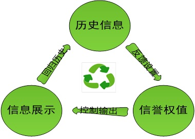

基于历史信息的互联网信息过滤筛选系统
==================================================================

1.现在的互联网信息传播
------------------------------------------------------------------ 
在现在互联网信息的传播中，大量的垃圾信息加大了功率与频率往我们面前推送，我们不得不耗费很多的时间和精力，在这些繁多垃圾信息中找到有价值和感兴趣的信息。

现有的信息内容分发系统只能做到大概判断用户是否感兴趣（比如今日头条），无法做到感兴趣程度数值化，即无法为信息做分级和阅读优先级推荐。

2.设计的灵感来源
------------------------------------------------------------------ 
在口口相传的现实生活中，我们大脑建立并应用了信誉机制的信息审判模型（这里的审判包含审查，查证，证明，保证，判断与评论），当不同的人告诉我们一条信息的时候：

序号 | 社会关系 | 信誉级别 | 信誉权值百分比 | 审判消耗 | 结果 
------------ | ------------ | ------------  | ------------  | ------------  | ------------
1 | 父母 | 极好的信誉 | 92%-100% | 极少 | 甚至不需要审判就可以相信这个信息
2 | 亲戚朋友 | 较好的信誉 | 50%-85%	 | 较少 | 做下简单审判就决定是否相信这个信息
3 | 陌生人 | 较差的信誉 | 10%-25% | 很多 | 需要做深入的审判，然后才来决定是否要相信这个信息
4 | 恶棍	 | 极差的信誉 | 0% | 不理会 | 不需要审判也不会相信这个信息，甚至有时候可以反着看

恶棍因为不断作恶，造就自己极差的信誉，所以不管再向谁重复诉说多少次，大家都不会再相信他提供的信息。

3.在互联网中应用
------------------------------------------------------------------ 
造成现在互联网大功率高频率垃圾信息满天飞的主要原因：其到处不断作恶，虽然已是极差的信誉，但是仍然可以浑水摸鱼，重复多次欺诈作恶后仍能从中获利，我们并未将信誉机制的信息审判模型引入其中。

在互联网中，**可查看信息提供者传播的历史信息，根据经验为其设置相应的信誉权值**。信誉权值越高说明其提供的信息就越有价值，我们就可以奖励回报他与反馈提高其信誉权值。信誉权值越低说明其提供的信息就越没有价值，我们就可以隔离惩罚他与反馈降低其信誉权值。

4.运行原理图
------------------------------------------------------------------ 

根据其传播的历史信息，反馈设置其信誉权值，信誉权值控制其新的信息输出与展示，新的信息又会回归到历史信息中影响到其信誉权值。

信誉权值控制着信息的输出，这样也使得垃圾信息将会大大的减少，系统会根据个人设置的信誉权值来推送个人兴趣爱好信息。

5.和现有算法过滤系统的比较
------------------------------------------------------------------ 
今日头条和微信的看一看的信息内容分发功能都是使用复杂的算法，根据个人阅读历史费劲心思地猜测，推送个人喜好的内容，但是个人的兴趣爱好是复杂且多变的，算法并不能很好的得出个人喜好，吃力不讨好不说，效果还不满意。

序号 | 现有系统 | 改进系统
------------ | ------------ | ------------ 
1 | 根据阅读历史使用算法猜测用户的兴趣爱好，控制权在平台手中，即系统错误推送不感兴趣信息也无法自己修正 | 用户自己使用信誉权值告诉系统个人的兴趣爱好，控制权在自己手中，想要显示什么形式的信息完全由自己控制
2 | 无法对兴趣爱好做分级 | 使用信誉权值数值做兴趣爱好的分级
3 | 无法在不通读信息的情况预先知道信息的价值程度 | 在不通读信息的情况，使用信誉权值数值大致反映信息的价值程度
4 | 顶一顶功能按人头计数，无法真实反映信息的价值，容易遭到水军冲击 | 使用信誉权值数值控制用户的顶一顶权值，即高权值用户的顶一顶相当于多个低权值用户的顶一顶，避免水军的垃圾信息冲击
5 | 无法有效避免垃圾信息用户的刷屏 | 使用信誉权值数值控制用户发的垃圾信息的显示
6 | 无法避免标题党浪费时间 | 从信誉权值数高低直观反映信息价值高低
7 | 关注订阅只有推送功能，无法直观的反应信息价值高低 | 使用信誉权值数值直观反映关注订阅推送的信息价值高低
8 | 无法为未阅读的感兴趣信息做优先级划分 | 使用信誉权值数值做信息优先级划分，极大缩短用户筛选信息的时间

当然也并不是排斥旧的信息内容分发功能，可以使用新的信誉权值控制方式为主，旧的信息内容分发为辅，从而使用户体验达到一个较好的平衡。

6.系统的社交属性和用户黏性
------------------------------------------------------------------ 
现有的用户社交添加的都是朋友和认识的人，虽然加了很多人，但是基本上都是可以很久不需要联系的。

在改进的系统中，**用户的参与信息评价使用信誉权值数值化，直观反映了信息的价值，使得该数值化评级可为他人做参考，而且其参考价值与其信誉权值成正相关性（参见第2节说明）**，实用性上会更强，这也使得用户之间的关联性比以前社交系统更加紧密。

而且其是基于历史信息建立的信任关系，别的平台没有相应的历史信息，如其信任的朋友没有转移平台，将很难发生用户转移的情况。

7.我们的优势
------------------------------------------------------------------ 
**系统按信息发布方的信誉权值，对其发布的信息做数值化分级和优先级处理，极大的缩短用户查找和搜索感兴趣信息的时间，这使得用户更加愿意使用系统。**

**其他用户对信息评级，也将按对其信誉权值做数值化处理，更加直观贴近反映出当前用户对信息的评级。这使得用户即使在没有通读信息的情况下，就已经大概知道信息的价值高低，极大可能性避免了用户浪费时间与精力在垃圾信息上，这也是其他系统没有的功能。**

对系统的架构和理解更好：

+  针对特别信任的用户，其以自己的知识与经验完成了信息的数值化评级，个人将非常愿意花费较少的金钱直接获取其对信息的数值化评级，毕竟有时候个人的能力不一定能验证信息，可能花费的时间与精力将会更多。

+  仿照现实生活中，父母告诉我们一个人是恶人，不要相信他说的话，我们即使没有接触恶人也会肯定其是恶人。在系统中，个人可以不需要手动一个一个设置其他用户的信誉权值，付费拷贝学习信任的极高信誉权值者的所有信誉权值设置即可。

+  平台需要鼓励和奖励专注于做信息推荐与评级的高信誉权值用户（或者组织），付费直接获取高信誉权值用户处理后的感兴趣信息将成新趋势。

8.盈利方式
------------------------------------------------------------------ 
验证改进系统的有效性与效率性，然后卖给想要进入或者加强用户社交领域的大公司，毕竟这个系统也只有在用户较多的情况下，才能更好的运转。

[*返回主页*](.)
------------------------------------------------------------------

***
